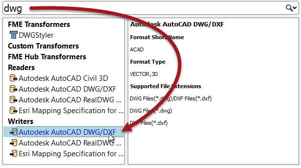

# Writers #

A **writer** is the FME term for the component in a translation that writes a destination dataset. A writer writes a single format of data. In general it also writes just a single dataset (i.e. a reader can read any number of datasets but, if sent to the same writer, they will be combined into a single output dataset).

By default, the Generate Workspace dialog creates workspace with a single writer. However, this does not mean the workspace is forever limited to this. Additional writers can be added to a workspace at any time, any number of formats can be used, and there does not need to be an equal number of readers and writers.

## Adding a Writer ##
Adding a writer to a workspace is a common requirement. There are several reasons:

- The Generate Workspace dialog only adds a single reader and writer
- Each reader and writer handles only one format of data.
- Different datasets (of the same format) may require reading handling with different parameters

Therefore the need to write multiple formats of data – such as Geodatabase and Oracle – requires multiple writers.

Additional writers are added to a translation using the Quick Add menu:

...Or by selecting Writers>Add Writer from the menubar.

---

<!--New Section--> 

<table style="border-spacing: 0px">
<tr>
<td style="vertical-align:middle;background-color:darkorange;border: 2px solid darkorange">
<i class="fa fa-bolt fa-lg fa-pull-left fa-fw" style="color:white;padding-right: 12px;vertical-align:text-top"></i>
NEW
</td>
</tr>

<tr>
<td style="border: 1px solid darkorange">

The ability to add a Writer using Quick Add is new for FME 2017

</td>
</tr>
</table>

---

Adding a writer has this effect on the hierarchy diagram:

## Removing a Writer ##

Not only can you add a new writer, you can remove an existing one; for example when you have an old writer whose output you no longer need. Tools exist to remove a writer from a workspace, both on the menubar and in context menus in the Navigator window.

Removing a writer obviously has the reverse effect on the hierarchy diagram!

---

<!--Updated Section--> 

<table style="border-spacing: 0px">
<tr>
<td style="vertical-align:middle;background-color:darkorange;border: 2px solid darkorange">
<i class="fa fa-bolt fa-lg fa-pull-left fa-fw" style="color:white;padding-right: 12px;vertical-align:text-top"></i>
.1 UPDATE
</td>
</tr>
<tr>
<td style="border: 1px solid darkorange">

As with readers, FME2017.1 introduces a tool to <strong>update</strong> a writer in Workbench, to bring its behaviour up to date with the current FME version.

</td>
</tr>
</table>

