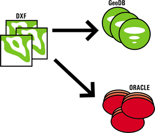
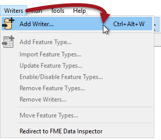
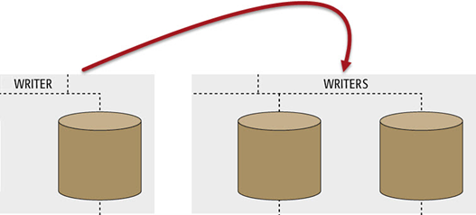
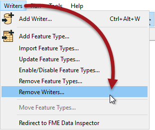

# Writers #

***Writers*** are the main components that write data in FME.

A Writer is the FME term for the component in a translation that writes a destination dataset. A Writer writes a single format of data. In general it also writes just a single dataset (i.e. a Reader can read any number of datasets but, if sent to the same Writer, they will be combined into a single output dataset).

By default, the Generate Workspace dialog creates workspace with a single Writer. However, this does not mean the workspace is forever limited to this. Additional Writers can be added to a workspace at any time, any number of formats can be used, and there does not need to be an equal number of Readers and Writers.

## Adding a Writer ##
Adding a Writer to a workspace is a common requirement. There are several reasons:

- The Generate Workspace dialog only adds a single Reader and Writer
- Each Reader and Writer handles only one format of data.
- Different datasets (of the same format) may require reading handling with different parameters

Therefore the need to write multiple formats of data – such as Geodatabase and Oracle – requires multiple Writers.

Additional Writers are added to a translation using Writers > Add Writer from the menubar.

Adding a Writer has this effect on the hierarchy diagram:

## Removing a Writer ##

Not only can you add a new Writer, you can remove an existing one; for example when you have an old Writer whose output you no longer need. Tools exist to remove a Writer from a workspace, both on the menubar and in context menus in the Navigator window.

Removing a Writer obviously has the reverse effect on the hierarchy diagram!

