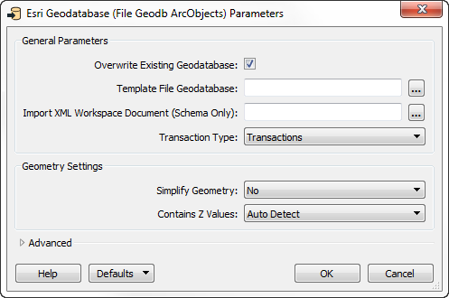

## Controlling Writers ##
Writers are controlled with Writer parameters.

Because parameters refer to specific components and characteristics of the related format, Writers of different formats have a different set of control parameters.

### Writer Parameters ###
Writer parameters can be located - and set - in one of two locations.

Firstly, these parameters can be found in a dialog when a new workspace is being generated, or a new Writer added:

---

<!--Updated Section--> 

<table style="border-spacing: 0px">
<tr>
<td style="vertical-align:middle;background-color:darkorange;border: 2px solid darkorange">
<i class="fa fa-bolt fa-lg fa-pull-left fa-fw" style="color:white;padding-right: 12px;vertical-align:text-top"></i>
.1 UPDATE
</td>
</tr>

<tr>
<td style="border: 1px solid darkorange">

The Geodatabase parameters dialog in the above screenshot was slightly redesigned in FME2016.1, with different options for a template Geodatabase and an XML Workspace template:
  
  This means the screenshots below are slightly different too.

</td>
</tr>
</table>

---

Secondly, after the workspace is generated/Writer is added, parameters are shown and set in the Navigator Window.

For ease-of-use, basic parameters are listed first, followed by advanced. 

To edit a parameter, double-click it. A dialog opens up where the parameter’s value may be set.

