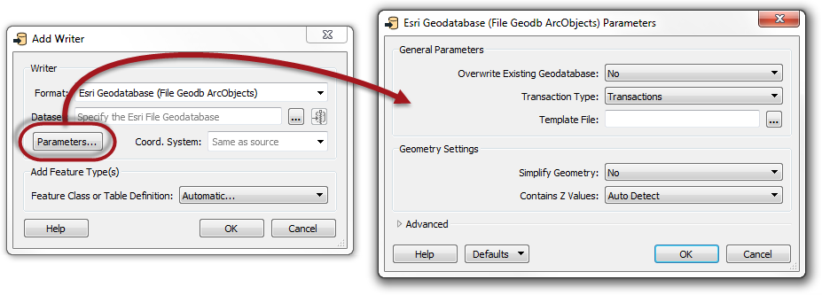
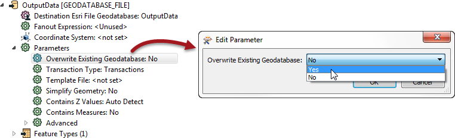

## Controlling Writers ##
Writers are controlled with Writer parameters.

Because parameters refer to specific components and characteristics of the related format, Writers of different formats have a different set of control parameters.

### Writer Parameters ###
Writer parameters can be located - and set - in one of two locations.

Firstly, these parameters can be found in a dialog when a new workspace is being generated, or a new Writer added:

Secondly, after the workspace is generated/Writer is added, parameters are shown and set in the Navigator Window.

For ease-of-use, basic parameters are listed first, followed by advanced. 

To edit a parameter, double-click it. A dialog opens up where the parameter’s value may be set.

