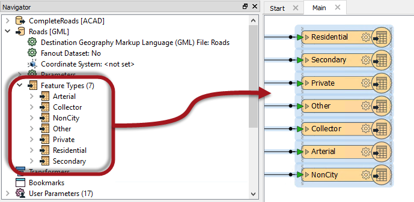
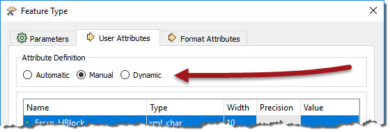
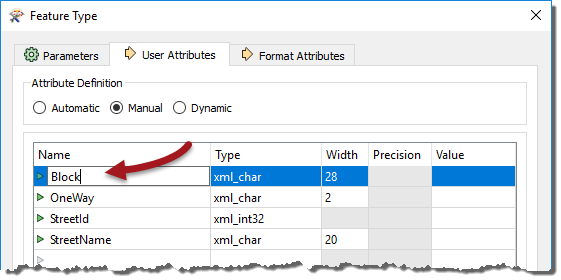
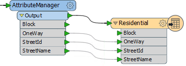
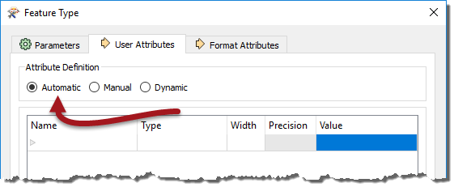
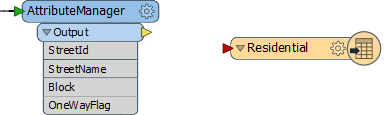
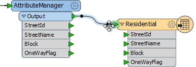
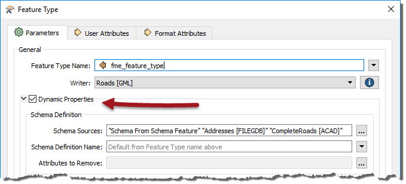

## Writer Feature Types ##

As per the hierarchy diagram, each Writer in FME can have a number of feature types. Feature types define the layers being written to a destination dataset and the attributes for those layers to possess. They are represented as objects on the workspace canvas and also listed in the Navigator window. 

In this workspace, a Writer is writing a dataset of roads, with a different layer for each road type. Notice the Writer in the Navigator window and how it has a list of feature types; then notice that each of these feature types is also depicted on the canvas:

A workspace can contain any number of Writers, each with any number of feature types.

---

### Writer Feature Type Attributes ###

The attributes on a Reader feature type represent *'what we have'* - literally what already exists in a source dataset. On the Writer feature type attributes represent *'what we want'*. 

Each Writer feature type has a User Attributes tab to define the attributes to be written. Unlike a Reader feature type, there is a setting with three options to control how attributes can be defined:

These options are Automatic, Manual, or Dynamic. Being aware of what these options do is important for managing Writer feature types. So we’ll look into them with Manual definitions first, since they are the easiest to understand.

---

#### Manual Attribute Definitions ####
A manual attribute definition is simply when the workspace author manually enters attribute names, and manually selects the attribute types, like so:

In this example, we are starting to define a table of road features. We have definitions for four attributes, one of which is just being edited.

In the Workbench canvas, the feature type would look like this:

By default, when you create a new workspace the Writer feature types are set in Manual attribute mode.

---

#### Automatic Attribute Definitions ####
An automatic attribute definition is when Workbench itself automatically defines the list of attributes, depending upon what Reader feature types are connected.

Here – when the user chooses the Automatic option - the attribute definition fields are left empty and uneditable, like so:

Similarly, on the canvas the feature type is also empty initially:

What makes the definitions automatic is the action that occurs when it is connected to the rest of the workspace:

Notice that all of the attributes defined - either on a Reader feature type or a transformer - are now copied over to the Writer feature type automatically.

Because this operates automatically, the list of attributes on the Writer feature type will be immediately updated to match whenever attributes are chanegd in the workspace. For example, if a Reader feature type is removed and another one connected, or if a second Reader feature type is connected:

This is really useful because it means that multiple streams of data can be merged into a single feature type, and all attribute definitions are taken care of.

However, what this won’t do is handle the scenario where you change a source dataset parameter to read a dataset with a different set of attributes. In other words, the Writer attributes will only be defined by what is connected, not what actually exists in the source data. For that scenario you need dynamic attributes.

---

#### Dynamic Attribute Definitions ####
When the attribute definition is set to dynamic it causes the Dynamic Properties option (in the General tab) to be selected:

A dynamic feature type truly has no definition in advance. Instead, it dynamically takes its attribute definitions from either whatever data is fed to it when the workspace is run, or another set of schema definitions selected by the user.

So, like an automatic definition, you don’t see attributes on the initial feature type. However, neither do you see attributes when Reader feature types are connected!

---

---

<!--Person X Says Section-->

<table style="border-spacing: 0px">
<tr>
<td style="vertical-align:middle;background-color:darkorange;border: 2px solid darkorange">
<i class="fa fa-quote-left fa-lg fa-pull-left fa-fw" style="color:white;padding-right: 12px;vertical-align:text-top"></i>
Police Chief Webb-Mapp says...
</td>
</tr>

<tr>
<td style="border: 1px solid darkorange">

OK let me spell out these important differences.  
  Automatic attributes takes their definition from whatever is connected to them. If the Source Dataset parameter is changed, it will have no effect. 
  Dynamic attributes are different. If the Source Dataset parameter is changed, the attribute definition comes from whatever source data gets read. 

</td>
</tr>
</table>

---

