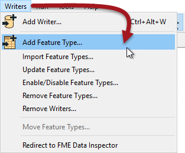
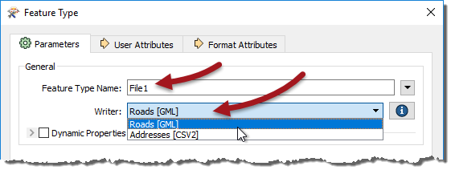
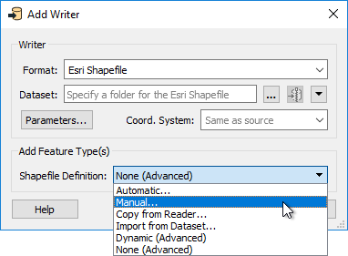

## Adding Writer Feature Types ##

Generating a workspace is the point at which most feature types are added to the translation. Whatever feature types are added by the Reader are automatically duplicated on the Writer:

The Writer feature types represent "what you want", but that is often not the same as "what you have". Therefore you need to edit the Writer feature types to get the structure that you desire.

Also, depending on format, you may need to add further Writers. How you add new feature types depends on whether it is a new Writer or an existing one.

---

### Adding Feature Types to an Existing Writer ###
Feature Types can be added manually to a writer using Writers>Add Feature Type on the menubar.

<!--Warning Section--> 

<table style="border-spacing: 0px">
<tr>
<td style="vertical-align:middle;background-color:darkorange;border: 2px solid darkorange">
<i class="fa fa-exclamation-triangle fa-lg fa-pull-left fa-fw" style="color:white;padding-right: 12px;vertical-align:text-top"></i>
WARNING
</td>
</tr>

<tr>
<td style="border: 1px solid darkorange">

At least one writer must exist in the translation hierarchy; else this option will be greyed out.

</td>
</tr>
</table>

---

Adding a feature type opens the Feature Type Properties dialog in order to edit the new feature type's properties.

As when editing the schema, the General tab can be used to define the new feature type’s name. Also, if there is more than one Writer in the workspace, there is a parameter to specify which Writer this new feature type belongs to:

---

<!--Tip Section--> 

<table style="border-spacing: 0px">
<tr>
<td style="vertical-align:middle;background-color:darkorange;border: 2px solid darkorange">
<i class="fa fa-info-circle fa-lg fa-pull-left fa-fw" style="color:white;padding-right: 12px;vertical-align:text-top"></i>
TIP
</td>
</tr>

<tr>
<td style="border: 1px solid darkorange">

It's worth remembering that, with format-specific terminology, instead of "Feature Type" this dialog's labels may state "Feature Class," "Layer," "Sheet," or whatever terminology is specific to the format of data you are writing.
</td>
</tr>
</table>

---

As usual, the User Attributes tab can be used to define the new feature type’s attribute schema, in either of the three different ways:

Here the user has added a new feature type and is manually defining the attributes that belong to it.

---

### Adding Feature Types to a New Writer ###
When a new writer is being created the option is provided to add new feature types:

As you can see, addition of feature types can be completed in a number of ways. The three methods we have already looked at are:

- **Automatic:** Adds a new feature type with the attribute definition parameter set to automatic
- **Manual:** Adds a new feature type with the attribute definition parameter set to manual
- **Dynamic (Advanced):** Adds a new feature type with the attribute definition parameter set to dynamic

The others are: 

**Copy from Reader:** Adds a new feature type with manual attribute definition; however, the attributes are pre-defined to an existing Reader schema. This is useful when you have manually added a Reader and want to duplicate its schema on the Writer. 

**Import from Dataset:** Adds a new feature type with manual attribute definition parameter; however, the attributes are pre-defined to an external dataset schema. This is useful where - for example - you are adding a Writer to write to a database; the database tables already exist and you use this tool to copy their schema definition into the workspace.

**None (Advanced):** Does not add any new feature type. This is a rare scenario, mostly used when you are adding a writer but are not yet ready to define its schema.