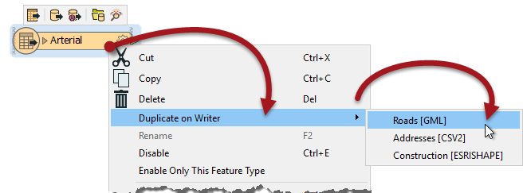
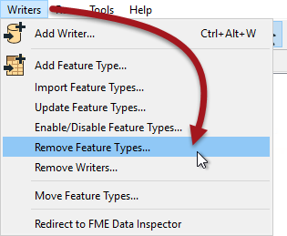
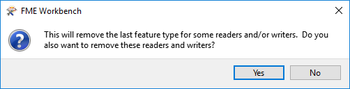

### Copying Feature Types to a Writer ###
If a workspace already contains a Writer, it's still possible to copy a Reader schema into it. This is simply done by selecting the required Reader feature types, right-clicking them, and using the option Duplicate (on Writer).

The command causes duplicates of the Reader feature types to be added to the Writer and automatically connected.

Again, at least one writer must exist in the translation hierarchy; else this option will be greyed out.

---

### Removing Feature Types ###
Feature types can be deleted by selecting them on the canvas and pressing the delete key. They can also be deleted using the remove feature types tool on the menubar:

A user might delete a feature type is there is a destination dataset layer that they no longer wish to write.

Whenever all feature types are deleted from a Writer then FME will prompt the user to decide whether to remove the Writer component as well.

This makes sense because if there are no feature types you wish to write, why would you still wish to write the dataset at all?

If you answer No, then the feature types are all removed, but the Writer is left in the translation. We call this a "dangling” Writer, because it has no children in the hierarchy.

---

<!--Tip Section--> 

<table style="border-spacing: 0px">
<tr>
<td style="vertical-align:middle;background-color:darkorange;border: 2px solid darkorange">
<i class="fa fa-info-circle fa-lg fa-pull-left fa-fw" style="color:white;padding-right: 12px;vertical-align:text-top"></i>
TIP
</td>
</tr>

<tr>
<td style="border: 1px solid darkorange">

A dangling Writer isn’t as much of a problem as a Reader, since there is no data to be written, although it can cause a loss of performance depending on other (advanced) factors such as the order of Writers.

</td>
</tr>
</table>