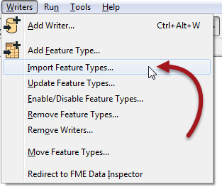

## Import Writer Feature Types ##

A further tool under the Writer menu is labelled Import Feature Types.

Importing feature types is like when you add a new Writer and choose to import the feature types, the difference being the Writer here already exists.

One reason to import feature types is to write to extra tables in a database.

For example, a user has a workspace that writes to a spatial database. It only needs to write to a single table (Roads), so there is a single Writer representing the database, and a single feature type representing the Roads table.

However, at some future point the user decides the workspace also needs to write to a second existing table (Rail) and so imports the schema for the Rail table.

The way to do this is to use the menu tool Writer > Import Feature Types:

The user selects the Writer to add the feature type to (if there is more than one Writer in the workspace) and then is prompted for the format and dataset to import the schema from.

The import tool will take the chosen schema definition and add it to the chosen Writer in the workspace.

---

<!--Person X Says Section-->

<table style="border-spacing: 0px">
<tr>
<td style="vertical-align:middle;background-color:darkorange;border: 2px solid darkorange">
<i class="fa fa-quote-left fa-lg fa-pull-left fa-fw" style="color:white;padding-right: 12px;vertical-align:text-top"></i>
Mr E. Dict (attorney of FME law) says...
</td>
</tr>

<tr>
<td style="border: 1px solid darkorange">

Whenever I create a new legal contract for a client, I copy previous contracts. I don't put the same clauses (data) in there, but they do have the same structure (schema). It's like using a template, and that's exactly what the Import Feature Types tool does.

</td>
</tr>
</table>

---

<!--Person X Says Section-->

<table style="border-spacing: 0px">
<tr>
<td style="vertical-align:middle;background-color:darkorange;border: 2px solid darkorange">
<i class="fa fa-quote-left fa-lg fa-pull-left fa-fw" style="color:white;padding-right: 12px;vertical-align:text-top"></i>
Miss Vector says...
</td>
</tr>

<tr>
<td style="border: 1px solid darkorange">

Here's an interesting question for you to consider. I want to convert some data from Esri Shapefile to GML format, with the GML having the same schema as an existing PostGIS database. How can I do this?
  <a href="http://52.73.3.37/fmedatastreaming/Manual/QAResponse2017.fmw?chapter=4&question=3&answer=1&DestDataset_TEXTLINE=C%3A%5CFMEOutput%5CQAResponse.html">1. Create a workspace to convert the Shapefile to PostGIS. Create a second workspace to convert the PostGIS to GML.</a>
  <a href="http://52.73.3.37/fmedatastreaming/Manual/QAResponse2017.fmw?chapter=4&question=3&answer=2&DestDataset_TEXTLINE=C%3A%5CFMEOutput%5CQAResponse.html">2. Create a workspace to convert the PostGIS to GML. Create a second workspace to convert the Shapefile to GML, overwriting the previously created GML file.</a>
  <a href="http://52.73.3.37/fmedatastreaming/Manual/QAResponse2017.fmw?chapter=4&question=3&answer=3&DestDataset_TEXTLINE=C%3A%5CFMEOutput%5CQAResponse.html">3. Create a workspace with PostGIS and Shapefile Readers, and a GML Writer. Copy the PostGIS Reader feature types to the GML Writer and connect the Shapefile Reader feature types to them. Delete the PostGIS Reader and run the workspace.</a>
  <a href="http://52.73.3.37/fmedatastreaming/Manual/QAResponse2017.fmw?chapter=4&question=3&answer=4&DestDataset_TEXTLINE=C%3A%5CFMEOutput%5CQAResponse.html">4. Create a workspace with a Shapefile Reader and a GML Writer. Import feature type schemas from the PostGIS database into the GML Writer.</a>

</td>
</tr>
</table>
