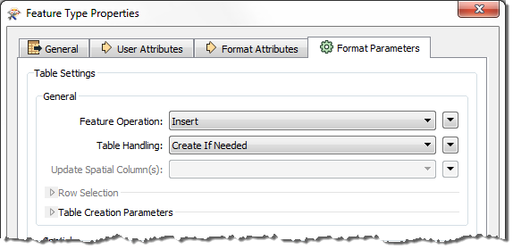

## Writer Feature Type Parameters ##
Just like Writers, Writer feature types have their own set of parameters that control how that feature type (layer/table) is being written. These parameters appear under the Format Parameters tab in the Feature Type Properties dialog:

The important thing is that these (feature type) parameters only apply to a single feature type, whereas a Writer parameter would apply to all feature types.

For example, when writing to a PostGIS database there is a feature type parameter that defines the operation to carry out:

This operation can be Insert, Update, or Delete. It is a Feature Type parameter because then each table might require a different operation; for example I want to insert records into table A, but delete records from table B.

Conversely, there is no password parameter at the feature type level because authentication applies to the entire database, not the individual tables. Authentication parameters are at the Writer level in the Navigator window or - like below - included in an FME Database Connection:

---

<!--Tip Section--> 

<table style="border-spacing: 0px">
<tr>
<td style="vertical-align:middle;background-color:darkorange;border: 2px solid darkorange">
<i class="fa fa-info-circle fa-lg fa-pull-left fa-fw" style="color:white;padding-right: 12px;vertical-align:text-top"></i>
TIP
</td>
</tr>

<tr>
<td style="border: 1px solid darkorange">

Not all feature types need a set of parameters, so the Format Parameters tab is not always present.

</td>
</tr>
</table>