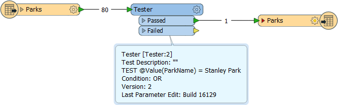
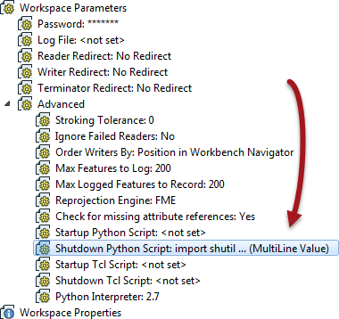

<!--Exercise Section-->
<!--NB: In GitBook world we don't give a number to exercises-->

<table style="border-spacing: 0px;border-collapse: collapse;font-family:serif">
<tr>
<td width=25% style="vertical-align:middle;background-color:darkorange;border: 2px solid darkorange">
<i class="fa fa-cogs fa-lg fa-pull-left fa-fw" style="color:white;padding-right: 12px;vertical-align:text-top"></i>
Exercise 1
</td>
<td style="border: 2px solid darkorange;background-color:darkorange;color:white">
Creating a Workspace
</td>
</tr>

<tr>
<td style="border: 1px solid darkorange; font-weight: bold">Data</td>
<td style="border: 1px solid darkorange">City Parks (MapInfo TAB)</td>
</tr>

<tr>
<td style="border: 1px solid darkorange; font-weight: bold">Overall Goal</td>
<td style="border: 1px solid darkorange">Create a set of data for mapping a recreational event</td>
</tr>

<tr>
<td style="border: 1px solid darkorange; font-weight: bold">Demonstrates</td>
<td style="border: 1px solid darkorange">Workspace component and parameters</td>
</tr>

<tr>
<td style="border: 1px solid darkorange; font-weight: bold">Start Workspace</td>
<td style="border: 1px solid darkorange">None</td>
</tr>

<tr>
<td style="border: 1px solid darkorange; font-weight: bold">End Workspace</td>
<td style="border: 1px solid darkorange">C:\FMEData2016\Workspaces\DesktopBasic\Components-Ex1-Complete.fmw</td>
</tr>

</table>

The city is hosting a fundraising walk for a major charity. There will be many thousands of people taking part and good organization of the event is vital. One of the requirements is a map for participants and you have been tasked with using FME to put together the data that will form the map.  

The data required for this project (and the format it is held in) includes:

<table>
<tr><th>Dataset</th><th>Format</th><th>Location</th></tr>
<tr><td>Park outline</td><td>MapInfo TAB</td><td>C:\FMEData2016\Data\Parks\Parks.tab</td></tr>
<tr><td>Trail Route</td><td>Comma Separated (CSV)</td><td>C:\FMEData2016\Data\GPS\WalkingTrail.csv</td></tr>
<tr><td>Food vendors</td><td>Esri File Geodatabase</td><td>C:\FMEData2016\Data\CommunityMapping\CommunityMap.gdb</td></tr>
<tr><td>Parking facilities</td><td>OpenStreetMap</td><td>C:\FMEData2016\Data\OpenStreetMap\amenity.osm</td></tr>
<tr><td>Roads into/out of park</td><td>OpenStreetMap</td><td>C:\FMEData2016\Data\OpenStreetMap\highway.osm</td></tr>
</table>

The outputs required are Google KML and GPX. So with this and the amount of input data, you will need to add lots of Readers (and Writers) to your workspace.

 **1) Inspect Data**
 As usual, the first thing to do is inspect the source data. There is a lot of it and - in many cases - the required data is just one feature or one layer within a larger dataset. The final dataset we want will look something like this:

 **2) Create Workspace**
 OK. Let's get going. Start FME Workbench and choose the option to generate a workspace. We'll start with the parks data so, when prompted, enter the following choices:

<table style="border: 0px">

<tr>
<td style="font-weight: bold">Reader Format</td>
<td style="">MapInfo TAB (MITAB)</td>
</tr>

<tr>
<td style="font-weight: bold">Reader Dataset</td>
<td style="">C:\FMEData2016\Data\Parks\Parks.tab</td>
</tr>

<tr>
<td style="font-weight: bold">Writer Format</td>
<td style="">Google KML</td>
</tr>

<tr>
<td style="font-weight: bold">Writer Dataset</td>
<td style="">C:\FMEData2016\Output\Training\FundraisingWalk.kml</td>
</tr>

</table>

 **3) Add Tester**
 The park that the walk is taking place in is called Stanley Park. Add a Tester transformer and use it to filter out any park features that are not part of Stanley Park:

Run the workspace (as you can see from above, only 1 feature passes the test) and view the output in either the FME Data Inspector or Google Earth.

 **4) Add Shutdown Script**
 The organizing team has created a share folder for materials. We could write our data to it directly, but instead let's write a the file to our system, then copy it to the centrally shared folder.

Locate the workspace parameter called Shutdown Python Script and double-click it to open an editor window. In the window enter the following code (**NB:** *The code can be copied from the file: C:\FMEData2016\Resources\ComponentsExerciseScript.py*):

<pre>import shutil
import os

if not os.path.exists('C:/FundraisingWalk'):
    os.makedirs('C:/FundraisingWalk')
shutil.copy2('c:/FMEData2016/Output/Training/FundraisingWalk.kml', 'C:/FundraisingWalk/FundraisingWalk.kml')
</pre>

You'll notice that we're not really writing to a shared folder, just a different folder on our own system. That's OK. It's not a real project! Anyway, the workspace parameters should look like this: 

 **5) Run Workspace**
 Run the workspace. You should see that the 'shared' folder is created (assuming it doesn't already exist) and the data is copied to it. This is an excellent example of the sort of thing you might be with a shutdown script. 

---

<!--Person X Says Section-->

<table style="border-spacing: 0px">
<tr>
<td style="vertical-align:middle;background-color:darkorange;border: 2px solid darkorange">
<i class="fa fa-quote-left fa-lg fa-pull-left fa-fw" style="color:white;padding-right: 12px;vertical-align:text-top"></i>
Aunt Interop says...
</td>
</tr>

<tr>
<td style="border: 1px solid darkorange">

If the workspace fails because of a Python error (it shouldn't, but just in case), don't worry about it. Everyone has a failure sometime. We aren't here to debug Python so just erase the script from the parameter and carry on. The important part is that you can see the type of thing a script can do and know where the parameters are to use them.

</td>
</tr>
</table>

---

<!--Exercise Congratulations Section--> 

<table style="border-spacing: 0px">
<tr>
<td style="vertical-align:middle;background-color:darkorange;border: 2px solid darkorange">
<i class="fa fa-thumbs-o-up fa-lg fa-pull-left fa-fw" style="color:white;padding-right: 12px;vertical-align:text-top"></i>
CONGRATULATIONS
</td>
</tr>

<tr>
<td style="border: 1px solid darkorange">

By completing this exercise you have learned how to:
 
<ul><li>Create a new workspace with Reader and Writer as the first step in a larger project</li>
<li>Locate and use a Python shutdown script</li></ul>

</td>
</tr>
</table>
