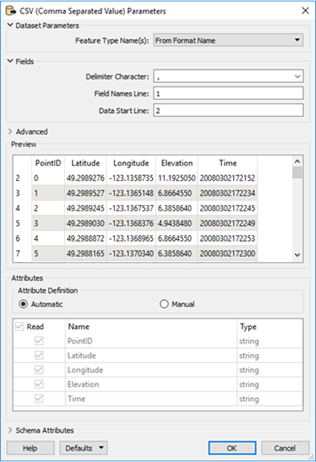
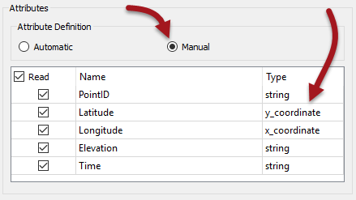
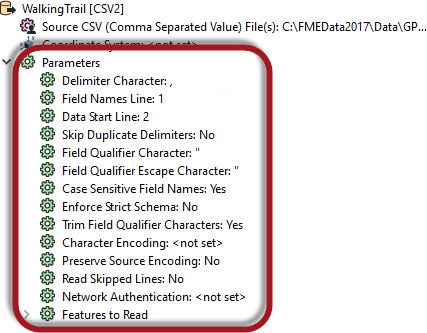
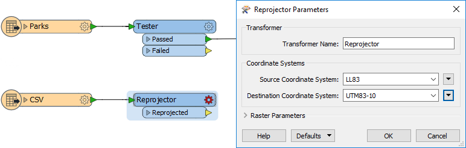
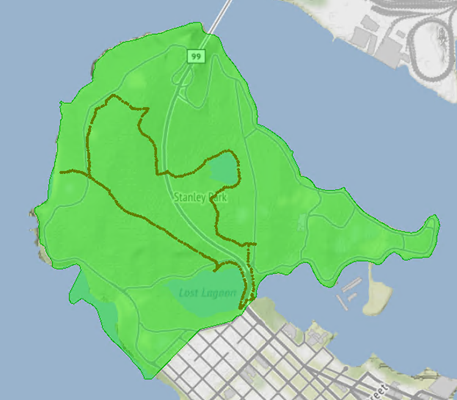

<!--Exercise Section-->

<table style="border-spacing: 0px;border-collapse: collapse;font-family:serif">
<tr>
<td width=25% style="vertical-align:middle;background-color:darkorange;border: 2px solid darkorange">
<i class="fa fa-cogs fa-lg fa-pull-left fa-fw" style="color:white;padding-right: 12px;vertical-align:text-top"></i>
Exercise 2
</td>
<td style="border: 2px solid darkorange;background-color:darkorange;color:white">
Adding Readers
</td>
</tr>

<tr>
<td style="border: 1px solid darkorange; font-weight: bold">Data</td>
<td style="border: 1px solid darkorange">City Parks (MapInfo TAB) Walking Trail (CSV)</td>
</tr>

<tr>
<td style="border: 1px solid darkorange; font-weight: bold">Overall Goal</td>
<td style="border: 1px solid darkorange">Create a set of data for mapping a recreational event</td>
</tr>

<tr>
<td style="border: 1px solid darkorange; font-weight: bold">Demonstrates</td>
<td style="border: 1px solid darkorange">Readers and Reader Parameters</td>
</tr>

<tr>
<td style="border: 1px solid darkorange; font-weight: bold">Start Workspace</td>
<td style="border: 1px solid darkorange">C:\FMEData2017\Workspaces\DesktopBasic\Components-Ex2-Begin.fmw</td>
</tr>

<tr>
<td style="border: 1px solid darkorange; font-weight: bold">End Workspace</td>
<td style="border: 1px solid darkorange">C:\FMEData2017\Workspaces\DesktopBasic\Components-Ex2-Complete.fmw</td>
</tr>

</table>

Let's continue your work on the fundraising walk project.

In case you forgot, the city is hosting a fundraising walk for a major charity and you have been tasked with using FME to put together the data that will form the event map.  

In this part of the project we’ll add another of the source datasets to the workspace as a reader. This format will need close inspection of the reader parameters to make sure we're reading the data correctly.

 **1) Start Workbench**
 Start Workbench (if necessary) and open the workspace from Exercise 1. Alternatively you can open C:\FMEData2017\Workspaces\DesktopBasic\Components-Ex2-Begin.fmw

 **2) Add Reader**
 The existing workspace already has a Reader for MapInfo (parks) data. Now let's add one for the most important dataset - the walk trail. This was walked by a colleague and captured on his GPS device.

Select Readers > Add Reader from the menubar in Workbench. When prompted fill in the following details (but don't press OK):

<table style="border: 0px">

<tr>
<td style="font-weight: bold">Reader Format</td>
<td style="">CSV (Comma Separated Value)</td>
</tr>

<tr>
<td style="font-weight: bold">Reader Dataset</td>
<td style="">C:\FMEData2017\Data\GPS\WalkingTrail.csv</td>
</tr>

<tr>
<td style="font-weight: bold">Coord. System</td>
<td style="">LL84</td>
</tr>

</table>

The coordinate system setting is below the Dataset parameter, on the right hand side of the dialog. It's important to specify the coordinate system here because we're going to be dealing with lots of datasets with different coordinate systems, and data unflagged with coordinate system information is going to be problematic. 
 
Now press the Parameters button. This brings up a parameters dialog that is rather large and looks like this:

The dialog includes various parameters for this reader and a preview of what the source dataset looks like. By default the Delimiter Character should be a comma (change it to a comma if it is not) and the Field Names Line parameter should be set to 1.

In the lower part of the dialog - under Attribute Definition - click the button marked Manual. Now change the type of the Latitude attribute to a y&#95;coordinate and the Longitude attribute to an x&#95;coordinate:

By setting these parameters FME will convert the plain-text CSV data into true spatial features. Click OK to close this dialog and OK again to close the Add Reader dialog.

---

<!--Person X Says Section-->

<table style="border-spacing: 0px">
<tr>
<td style="vertical-align:middle;background-color:darkorange;border: 2px solid darkorange">
<i class="fa fa-quote-left fa-lg fa-pull-left fa-fw" style="color:white;padding-right: 12px;vertical-align:text-top"></i>
Mr. Statistics-Calculator says...
</td>
</tr>

<tr>
<td style="border: 1px solid darkorange">

Some things just won't wait. It's important to set these parameters now as they affect how the schema is depicted on the canvas. If I mess this up I'd have to delete the reader and re-add it. That's not an efficient use of time and resources.

</td>
</tr>
</table>

---

 **3) Check Reader Parameters**
 Locate the CSV reader in the Navigator window and expand the list of parameters to see what there is:

Notice that some of the parameters we set earlier are no longer available. That's because they specified how to define the feature type schema, and it's too late to set them now.

There are other parameters, but none we need to set for this exercise.

 **4) Add Reprojector**
 The one issue with the CSV data is that it is in a Latitude/Longitude coordinate system, and not the same UTM system as used by the parks data. Let's fix that by adding a Reprojector transformer to the workspace.

Connect it to the CSV reader feature type and set its parameters to reproject from *Read from feature* to *UTM83-10*:

Also, as in the above image, connect the Tester:Passed output port to the Reprojector.

---

<!--Person X Says Section-->

<table style="border-spacing: 0px">
<tr>
<td style="vertical-align:middle;background-color:darkorange;border: 2px solid darkorange">
<i class="fa fa-quote-left fa-lg fa-pull-left fa-fw" style="color:white;padding-right: 12px;vertical-align:text-top"></i>
First Officer Transformer says...
</td>
</tr>

<tr>
<td style="border: 1px solid darkorange">

This might seem odd. The Parks data is already in the correct coordinate system, so why reproject it?
  The answer is that we're trying to make a tidy workspace. If all features go through the Reprojector there will be fewer connections passing across the screen. We can separate the data out again at a later stage.
  We don't need to worry that the Parks data will be wrongly reprojected. It is already tagged with UTM83-10 and FME will recognize this and carry out no action on the data.

</td>
</tr>
</table>

---

 **5) Run Workspace**
 Feel free to add Inspector transformers and run the workspace to inspect what we have created so far.

 Map tiles by <a href="http://stamen.com">Stamen Design</a>, under <a href="http://creativecommons.org/licenses/by/3.0">CC-BY-3.0</a>. Data by <a href="http://openstreetmap.org">OpenStreetMap</a>, under <a href="http://creativecommons.org/licenses/by-sa/3.0">CC-BY-SA</a>.

---

<!--Exercise Congratulations Section--> 

<table style="border-spacing: 0px">
<tr>
<td style="vertical-align:middle;background-color:darkorange;border: 2px solid darkorange">
<i class="fa fa-thumbs-o-up fa-lg fa-pull-left fa-fw" style="color:white;padding-right: 12px;vertical-align:text-top"></i>
CONGRATULATIONS
</td>
</tr>

<tr>
<td style="border: 1px solid darkorange">

By completing this exercise you have learned how to:
 
<ul><li>Add readers to a workspace</li>
<li>Set parameters when adding a new reader</li>
<li>Set parameters after adding a new reader</li>
<li>Convert CSV attributes into spatial features</li></ul>

</td>
</tr>
</table>
