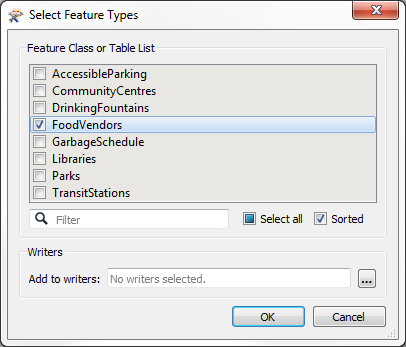
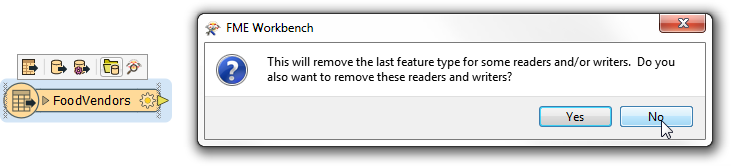
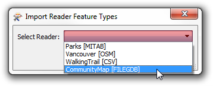
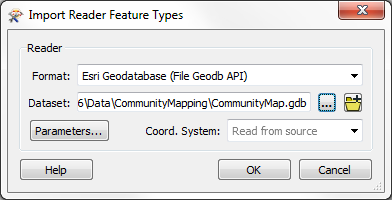
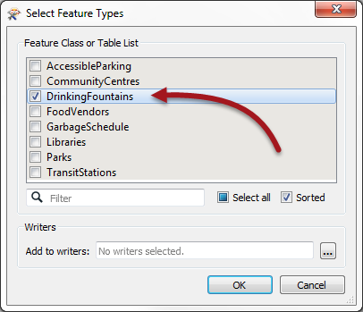
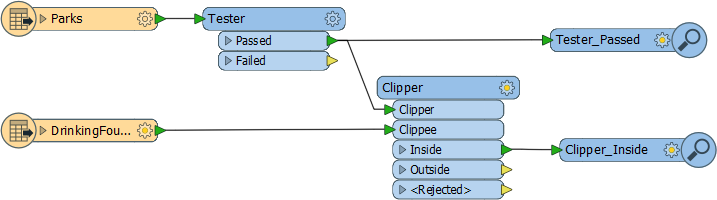
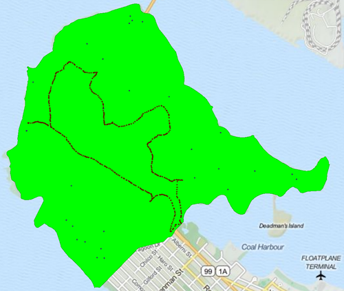

<!--Exercise Section-->

<table style="border-spacing: 0px;border-collapse: collapse;font-family:serif">
<tr>
<td width=25% style="vertical-align:middle;background-color:darkorange;border: 2px solid darkorange">
<i class="fa fa-cogs fa-lg fa-pull-left fa-fw" style="color:white;padding-right: 12px;vertical-align:text-top"></i>
Exercise 3
</td>
<td style="border: 2px solid darkorange;background-color:darkorange;color:white">
Reader Feature Types
</td>
</tr>

<tr>
<td style="border: 1px solid darkorange; font-weight: bold">Data</td>
<td style="border: 1px solid darkorange">City Parks (MapInfo TAB) Walking Trail (CSV) Food Vendors/Water Fountains (File Geodatabase)</td>
</tr>

<tr>
<td style="border: 1px solid darkorange; font-weight: bold">Overall Goal</td>
<td style="border: 1px solid darkorange">Create a set of data for mapping a recreational event</td>
</tr>

<tr>
<td style="border: 1px solid darkorange; font-weight: bold">Demonstrates</td>
<td style="border: 1px solid darkorange">Handling and Controlling Reader Feature Types</td>
</tr>

<tr>
<td style="border: 1px solid darkorange; font-weight: bold">Start Workspace</td>
<td style="border: 1px solid darkorange">C:\FMEData2017\Workspaces\DesktopBasic\Components-Ex3-Begin.fmw</td>
</tr>

<tr>
<td style="border: 1px solid darkorange; font-weight: bold">End Workspace</td>
<td style="border: 1px solid darkorange">C:\FMEData2017\Workspaces\DesktopBasic\Components-Ex3-Complete.fmw</td>
</tr>

</table>

Let's continue your work on the fundraising walk project.

In case you forgot, the city is hosting a fundraising walk for a major charity and you have been tasked with using FME to put together the data that will form the event map.  

In this part of the project we’ll add another of the source datasets to the workspace.

 **1) Start Workbench**
 Start Workbench (if necessary) and open the workspace from Exercise 2. Alternatively you can open C:\FMEData2017\Workspaces\DesktopBasic\Components-Ex3-Begin.fmw

 **2) Add Reader**
 The existing workspace already has various Readers; now it needs one for loading a layer of food vendor data. This is stored in the Community Mapping Geodatabase

Select Readers > Add Reader from the menubar in Workbench. When prompted fill in the following details:

<table style="border: 0px">

<tr>
<td style="font-weight: bold">Reader Format</td>
<td style="">Esri Geodatabase (File Geodb API)</td>
</tr>

<tr>
<td style="font-weight: bold">Reader Dataset</td>
<td style="">C:\FMEData2017\Data\CommunityMapping\CommunityMap.gdb</td>
</tr>

</table>

This dataset contains several tables, but we only need one of them. So, when prompted, deselect all feature types and leave only FoodVendors selected:

 **3) Remove FoodVendors Feature Type**
 No sooner have you added the FoodVendors layer to the workspace than the telephone rings. It is the event organizers. Instead of showing food vendors on the map, they now want to simply show the location of drinking fountains.

Muttering under your breath, click on the newly added feature type for FoodVendors and press the delete key. You will see this dialog appear:

  

The dialog appears because FoodVendors is the only feature type in the workspace for this Reader. It is asking if we wish to delete the Reader component as well, since there are no feature types left to read.

Usually the answer is Yes. However, we wish to now read the DrinkingFountains data. We could choose to delete the Reader and just add a new one. But, because DrinkingFountains is a table in the same geodatabase as FoodVendors there is another way.

So, click No in this dialog.

 **4) Import DrinkingFountains Feature Type**
 Now we have a Reader reading from a Geodatabase, but without feature types. You can see that if you look in the Navigator window. Let's fix that. Click Readers > Import Feature Types on the menubar.

The first dialog that pops up will ask you which Reader you want to import the feature type to. Select the Community Mapping Geodatabase:

Now you are prompted which dataset you wish to import the feature type from. Enter the details (as above) for the Community Mapping Geodatabase:

Finally you are prompted to select the feature type to import. In this case deselect all tables except for DrinkingFountains:

This will add the DrinkingFountains feature type to the workspace.

 **5) Add Clipper**
 If you recall the Community Maps dataset covers the entire city, and yet we're restricting the map to the park boundaries. To cut the excess data away we'll use a Clipper transformer, so add one to the canvas. Then...

- Connect the Tester:Passed port to the Clipper:Clipper port. 
- Connect the CommunityMap:DrinkingFountains feature type to the Clipper:Clippee port:

 

You can check the transformer parameters, but the defaults should be fine for this project.

 **6) Run Workspace**
 Again, add Inspectors and run the workspace to ensure the result is what we are expecting.

 Tiles Courtesy of <a href="http://www.mapquest.com/">MapQuest</a>

---

<!--Exercise Congratulations Section--> 

<table style="border-spacing: 0px">
<tr>
<td style="vertical-align:middle;background-color:darkorange;border: 2px solid darkorange">
<i class="fa fa-thumbs-o-up fa-lg fa-pull-left fa-fw" style="color:white;padding-right: 12px;vertical-align:text-top"></i>
CONGRATULATIONS
</td>
</tr>

<tr>
<td style="border: 1px solid darkorange">

By completing this exercise you have learned how to:
 
<ul><li>Delete feature types from a workspace</li>
<li>Handle the options when the final feature type in a Reader is deleted</li>
<li>Import a feature type from a dataset into a Reader in the workspace</li>
<li>Use the Clipper transformer to clip data</li></ul>

</td>
</tr>
</table>
 