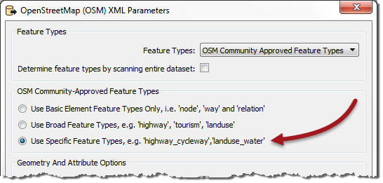
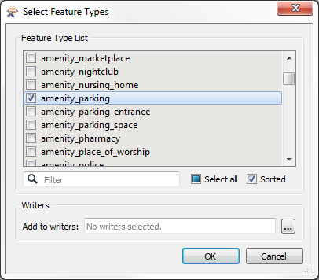
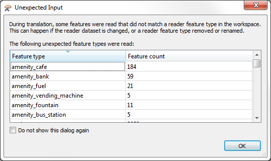
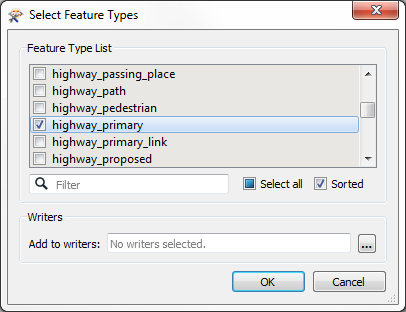
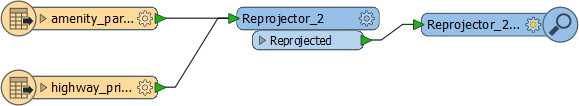
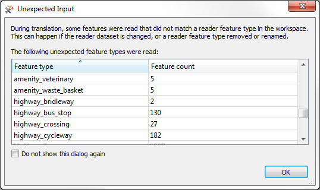

<!--Exercise Section-->
<!--NB: In GitBook world we don't give a number to exercises-->

<table style="border-spacing: 0px;border-collapse: collapse;font-family:serif">
<tr>
<td width=25% style="vertical-align:middle;background-color:darkorange;border: 2px solid darkorange">
<i class="fa fa-cogs fa-lg fa-pull-left fa-fw" style="color:white;padding-right: 12px;vertical-align:text-top"></i>
Exercise
</td>
<td style="border: 2px solid darkorange;background-color:darkorange;color:white">
Unexpected Input
</td>
</tr>

<tr>
<td style="border: 1px solid darkorange; font-weight: bold">Data</td>
<td style="border: 1px solid darkorange">City Parks (MapInfo TAB) Walking Trail (CSV) Water Fountains (File Geodatabase) Car Parking (OpenStreetMap) Roads (OpenStreetMap)</td>
</tr>

<tr>
<td style="border: 1px solid darkorange; font-weight: bold">Overall Goal</td>
<td style="border: 1px solid darkorange">Create a set of data for mapping a recreational event</td>
</tr>

<tr>
<td style="border: 1px solid darkorange; font-weight: bold">Demonstrates</td>
<td style="border: 1px solid darkorange">Handling Unexpected Input</td>
</tr>

<tr>
<td style="border: 1px solid darkorange; font-weight: bold">Start Workspace</td>
<td style="border: 1px solid darkorange">C:\FMEData2016\Workspaces\DesktopBasic\Components-Ex4-Begin.fmw</td>
</tr>

<tr>
<td style="border: 1px solid darkorange; font-weight: bold">End Workspace</td>
<td style="border: 1px solid darkorange">C:\FMEData2016\Workspaces\DesktopBasic\Components-Ex4-Complete.fmw</td>
</tr>

</table>

Let's continue your work on the fundraising walk project.

In case you forgot, the city is hosting a fundraising walk for a major charity and you have been tasked with using FME to put together the data that will form the event map.  

In this part of the project we’ll add some OpenStreetMap format data to the workspace.

 **1) Start Workbench**
 Start Workbench (if necessary) and open the workspace from Exercise 3. Alternatively you can open C:\FMEData2016\Workspaces\DesktopBasic\Components-Ex4-Begin.fmw

 **2) Add Reader**
 Let's add some more data. This time we'll add the car parking. Select Readers > Add Reader and choose the following data:

<table style="border: 0px">

<tr>
<td style="font-weight: bold">Reader Format</td>
<td style="">OpenStreetMap (OSM) XML</td>
</tr>

<tr>
<td style="font-weight: bold">Reader Dataset</td>
<td style="">C:\FMEData2016\Data\OpenStreetMap\amenity.osm</td>
</tr>

<tr>
<td style="font-weight: bold">Reader Parameters</td>
<td style="">Feature Types: Use Specific Features</td>
</tr>

</table>

The parameter is important because it specifies what feature types we will be presented with:

If we go with the Broad feature types, we will be presented with a broad set of layers and car parks will be hidden inside Amenities. If we go with Specific feature types we can select only car parks by themselves.

So, click OK to close this dialog and OK to add the Reader. When prompted, deselect all feature types and leave only amenity_parking selected:

 **3) Add Reprojector**
 Like the trail data, OSM is in a Latitude/Longitude coordinate system, and not the same UTM system as used by the parks data. So add a second Reprojector to the workspace to reproject the amenity_parking feature type from LL84 to UTM83-10

 **4) Run Workspace**
 Add an Inspector transformer to visualize the car park data and run the workspace. The data appears to be read correctly, but we get a pop-up dialog like so:

In fact, the log window also reports this information:

> *During translation, some features were read that did not match a reader feature type in the workspace.  This can happen if the reader dataset is changed, or a reader feature type removed or renamed.*

OK. Well let's add some more data and see if the same thing happens.

 **5) Add Reader**
 Now add another Reader. Select Readers > Add Reader and choose the following data:

<table style="border: 0px">

<tr>
<td style="font-weight: bold">Reader Format</td>
<td style="">OpenStreetMap (OSM) XML</td>
</tr>

<tr>
<td style="font-weight: bold">Reader Dataset</td>
<td style="">C:\FMEData2016\Data\OpenStreetMap\highway.osm</td>
</tr>

<tr>
<td style="font-weight: bold">Reader Parameters</td>
<td style="">Feature Types: Use Specific Features</td>
</tr>

</table>

Our initial specification said only major roads are required so, when prompted, deselect all feature types and leave only highway_primary selected:

---

<!--Person X Says Section-->

<table style="border-spacing: 0px">
<tr>
<td style="vertical-align:middle;background-color:darkorange;border: 2px solid darkorange">
<i class="fa fa-quote-left fa-lg fa-pull-left fa-fw" style="color:white;padding-right: 12px;vertical-align:text-top"></i>
Dr Workbench says...
</td>
</tr>

<tr>
<td style="border: 1px solid darkorange">

If you've taken your smart pills today, you'll be thinking that we could use the same OSM Reader to read both datasets. That's true. Well done you. But we'll stick to separate Readers just to make this exercise simpler.

</td>
</tr>
</table>

---

 **6) Connect to Reprojector**
 Like some other datasets, this data is in Latitude/Longitude. Connect it to the same Reprojector that the car park data is connected to:

 **7) Run Workspace**
 Run the workspace once more. Once more that output appears correct, but that dialog pops-up again. This time it includes an even longer list of features:

What on earth can be going on? We'll find out shortly...

---

<!--Exercise Congratulations Section--> 

<table style="border-spacing: 0px">
<tr>
<td style="vertical-align:middle;background-color:darkorange;border: 2px solid darkorange">
<i class="fa fa-thumbs-o-up fa-lg fa-pull-left fa-fw" style="color:white;padding-right: 12px;vertical-align:text-top"></i>
CONGRATULATIONS
</td>
</tr>

<tr>
<td style="border: 1px solid darkorange">

By completing this exercise you have learned how to:
 
<ul><li>Delete feature types from a workspace</li>
<li>Handle the options when the final feature type in a Reader is deleted</li>
<li>Import a feature type from a dataset into a Reader in the workspace</li>
<li>Use the Clipper transformer to clip data</li></ul>

</td>
</tr>
</table>