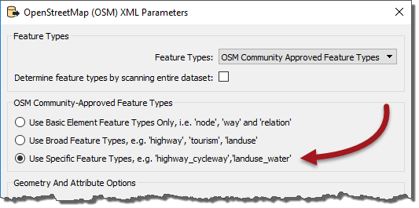
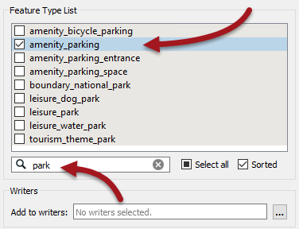
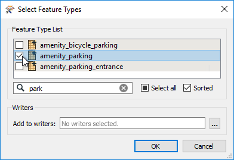
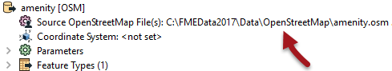
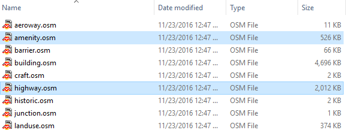
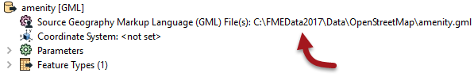
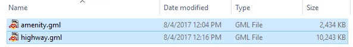
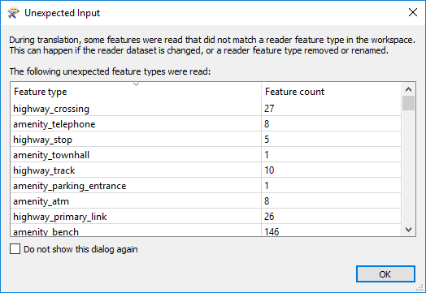

<!--Exercise Section-->

<table style="border-spacing: 0px;border-collapse: collapse;font-family:serif">
<tr>
<td width=25% style="vertical-align:middle;background-color:darkorange;border: 2px solid darkorange">
<i class="fa fa-cogs fa-lg fa-pull-left fa-fw" style="color:white;padding-right: 12px;vertical-align:text-top"></i>
Exercise 4
</td>
<td style="border: 2px solid darkorange;background-color:darkorange;color:white">
Unexpected Input
</td>
</tr>

<tr>
<td style="border: 1px solid darkorange; font-weight: bold">Data</td>
<td style="border: 1px solid darkorange">City Parks (MapInfo TAB) Walking Trail (CSV) Water Fountains (File Geodatabase) Car Parking (OpenStreetMap) Roads (OpenStreetMap)</td>
</tr>

<tr>
<td style="border: 1px solid darkorange; font-weight: bold">Overall Goal</td>
<td style="border: 1px solid darkorange">Create a set of data for mapping a recreational event</td>
</tr>

<tr>
<td style="border: 1px solid darkorange; font-weight: bold">Demonstrates</td>
<td style="border: 1px solid darkorange">Handling Unexpected Input</td>
</tr>

<tr>
<td style="border: 1px solid darkorange; font-weight: bold">Start Workspace</td>
<td style="border: 1px solid darkorange">C:\FMEData2018\Workspaces\DesktopBasic\Components-Ex4-Begin.fmw</td>
</tr>

<tr>
<td style="border: 1px solid darkorange; font-weight: bold">End Workspace</td>
<td style="border: 1px solid darkorange">C:\FMEData2018\Workspaces\DesktopBasic\Components-Ex4-Complete.fmw C:\FMEData2018\Workspaces\DesktopBasic\Components-Ex4-Complete.1.fmw</td>
</tr>

</table>

Let's continue your work on the fundraising walk project.

In this part of the project we’ll add some OpenStreetMap format data to the workspace.

 **1) Start Workbench**
 Start Workbench (if necessary) and open the workspace from Exercise 3. Alternatively you can open C:\FMEData2018\Workspaces\DesktopBasic\Components-Ex4-Begin.fmw

 **2) Add Reader**
 Let's add some more data. This time we'll add the car parking. 

---

<!--Updated Section--> 

<table style="border-spacing: 0px">
<tr>
<td style="vertical-align:middle;background-color:darkorange;border: 2px solid darkorange">
<i class="fa fa-bolt fa-lg fa-pull-left fa-fw" style="color:white;padding-right: 12px;vertical-align:text-top"></i>
.1 UPDATE
</td>
</tr>

<tr>
<td style="border: 1px solid darkorange">

The OpenStreetMap reader has changed significantly in FME2017.1. Therefore the next step has two sets of instructions; one for 2017.0 (using OpenStreetMap) and the other for 2017.1 (using GML).

</td>
</tr>
</table>

---

In **FME2017.0**, Select Readers > Add Reader and choose the following data:

<table style="border: 0px">

<tr>
<td style="font-weight: bold">Reader Format</td>
<td style="">OpenStreetMap (OSM) XML</td>
</tr>

<tr>
<td style="font-weight: bold">Reader Dataset</td>
<td style="">C:\FMEData2018\Data\OpenStreetMap\amenity.osm</td>
</tr>

<tr>
<td style="font-weight: bold">Reader Parameters</td>
<td style="">Feature Types: Use Specific Features</td>
</tr>

</table>

The parameter is important because it specifies what feature types we will be presented with:

If we go with the Broad feature types, we will be presented with a broad set of layers and car parks will be hidden inside Amenities. If we go with Specific feature types we can select only car parks by themselves.

So, click OK to close this dialog and OK to add the reader. When prompted, deselect all feature types and leave only amenity_parking selected:

---

<!--Tip Section--> 

<table style="border-spacing: 0px">
<tr>
<td style="vertical-align:middle;background-color:darkorange;border: 2px solid darkorange">
<i class="fa fa-info-circle fa-lg fa-pull-left fa-fw" style="color:white;padding-right: 12px;vertical-align:text-top"></i>
TIP
</td>
</tr>

<tr>
<td style="border: 1px solid darkorange">

There are a lot of different amenity feature types in this dialog so using the Filter setting (as above) is useful.

</td>
</tr>
</table>

---

In **FME2017.1**, Select Readers > Add Reader and choose the following data:

<table style="border: 0px">
<tr>
<td style="font-weight: bold">Reader Format</td>
<td style="">GML (Geography Markup Language)</td>
</tr>

<tr>
<td style="font-weight: bold">Reader Dataset</td>
<td style="">C:\FMEData2018\Data\OpenStreetMap\amenity.gml</td>
</tr>
</table>

Click OK to close the dialog and when prompted browse through the features list and pick out amenity_parking:

Click OK to close this dialog and add the reader.

---

<!--Tip Section--> 

<table style="border-spacing: 0px">
<tr>
<td style="vertical-align:middle;background-color:darkorange;border: 2px solid darkorange">
<i class="fa fa-info-circle fa-lg fa-pull-left fa-fw" style="color:white;padding-right: 12px;vertical-align:text-top"></i>
TIP
</td>
</tr>

<tr>
<td style="border: 1px solid darkorange">

Why GML? It's not that the OSM reader no longer works in 2017.1, it just doesn't work in the best way needed to demonstrate unexpected input.
</td>
</tr>
</table>

---

 **3) Connect to Reprojector**
 As with all the other data, connect the new amenity_parking feature type to the Reprojector transformer. If you inspect this source data you'll see that it is automatically tagged as LL84, so we don't need to define that manually.

 **4) Update Reader**
 We also need some data from a different dataset (again this differs for 2017.0 and 2017.1)

---

In **2017.0** we need to also read an OpenStreetMap dataset called highway.osm

We could add another reader, but we already have an OSM reader so why not use that? Locate the OSM reader in the Navigator window and double-click on the Source OpenStreetMap File(s) parameter:

In the dialog that opens, click the browse button. Now select both the amenity and highway osm files; we're resetting this parameter so if you don't select the amenity file as well it will be dropped.

---

In **2017.1** we will read a GML dataset called highway.gml

As with OSM, we could add another reader, but we already have a GML reader so why not use that? Locate the GML reader in the Navigator window and double-click on the Source Geography Markup Language (GML) File(s) parameter:

In the dialog that opens, click the browse button. Now select both the amenity and highway GML files; we're resetting this parameter so if you don't select the amenity file as well it will be dropped.

 **5) Run Workspace**
 Re-run the workspace. The data appears to be read correctly, but we get a pop-up dialog like so:

In fact, the log window also reports this information:

> *During translation, some features were read that did not match a reader feature type in the workspace.  This can happen if the reader dataset is changed, or a reader feature type removed or renamed.*

This is worrying. A lot of these aren't layers we wanted to read, but we did want to read some highways data and this is also appearing in the list of "unexpected input".

What on earth can be going on? We'll find out shortly...

---

<!--Exercise Congratulations Section--> 

<table style="border-spacing: 0px">
<tr>
<td style="vertical-align:middle;background-color:darkorange;border: 2px solid darkorange">
<i class="fa fa-thumbs-o-up fa-lg fa-pull-left fa-fw" style="color:white;padding-right: 12px;vertical-align:text-top"></i>
CONGRATULATIONS
</td>
</tr>

<tr>
<td style="border: 1px solid darkorange">

By completing this exercise you have learned how to:
 
<ul><li>Update a reader's source dataset parameter</li>
<li>Select multiple files in a reader's source dataset parameter</li>
<li>Detect what feature types are Unexpected Input</li></ul>

</td>
</tr>
</table>