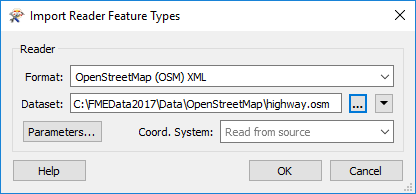
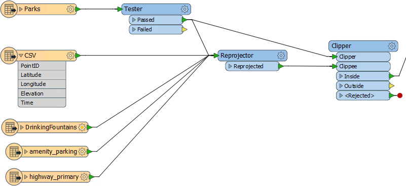
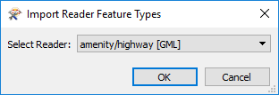
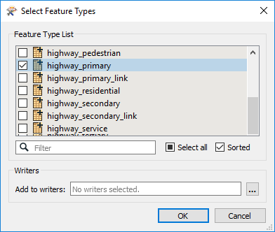
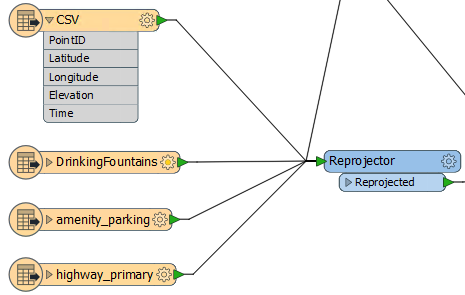
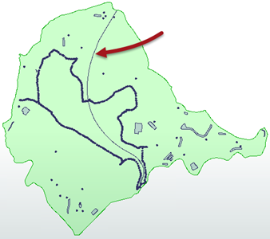
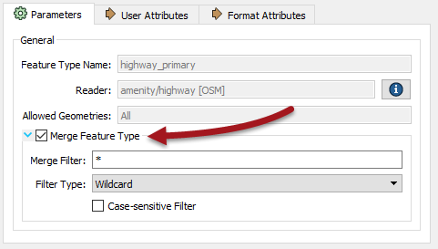
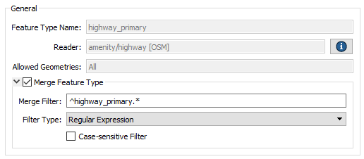
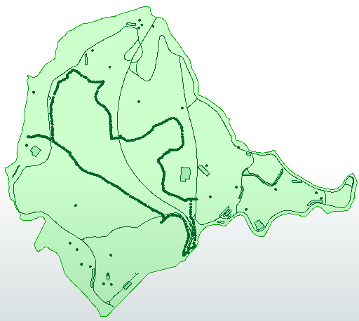

<!--Exercise Section-->

<table style="border-spacing: 0px;border-collapse: collapse;font-family:serif">
<tr>
<td width=25% style="vertical-align:middle;background-color:darkorange;border: 2px solid darkorange">
<i class="fa fa-cogs fa-lg fa-pull-left fa-fw" style="color:white;padding-right: 12px;vertical-align:text-top"></i>
Exercise 5
</td>
<td style="border: 2px solid darkorange;background-color:darkorange;color:white">
Dealing with Unexpected Input
</td>
</tr>

<tr>
<td style="border: 1px solid darkorange; font-weight: bold">Data</td>
<td style="border: 1px solid darkorange">City Parks (MapInfo TAB) Walking Trail (CSV) Water Fountains (File Geodatabase) Car Parking (OpenStreetMap) Roads (OpenStreetMap)</td>
</tr>

<tr>
<td style="border: 1px solid darkorange; font-weight: bold">Overall Goal</td>
<td style="border: 1px solid darkorange">Create a set of data for mapping a recreational event</td>
</tr>

<tr>
<td style="border: 1px solid darkorange; font-weight: bold">Demonstrates</td>
<td style="border: 1px solid darkorange">Handling Unexpected Input</td>
</tr>

<tr>
<td style="border: 1px solid darkorange; font-weight: bold">Start Workspace</td>
<td style="border: 1px solid darkorange">C:\FMEData2017\Workspaces\DesktopBasic\Components-Ex5-Begin.fmw C:\FMEData2017\Workspaces\DesktopBasic\Components-Ex5-Begin.1.fmw</td>
</tr>

<tr>
<td style="border: 1px solid darkorange; font-weight: bold">End Workspace</td>
<td style="border: 1px solid darkorange">C:\FMEData2017\Workspaces\DesktopBasic\Components-Ex5-Complete.fmw C:\FMEData2017\Workspaces\DesktopBasic\Components-Ex5-Complete.1.fmw</td>
</tr>

</table>

Let's continue your work on the fundraising walk project.

In this part of the project we’ll look at whether the Unexpected Input warnings we received are something we need to be concerned about.

 **1) Start Workbench**
 Start Workbench (if necessary) and open the workspace from Exercise 4. Alternatively you can open C:\FMEData2017\Workspaces\DesktopBasic\Components-Ex5-Begin.fmw (for 2017.0) or C:\FMEData2017\Workspaces\DesktopBasic\Components-Ex5-Begin.1.fmw (for 2017.1).

Run the workspace (if you haven't before) to remind yourself of the warning dialog that pops up.

 **2) Import Feature Types**
 For the amenities dataset, car parks are the only feature type we require. We do not need - for example - either hospitals or schools to appear in our data. Therefore the reports of amenities data as unexpected input can be safely ignored.

The problem with highways is that we do need them. But there are no feature types on the canvas for highway features. That's why highways are unexpected input and that is why they are getting dropped.

The solution is to add a feature type for highways. 

---

In **FME2017.0** choose Readers > Import Feature Types from the menubar. When prompted, choose to import them to the amenity/highway [OSM] reader:

Click OK and you will be prompted for the dataset to import these feature types from. We have all the amenity types we need, so you don't need to select that; just select the highway.osm file:

Our initial specification said only major roads are required so, when prompted, deselect all feature types and leave only highway_primary selected:

As with all other datasets, connect this feature type to the Reprojector transformer:

---

In **FME2017.1** choose Readers > Import Feature Types from the menubar. When prompted, choose to import them to the amenity/highway [GML] reader:

Click OK and you will be prompted for the dataset to import these feature types from. We have all the amenity types we need, so you don't need to select that; just select the highway.gml file:

Our initial specification said only major roads are required so, when prompted, deselect all feature types and leave only highway_primary selected:

As with all other datasets, connect this feature type to the Reprojector transformer:

 **3) Run Workspace**
 Run the workspace once more. This time there will still be unexpected input, but it will not include highways_primary; these will make it to the output dataset:

This is all good, except... I can only see a single road feature on the map. Other roads must be in a different feature type. In fact, if I inspect the source data (you can too if you like) I see that the two feature types I need are called *highway&#95;primary&#95;link* and *highway&#95;unclassified* - both of which are reported as unexpected input.

So that is something that we need to fix.

 **4) Fix Unclassified Roads**
 Let's fix the unclassified roads first. Again, if a required source feature type is missing from the workspace, the simplest method is to add it. 

So once more (as in step 2) select Readers > Import Feature Type from the menubar, and go through the import process, this time importing the *highway_unclassified* layer from either highways.osm (2017.0) or highways.gml (2017.1). 

Again connect it to the Reprojector transformer.

 **5) Fix Primary Links**
 Now let's fix the primary links (these are short roads that connect the primary roads to the unclassified roads). We could use the same import tool to add a feature type, but let's try a different way.

***NB:*** *The images in this step are for OSM data in 2017.0, but the same method applies to GML dataset in 2017.1*

View the properties for the *highway&#95;primary* feature type. You will see a section of the General tab is labelled Merge Feature Types. Click in the Merge Feature Type toggle setting to turn it on:

By default the merge filter is set to allow everything in. This is a great way to read all of the data from a single dataset into a single feature type. But it's certainly not suitable here because it will allow FME to read ALL road features (even ones we don't want) plus it will allow in all of the amenity features that we've already decided aren't required.

So we have to be more subtle. In the Merge Filter settings, change the filter type to be a Regular Expression. Change the merge filter to be:

<pre>
^highway_primary.*
</pre>  

Basically, this will allow feature types to pass only if they begin with "highway_primary". The result should be as follows:

Hurrah! We now have the data we want entering the workspace. Any other reports of Unexpected Input can now be ignored. We have completed the reading part of this project and the feature counts should now look like this:

---

<!--Exercise Congratulations Section--> 

<table style="border-spacing: 0px">
<tr>
<td style="vertical-align:middle;background-color:darkorange;border: 2px solid darkorange">
<i class="fa fa-thumbs-o-up fa-lg fa-pull-left fa-fw" style="color:white;padding-right: 12px;vertical-align:text-top"></i>
CONGRATULATIONS
</td>
</tr>

<tr>
<td style="border: 1px solid darkorange">

By completing this exercise you have learned how to:
 
<ul><li>Identify when unexpected input is (and isn't) a problem</li>
<li>Handle unexpected input by using the Import Feature Type tool</li>
<li>Handle unexpected input by using the Merge Feature Type tool</li>
<li>Use a regular expression in the Merge Feature Type tool</li></ul>

</td>
</tr>
</table>