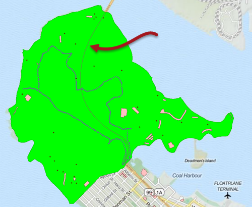
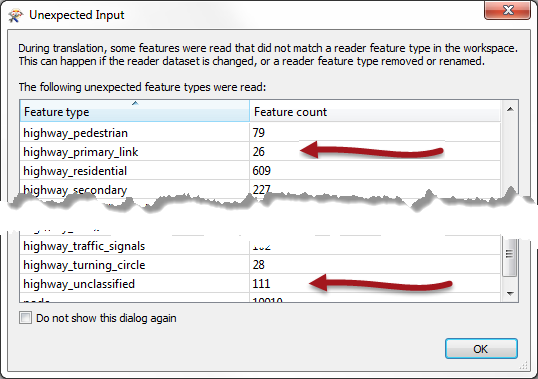
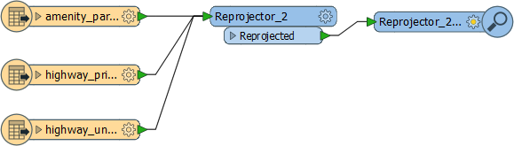
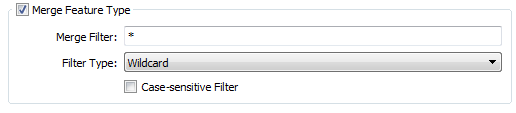
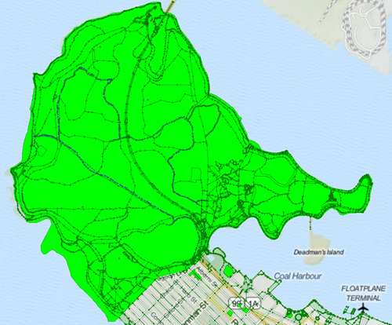
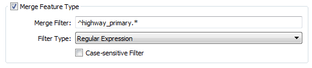
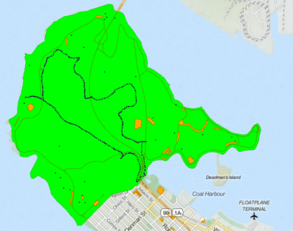
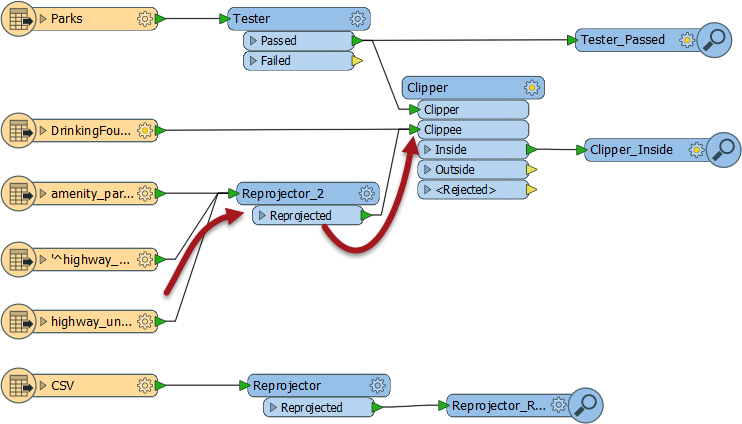

<!--Exercise Section-->
<!--NB: In GitBook world we don't give a number to exercises-->

<table style="border-spacing: 0px;border-collapse: collapse;font-family:serif">
<tr>
<td style="vertical-align:middle;background-color:darkorange;border: 2px solid darkorange">
<i class="fa fa-cogs fa-lg fa-pull-left fa-fw" style="color:white;padding-right: 12px;vertical-align:text-top"></i>
Exercise
</td>
<td style="border: 2px solid darkorange;background-color:darkorange;color:white">
Dealing with Unexpected Input
</td>
</tr>

<tr>
<td style="border: 1px solid darkorange; font-weight: bold">Data</td>
<td style="border: 1px solid darkorange">City Parks (MapInfo TAB) Walking Trail (CSV) Water Fountains (File Geodatabase) Car Parking (OpenStreetMap) Roads (OpenStreetMap)</td>
</tr>

<tr>
<td style="border: 1px solid darkorange; font-weight: bold">Overall Goal</td>
<td style="border: 1px solid darkorange">Create a set of data for mapping a recreational event</td>
</tr>

<tr>
<td style="border: 1px solid darkorange; font-weight: bold">Demonstrates</td>
<td style="border: 1px solid darkorange">Handling Unexpected Input</td>
</tr>

<tr>
<td style="border: 1px solid darkorange; font-weight: bold">Start Workspace</td>
<td style="border: 1px solid darkorange">C:\FMEData2016\Workspaces\DesktopBasic\Components-Ex5-Begin.fmw</td>
</tr>

<tr>
<td style="border: 1px solid darkorange; font-weight: bold">End Workspace</td>
<td style="border: 1px solid darkorange">C:\FMEData2016\Workspaces\DesktopBasic\Components-Ex5-Complete.fmw</td>
</tr>

</table>

Let's continue your work on the fundraising walk project.

In case you forgot, the city is hosting a fundraising walk for a major charity and you have been tasked with using FME to put together the data that will form the event map.  

In this part of the project we’ll look at whether the Unexpected Input warnings we received are something we need to be concerned about.

 **1) Start Workbench**
 Start Workbench (if necessary) and open the workspace from Exercise 4. Alternatively you can open C:\FMEData2016\Workspaces\DesktopBasic\Components-Ex5-Begin.fmw

 **2) Run Workspace**
 Run the workspace (if you haven't before) to remind yourself of the warning dialog that pops up.

 **3) Consider Amenities Data**
 Let's look at the amenities dataset. We are reading that to get a set of car parks into the workspace. The car parks are the only feature type we require. We do not need - for example - either hospitals or schools to appear in our data.

Therefore the unexpected input dialog can be safely ignored. The warnings about missing feature types applies only to layers of data that we do not need.

 **4) Consider Roads Data**
 Like the amenities, the only feature type we wanted to read from the highways dataset was for highway_primary. Other feature types we can safely ignore. Except.....

...I can only see a single road feature on the map. There are no roads marked to show us how to get to the car parks. These must be in a different feature type. In fact, if I inspect the source data (you can too if you like) I see that the two feature types I need are called *highway_primary_link* and *highway_unclassified* - both of which are reported as unexpected input:

So there the Unexpected Input dialog is telling us something useful that we need to fix.

 **5) Fix Unclassified Roads**
 Let's fix the unclassified roads first. As mentioned, if a required source feature type is missing from the workspace, the simplest method is to add it. We can do that with the Import Feature Type tool.

So, select Readers > Import Feature Type from the menubar. When prompted, select the Highways Reader to add it to, then define the highways dataset to read it from:

<table style="border: 0px">

<tr>
<td style="font-weight: bold">Reader Format</td>
<td style="">OpenStreetMap (OSM) XML</td>
</tr>

<tr>
<td style="font-weight: bold">Reader Dataset</td>
<td style="">C:\FMEData2016\Data\OpenStreetMap\highway.osm</td>
</tr>

<tr>
<td style="font-weight: bold">Reader Parameters</td>
<td style="">Feature Types: Use Specific Features</td>
</tr>

</table>

Finally, when prompted, deselect all feature types in the dataset except for *highway_unclassified*. The feature type will be added and can be connected like so:

 **5) Fix Primary Links**
 Now let's fix the primary links (these are short roads that connect the primary roads to the unclassified roads). We could use the same import tool to add a feature type, but let's try a different way.

Click on the cogwheel button to open the properties dialog for the *highway_primary* feature type. You will see a section of the General tab is labelled Merge Feature Types.

Click in the Merge Feature Type toggle setting to turn it on:

OK. By default the merge filter is set to allow everything in. This is a great way to read all of the data from a single dataset into a single feature type. If you run the workspace now you will see that we read ALL of the data from the roads dataset (except for Unclassified roads, which have their own feature type).

This is clearly not what we need (although notice that no highway features now appear in the unexpected input dialog), so we have to be more subtle. In the Merge Filter settings, change the filter type to be a Regular Expression. Change the merge filter to be:

<pre>^highway_primary.*</pre>  

Basically, this will allow feature types to pass only if they begin with "highway_primary". The result should be as follows:

Hurrah! We now have the data we want entering the workspace. Any other reports of Unexpected Input can now be ignored.

 **6) Connect to Clipper**
 You might have noticed that the OSM data covers the entire city whereas, once more, we only want that which covers the park the event is taking place in. So connect the Reproject:Reprojected port to the existing Clipper:Clippee port:

Run the workspace to prove that the output is correct. We have now completed the reading part of this project!

---

<!--Exercise Congratulations Section--> 

<table style="border-spacing: 0px">
<tr>
<td style="vertical-align:middle;background-color:darkorange;border: 2px solid darkorange">
<i class="fa fa-thumbs-o-up fa-lg fa-pull-left fa-fw" style="color:white;padding-right: 12px;vertical-align:text-top"></i>
CONGRATULATIONS
</td>
</tr>

<tr>
<td style="border: 1px solid darkorange">

By completing this exercise you have learned how to:
  <li>Identify when unexpected input is (and isn't) a problem
 <li>Handle unexpected input by using the Import Feature Type tool
 <li>Handle unexpected input by using the Merge Feature Type tool
 <li>Use a regular expression in the Merge Feature Type tool

</td>
</tr>
</table>