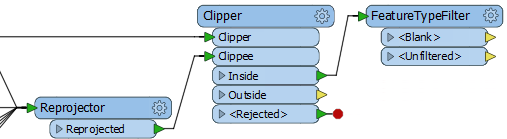
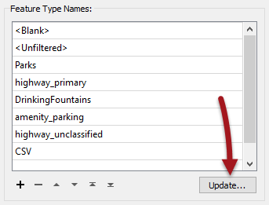
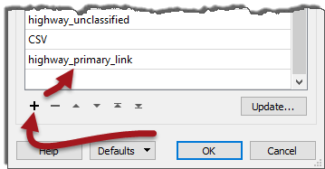
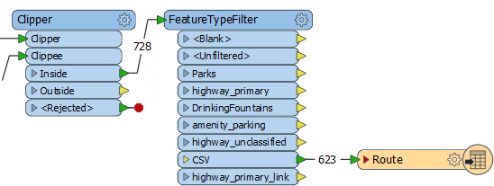
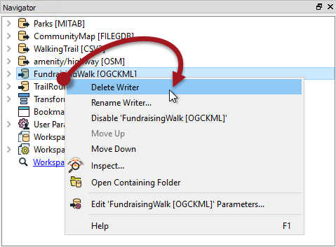

<!--Exercise Section-->

<table style="border-spacing: 0px;border-collapse: collapse;font-family:serif">
<tr>
<td width=25% style="vertical-align:middle;background-color:darkorange;border: 2px solid darkorange">
<i class="fa fa-cogs fa-lg fa-pull-left fa-fw" style="color:white;padding-right: 12px;vertical-align:text-top"></i>
Exercise 6
</td>
<td style="border: 2px solid darkorange;background-color:darkorange;color:white">
Adding Writers
</td>
</tr>

<tr>
<td style="border: 1px solid darkorange; font-weight: bold">Data</td>
<td style="border: 1px solid darkorange">City Parks (MapInfo TAB) Walking Trail (CSV) Water Fountains (File Geodatabase) Car Parking (OpenStreetMap) Roads (OpenStreetMap)</td>
</tr>

<tr>
<td style="border: 1px solid darkorange; font-weight: bold">Overall Goal</td>
<td style="border: 1px solid darkorange">Create a set of data for mapping a recreational event</td>
</tr>

<tr>
<td style="border: 1px solid darkorange; font-weight: bold">Demonstrates</td>
<td style="border: 1px solid darkorange">Adding Writers</td>
</tr>

<tr>
<td style="border: 1px solid darkorange; font-weight: bold">Start Workspace</td>
<td style="border: 1px solid darkorange">C:\FMEData2017\Workspaces\DesktopBasic\Components-Ex6-Begin.fmw C:\FMEData2017\Workspaces\DesktopBasic\Components-Ex6-Begin.1.fmw</td>
</tr>

<tr>
<td style="border: 1px solid darkorange; font-weight: bold">End Workspace</td>
<td style="border: 1px solid darkorange">C:\FMEData2017\Workspaces\DesktopBasic\Components-Ex6-Complete.fmw C:\FMEData2017\Workspaces\DesktopBasic\Components-Ex6-Complete.1.fmw</td>
</tr>

</table>

Let's continue your work on the fundraising walk project. In this part of the project we’ll start concentrating on the output requirements.

 **1) Start Workbench**
 Start Workbench (if necessary) and open the workspace from Exercise 5. Alternatively you can open C:\FMEData2017\Workspaces\DesktopBasic\Components-Ex6-Begin.fmw (for 2017.0) or C:\FMEData2017\Workspaces\DesktopBasic\Components-Ex6-Begin.1.fmw (for 2017.1).

 **2) Add Writer**
 One of the output requirements is a GPX dataset of the walk route. So select Writers > Add Writer from the menubar and then enter these parameters:

<table style="border: 0px">

<tr>
<td style="font-weight: bold">Writer Format</td>
<td style="">GPS eXchange Format (GPX)</td>
</tr>

<tr>
<td style="font-weight: bold">Writer Dataset</td>
<td style="">C:\FMEData2017\Output\Training\TrailRoute.gpx</td>
</tr>

</table>

Click OK to add the Writer.

This format is what we call Fixed Schema. It means the feature types are predefined by the format specification and we shouldn't try to change them. In this case we get six output feature types:

A route is a route to be followed, a track is a route that has been taken. 

 **3) Add FeatureTypeFilter**
 One issue about our workspace is that we merged all our data together through the Reprojector and Clipper transformers. It helped keep the workspace tidier, but now it's necessary to divide the data again if we want to write it onto separate layers. 

We can do this with a FeatureTypeFilter transformer.

So, add a FeatureTypeFilter transformer and connect it to the Clipper:Inside output port:

Now view the transformer's parameters and click the Update button:

This fetches all the source feature type names in order to filter the data. However, it cannot identify merged feature types, so click the + button and manually add *highway&#95;primary&#95;link*:
 

Now we can map the trail data to the correct feature type.

 **4) Connect Schema**
 Simply connect the FeatureTypeFilter:CSV output port to the Route feature type:

 **5) Run Workspace**
 Now run the workspace and examine the GPX output in the FME Data Inspector to ensure it is correct.

 **6) Delete Writer**
 Another phone call leads to another change. The organizers have decided not to write the main dataset to KML. They will let you know later which format to use. For now simply locate the Google KML Writer in the Navigator window, right-click on it, and choose the option to Delete Writer:

---

<!--Exercise Congratulations Section--> 

<table style="border-spacing: 0px">
<tr>
<td style="vertical-align:middle;background-color:darkorange;border: 2px solid darkorange">
<i class="fa fa-thumbs-o-up fa-lg fa-pull-left fa-fw" style="color:white;padding-right: 12px;vertical-align:text-top"></i>
CONGRATULATIONS
</td>
</tr>

<tr>
<td style="border: 1px solid darkorange">

By completing this exercise you have learned how to:
 
<ul><li>Add writers to a workspace</li>
<li>Handle a fixed-schema writer</li>
<li>Use the FeatureTypeFilter transformer to split data by reader feature type</li>
<li>Delete a writer from a workspace</li></ul>

</td>
</tr>
</table>
   