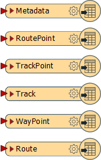
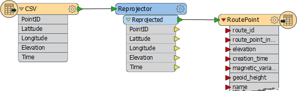
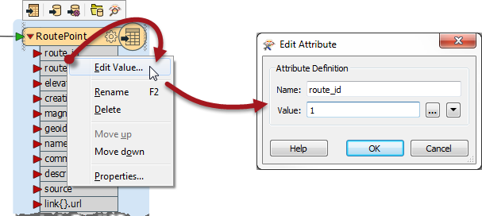
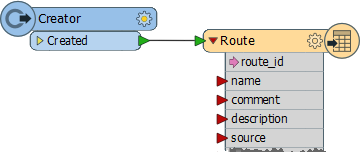
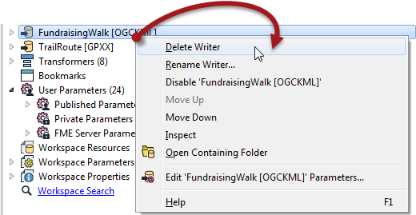

<!--Exercise Section-->
<!--NB: In GitBook world we don't give a number to exercises-->

<table style="border-spacing: 0px;border-collapse: collapse;font-family:serif">
<tr>
<td width=25% style="vertical-align:middle;background-color:darkorange;border: 2px solid darkorange">
<i class="fa fa-cogs fa-lg fa-pull-left fa-fw" style="color:white;padding-right: 12px;vertical-align:text-top"></i>
Exercise
</td>
<td style="border: 2px solid darkorange;background-color:darkorange;color:white">
Adding Writers
</td>
</tr>

<tr>
<td style="border: 1px solid darkorange; font-weight: bold">Data</td>
<td style="border: 1px solid darkorange">City Parks (MapInfo TAB) Walking Trail (CSV) Water Fountains (File Geodatabase) Car Parking (OpenStreetMap) Roads (OpenStreetMap)</td>
</tr>

<tr>
<td style="border: 1px solid darkorange; font-weight: bold">Overall Goal</td>
<td style="border: 1px solid darkorange">Create a set of data for mapping a recreational event</td>
</tr>

<tr>
<td style="border: 1px solid darkorange; font-weight: bold">Demonstrates</td>
<td style="border: 1px solid darkorange">Adding Writers</td>
</tr>

<tr>
<td style="border: 1px solid darkorange; font-weight: bold">Start Workspace</td>
<td style="border: 1px solid darkorange">C:\FMEData2016\Workspaces\DesktopBasic\Components-Ex6-Begin.fmw</td>
</tr>

<tr>
<td style="border: 1px solid darkorange; font-weight: bold">End Workspace</td>
<td style="border: 1px solid darkorange">C:\FMEData2016\Workspaces\DesktopBasic\Components-Ex6-Complete.fmw</td>
</tr>

</table>

Let's continue your work on the fundraising walk project.

In this part of the project we’ll start concentrating on the output requirements.

 **1) Start Workbench**
 Start Workbench (if necessary) and open the workspace from Exercise 5. Alternatively you can open C:\FMEData2016\Workspaces\DesktopBasic\Components-Ex6-Begin.fmw

 **2) Add Writer**
 One of the output requirements is a GPX dataset of the walk route. So select Writers > Add Writer from the menubar and then enter these parameters:

<table style="border: 0px">

<tr>
<td style="font-weight: bold">Writer Format</td>
<td style="">GPS eXchange Format (GPX)</td>
</tr>

<tr>
<td style="font-weight: bold">Writer Dataset</td>
<td style="">C:\FMEData2016\Output\Training\TrailRoute.gpx</td>
</tr>

</table>

Click OK to add the Writer.

This format is what we call Fixed Schema. It means the feature types are predefined by the format specification and we shouldn't try to change them. In this case we get six output feature types:

A route is a route to be followed, a track is a route that has been taken. 

 **3) Connect Schema**
 When the Writer is fixed schema, and generally when Writers are added separately, some schema mapping is required. The incoming source data is a series of points that specify the route to take, so connect it to the RoutePoint feature type:

We need to set a value for the route_id attribute. The simplest method is to right-click on that attribute, choose Edit Value, and enter a value of 1:

 **4) Create Route Feature**
 We also need to create a single feature (of any geometry) to set as a Route (not RoutePoint) feature. So, place a Creator transformer and connect it to the Route feature type.

Repeat the step above to give this feature type a value for route_id too:

 **5) Run Workspace**
 Now run the workspace and examine the GPX output in the FME Data Inspector to ensure it is correct.

 **6) Delete Writer**
 Another phone call leads to another change. You're now asked to write the data in Adobe PDF instead of Google KML. So locate the Google KML Writer in the Navigator window, right-click on it, and choose the option to Delete Writer:

---

<!--Exercise Congratulations Section--> 

<table style="border-spacing: 0px">
<tr>
<td style="vertical-align:middle;background-color:darkorange;border: 2px solid darkorange">
<i class="fa fa-thumbs-o-up fa-lg fa-pull-left fa-fw" style="color:white;padding-right: 12px;vertical-align:text-top"></i>
CONGRATULATIONS
</td>
</tr>

<tr>
<td style="border: 1px solid darkorange">

By completing this exercise you have learned how to:
 
<ul><li>Add Writers to a workspace</li>
<li>Delete a Writer from a workspace</li>
<li>Handle a fixed-schema Writer</li></ul>

</td>
</tr>
</table>
   