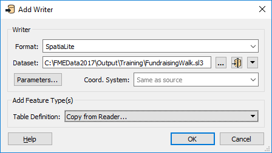
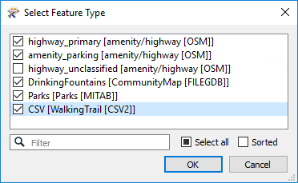
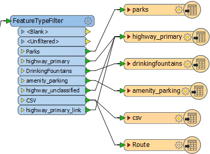
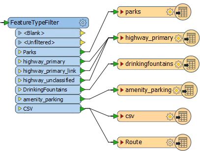
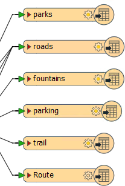
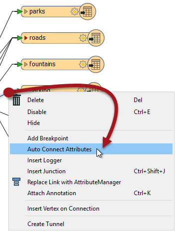
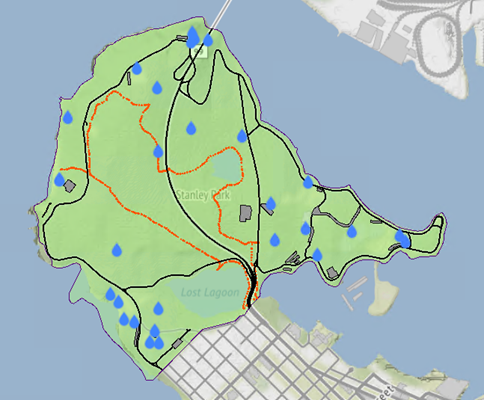

<!--Exercise Section-->

<table style="border-spacing: 0px;border-collapse: collapse;font-family:serif">
<tr>
<td width=25% style="vertical-align:middle;background-color:darkorange;border: 2px solid darkorange">
<i class="fa fa-cogs fa-lg fa-pull-left fa-fw" style="color:white;padding-right: 12px;vertical-align:text-top"></i>
Exercise 7
</td>
<td style="border: 2px solid darkorange;background-color:darkorange;color:white">
Managing Writer Feature Types
</td>
</tr>

<tr>
<td style="border: 1px solid darkorange; font-weight: bold">Data</td>
<td style="border: 1px solid darkorange">City Parks (MapInfo TAB) Walking Trail (CSV) Water Fountains (File Geodatabase) Car Parking (OpenStreetMap) Roads (OpenStreetMap)</td>
</tr>

<tr>
<td style="border: 1px solid darkorange; font-weight: bold">Overall Goal</td>
<td style="border: 1px solid darkorange">Create a set of data for mapping a recreational event</td>
</tr>

<tr>
<td style="border: 1px solid darkorange; font-weight: bold">Demonstrates</td>
<td style="border: 1px solid darkorange">Adding Writer Feature Types</td>
</tr>

<tr>
<td style="border: 1px solid darkorange; font-weight: bold">Start Workspace</td>
<td style="border: 1px solid darkorange">C:\FMEData2017\Workspaces\DesktopBasic\Components-Ex7-Begin.fmw</td>
</tr>

<tr>
<td style="border: 1px solid darkorange; font-weight: bold">End Workspace</td>
<td style="border: 1px solid darkorange">C:\FMEData2017\Workspaces\DesktopBasic\Components-Ex7-Complete.fmw</td>
</tr>

</table>

Let's finish up your work on the fundraising walk project.

In this part of the project we’ll finalize the output requirements.

 **1) Start Workbench**
 Start Workbench (if necessary) and open the workspace from Exercise 6. Alternatively you can open C:\FMEData2017\Workspaces\DesktopBasic\Components-Ex7-Begin.fmw

 **2) Add Writer**
 If you recall, one late change was to change the writer format. The organizers have decided to go with SpatiaLite instead of KML. So add a SpatiaLite Writer with the following parameters:

<table style="border: 0px">

<tr>
<td style="font-weight: bold">Writer Format</td>
<td style="">SpatiaLite</td>
</tr>

<tr>
<td style="font-weight: bold">Writer Dataset</td>
<td style="">C:\FMEData2017\Output\Training\FundraisingWalk.sl3</td>
</tr>

<tr>
<td style="font-weight: bold">Add Feature Type(s)</td>
<td style="">Table Definition: Copy from Reader</td>
</tr>

</table>

Click OK. When prompted select all the following reader feature types to copy onto the writer:

- highway_primary
- amenity_parking
- DrinkingFountains
- Parks
- CSV

This will give a series of Writer feature types. The highway_unclassigied feature type isn't needed because we will write all road features to the same table.

Now all that is to do is do some schema mapping.

 **3) Map Schema**
 Make the following connections:

<table>
<tr><th>FeatureTypeFilter Port</th><th>Writer Feature Type</th></tr>
<tr><td>Parks</td><td>parks</td></tr>
<tr><td>highway_primary</td><td>highway_primary</td></tr>
<tr><td>highway_primary_link</td><td>highway_primary</td></tr>
<tr><td>highway_unclassified</td><td>highway_primary</td></tr>
<tr><td>DrinkingFountains</td><td>drinkingfountains</td></tr>
<tr><td>amenity_parking</td><td>amenity_parking</td></tr>
<tr><td>CSV</td><td>csv</td></tr>
</table>

 **4) Tidy Connections**
 Right now some connections overlap. This isn't a good idea as it makes the workspace harder to interpret. So check the parameters for the FeatureTypeFilter. Use the arrow buttons to move feature types up and down in the list until all connections are separated out:

 **5) Tidy Feature Types**
 One last task is tidy up some of the writer feature types.

Firstly delete all Writer feature types that aren't being used (RoutePoint, TrackPoint, Metadata, WayPoint, Track). You can do this using Tools &gt; Remove &gt; Unattached on the menubar.

Secondly rename all Writer feature types to something more user friendly, for example:

- Rename highway_primary to roads
- Rename amenity_parking to parking
- Rename CSV to trail
- Rename drinkingfountains to fountains

***NB:** All feature type and attribute names in SpatiaLite are lower case.*

Finally let's clean up and connect some of the writer feature type attributes. The simplest way to connect most of them is to right-click a connection and choose Auto Connect Attributes:

This works because most of the attributes have the same name, just a different case, and FME can figure that out automatically. If the attributes have a completely different name, then you would have to connect them manually; or you can just delete from the writer schema any attributes we don't really need.

Re-run the workspace and examine the SpatiaLite output in the FME Data Inspector. It should look like this:

That is the end of this project. The SpatiaLite database can now be passed on to the organziers to produce the actual event map.

---

<!--Advanced Exercise Section-->

<table style="border-spacing: 0px">
<tr>
<td style="vertical-align:middle;background-color:darkorange;border: 2px solid darkorange">
<i class="fa fa-cogs fa-lg fa-pull-left fa-fw" style="color:white;padding-right: 12px;vertical-align:text-top"></i>
Advanced Exercise
</td>
</tr>

<tr>
<td style="border: 1px solid darkorange">

Oh! Now that we dropped the KML output dataset, the Python script we wrote probably won't work! 
  If you have time, and have experience of Python, why not edit the script to support copying the GPX and SpatiaLite output datasets to the "shared" folder?

</td>
</tr>
</table>

---

<!--Exercise Congratulations Section--> 

<table style="border-spacing: 0px">
<tr>
<td style="vertical-align:middle;background-color:darkorange;border: 2px solid darkorange">
<i class="fa fa-thumbs-o-up fa-lg fa-pull-left fa-fw" style="color:white;padding-right: 12px;vertical-align:text-top"></i>
CONGRATULATIONS
</td>
</tr>

<tr>
<td style="border: 1px solid darkorange">

By completing this exercise you have learned how to:
 
<ul><li>Copying reader feature types while adding a new Writer</li>
<li>Untangling overlapping connections by moving transformer ports</li>
<li>Deleting unattached writer feature types</li>
<li>Cleaning up a writer schema by making automatic attribute connections</li></ul>

</td>
</tr>
</table>