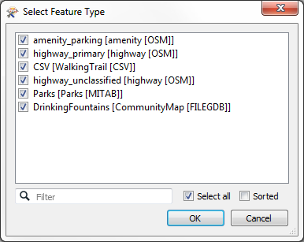
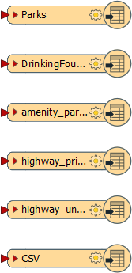
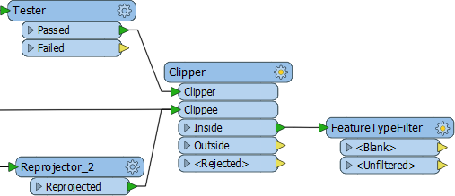
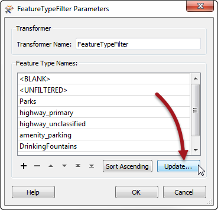
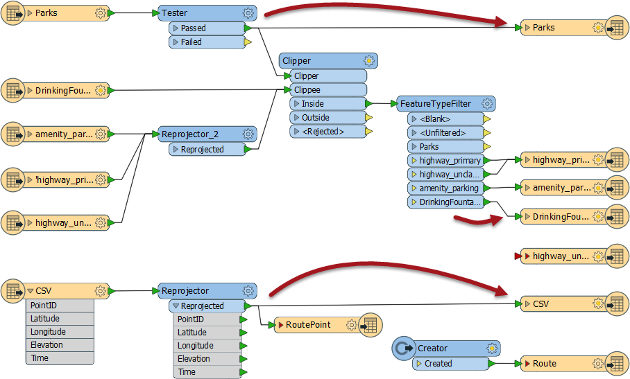
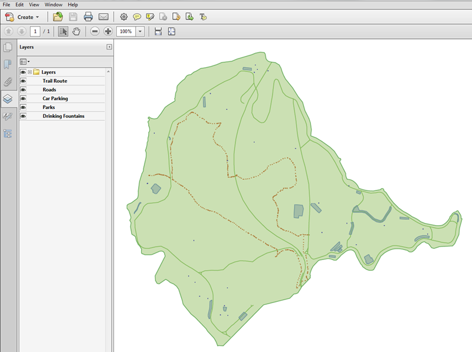

<!--Exercise Section-->
<!--NB: In GitBook world we don't give a number to exercises-->

<table style="border-spacing: 0px;border-collapse: collapse;font-family:serif">
<tr>
<td width=25% style="vertical-align:middle;background-color:darkorange;border: 2px solid darkorange">
<i class="fa fa-cogs fa-lg fa-pull-left fa-fw" style="color:white;padding-right: 12px;vertical-align:text-top"></i>
Exercise
</td>
<td style="border: 2px solid darkorange;background-color:darkorange;color:white">
Managing Writer Feature Types
</td>
</tr>

<tr>
<td style="border: 1px solid darkorange; font-weight: bold">Data</td>
<td style="border: 1px solid darkorange">City Parks (MapInfo TAB) Walking Trail (CSV) Water Fountains (File Geodatabase) Car Parking (OpenStreetMap) Roads (OpenStreetMap)</td>
</tr>

<tr>
<td style="border: 1px solid darkorange; font-weight: bold">Overall Goal</td>
<td style="border: 1px solid darkorange">Create a set of data for mapping a recreational event</td>
</tr>

<tr>
<td style="border: 1px solid darkorange; font-weight: bold">Demonstrates</td>
<td style="border: 1px solid darkorange">Adding Writer Feature Types</td>
</tr>

<tr>
<td style="border: 1px solid darkorange; font-weight: bold">Start Workspace</td>
<td style="border: 1px solid darkorange">C:\FMEData2016\Workspaces\DesktopBasic\Components-Ex7-Begin.fmw</td>
</tr>

<tr>
<td style="border: 1px solid darkorange; font-weight: bold">End Workspace</td>
<td style="border: 1px solid darkorange">C:\FMEData2016\Workspaces\DesktopBasic\Components-Ex7-Complete.fmw C:\FMEData2016\Workspaces\DesktopBasic\Components-Ex7-Complete-Advanced.fmw</td>
</tr>

</table>

Let's continue your work on the fundraising walk project.

In case you forgot, the city is hosting a fundraising walk for a major charity and you have been tasked with using FME to put together the data that will form the event map.  

In this part of the project we’ll finalize the output requirements.

 **1) Start Workbench**
 Start Workbench (if necessary) and open the workspace from Exercise 6. Alternatively you can open C:\FMEData2016\Workspaces\DesktopBasic\Components-Ex7-Begin.fmw

 **2) Add Writer**
 If you recall, one late change was to write to PDF instead of KML. So add an Adobe PDF Writer with the following parameters:

<table style="border: 0px">

<tr>
<td style="font-weight: bold">Writer Format</td>
<td style="">Adobe Geospatial PDF</td>
</tr>

<tr>
<td style="font-weight: bold">Writer Dataset</td>
<td style="">C:\FMEData2016\Output\Training\CharityWalk.pdf</td>
</tr>

<tr>
<td style="font-weight: bold">Add Feature Type(s)</td>
<td style="">Layer Definition: Copy from Reader</td>
</tr>

</table>

Click OK. When prompted select all of the Reader feature types to copy onto the Writer:

This will give a series of Writer feature types like so:

Now all that is to do is do some schema mapping.

 **3) Add FeatureTypeFilter**
 One issue about our schema mapping is that we merged a lot of data together through a Clipper transformer and it's necessary to divide it back up again if we want to write the data onto the separate layers.

So, add a FeatureTypeFilter transformer and connect it to the Clipper:Inside output port:

Now open the parameters dialog and click the Update button:

Now we can map all of our source data to the correct feature type.

 **3) Map Schema**
 OK. Make the following connections:

- Tester:Passed to PDF:Parks
- (CSV)Reprojector:Reprojected to PDF:CSV
- FeatureTypeFilter:DrinkingFountains to PDF:DrinkingFountains
- FeatureTypeFilter:amenity\_parking to PDF:amenity\_parking
- FeatureTypeFilter:highway\_primary to PDF:highway\_primary
- FeatureTypeFilter:highway\_unclassified to PDF:highway\_primary

You'll note that all highway data is being sent to a single Writer feature type.

 **4) Tidy Output**
 The only thing left to do now is tidy up some of the Writer feature types.

Firstly delete all Writer feature types that aren't being used (Track, TrackPoint, Metadata, WayPoint, highway_unclassified).

Secondly rename all Writer feature types to something more user friendly, for example:

- Rename highway_primary to Roads
- Rename amenity_parking to Car Parking
- Rename CSV to Trail Route
- Rename DrinkingFountains to Drinking Fountains

Re-run the workspace and examine the output in Adobe PDF Reader. It should look like this:

That is the end of this project. The data can now be passed on to produce the actual event map.

---

<!--Advanced Exercise Section-->

<table style="border-spacing: 0px">
<tr>
<td style="vertical-align:middle;background-color:darkorange;border: 2px solid darkorange">
<i class="fa fa-cogs fa-lg fa-pull-left fa-fw" style="color:white;padding-right: 12px;vertical-align:text-top"></i>
Advanced Exercise
</td>
</tr>

<tr>
<td style="border: 1px solid darkorange">

Oh! Now that we dropped the KML output dataset, the Python script we wrote probably won't work! 
 If you have time, and have experience of Python, why not edit the script to support copying the GPX and PDF output datasets to the "shared" folder.
  If you have spare time, but no Python experience, why not try improving the look of the PDF output instead?
 Transformers you might find useful are the PDFStyler and the PDFPageFormatter.

</td>
</tr>
</table>

---

<!--Exercise Congratulations Section--> 

<table style="border-spacing: 0px">
<tr>
<td style="vertical-align:middle;background-color:darkorange;border: 2px solid darkorange">
<i class="fa fa-thumbs-o-up fa-lg fa-pull-left fa-fw" style="color:white;padding-right: 12px;vertical-align:text-top"></i>
CONGRATULATIONS
</td>
</tr>

<tr>
<td style="border: 1px solid darkorange">

By completing this exercise you have learned how to:
 
<ul><li>Copying Reader feature types while adding a new Writer</li>
<li>Deleting Writer feature types</li>
<li>Dividing data using the FeatureTypeFilter transformer</li></ul>

</td>
</tr>
</table>