<!--Exercise Section-->

<table style="border-spacing: 0px;border-collapse: collapse;font-family:serif">
<tr>
<td width=25% style="vertical-align:middle;background-color:darkorange;border: 2px solid darkorange">
<i class="fa fa-cogs fa-lg fa-pull-left fa-fw" style="color:white;padding-right: 12px;vertical-align:text-top"></i>
Exercise 8
</td>
<td style="border: 2px solid darkorange;background-color:darkorange;color:white">
Elevation Model Updates
</td>
</tr>

<tr>
<td style="border: 1px solid darkorange; font-weight: bold">Data</td>
<td style="border: 1px solid darkorange">Contours (Esri Shapefile) Raster Orthophoto (JPEG)</td>
</tr>

<tr>
<td style="border: 1px solid darkorange; font-weight: bold">Overall Goal</td>
<td style="border: 1px solid darkorange">Generate a 3D surface model using updated information</td>
</tr>

<tr>
<td style="border: 1px solid darkorange; font-weight: bold">Demonstrates</td>
<td style="border: 1px solid darkorange">Workspace components and parameters</td>
</tr>

<tr>
<td style="border: 1px solid darkorange; font-weight: bold">Start Workspace</td>
<td style="border: 1px solid darkorange">None</td>
</tr>

<tr>
<td style="border: 1px solid darkorange; font-weight: bold">End Workspace</td>
<td style="border: 1px solid darkorange">C:\FMEData2017\Workspaces\DesktopBasic\Components-Ex8-Complete.fmw C:\FMEData2017\Workspaces\DesktopBasic\Components-Ex8-Complete-Advanced.fmw</td>
</tr>

</table>

A new property development is being planned within the city. The planning department has asked for a 3D visualization of the city elevation model, taking this new development into account. 

The task is to read the current elevation model, apply changes provided by the property developer, and create a three-dimensional output in Adobe PDF format.

Your manager has handed you this task, thinking that it will be very difficult. He doesn't know FME as well as you do!

---

 **1) Inspect Data**
 The first task is to read the existing contour files into a workspace. Examine the folder and you see that the contours are held in a set of Shapefile tiles:

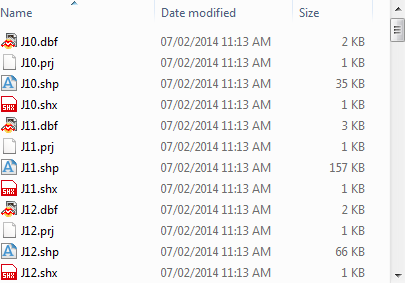

Feel free to use the FME Data Inspector to inspect these source files.

 **2) Add Reader**
 Start FME Workbench and begin with a blank workspace. Select Readers > Add Reader to read the contour files:

<table style="border: 0px">

<tr>
<td style="font-weight: bold">Reader Format</td>
<td style="">Esri Shapefile</td>
</tr>

<tr>
<td style="font-weight: bold">Reader Dataset</td>
<td style="">C:\FMEData2017\Data\ElevationModel\Contours\*.shp</td>
</tr>

</table>

When it comes to selecting the data, select all of the Shape files in that folder. But don't click OK yet. First of all, select the workflow option for a "Single Merged Feature Type":

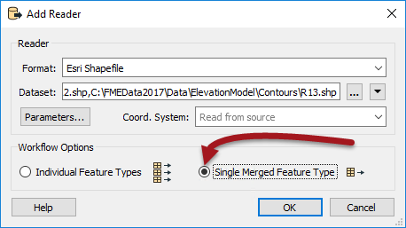

What this will do is add a single feature type with a Merge Filter automatically set:

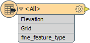

---

<!--Person X Says Section-->

<table style="border-spacing: 0px">
<tr>
<td style="vertical-align:middle;background-color:darkorange;border: 2px solid darkorange">
<i class="fa fa-quote-left fa-lg fa-pull-left fa-fw" style="color:white;padding-right: 12px;vertical-align:text-top"></i>
Sister Intuitive says...
</td>
</tr>

<tr>
<td style="border: 1px solid darkorange">

This is a HUGE shortcut here. It has added a single feature type and set a merge filter to read ALL data. In this scenario it makes the workspace way tidier and easy to use than if each file had its own feature type. 
  Of course, this only works where all of the source files have the same attribute schema (like here) and we are sure that we want to read all of the source layers (we do).

</td>
</tr>
</table>

---

 **3) Add Reader**
 Now let's add the developer's data. Again select Readers > Add Reader from the menubar.

<table style="border: 0px">

<tr>
<td style="font-weight: bold">Reader Format</td>
<td style="">Esri Shapefile</td>
</tr>

<tr>
<td style="font-weight: bold">Reader Dataset</td>
<td style="">C:\FMEData2017\Data\Parcels\NewDevelopment.zip</td>
</tr>

</table>

Because the data has been sent in a zip file, we can still read it, but when we browse for the data we need to change the filter to look for zip files:

The other thing we should do is set the workflow option back to Individual Feature Types, in case there is data other than contours in there.

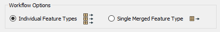

Now click OK. When prompted for which feature types you want from the zip file, select NewContours only.

 **4) Add ChangeDetector**
 The ChangeDetector transformer will tell us which contours are new in this dataset, which are replacements, and which are the same as before. So, place a ChangeDetector transformer and connect it in. The original contours should be connected to the Original port(!) and the revised contours to the Revised port.

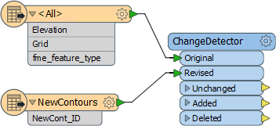

You can check the parameters, but none should need changing. We can check in 2D because the contours are 2D with an elevation attribute.

 **5) Add Inspectors**
 Add Inspector transformers to the output ports of the ChangeDetector and run the workspace to see what we have got so far.

---

<!--Tip Section--> 

<table style="border-spacing: 0px">
<tr>
<td style="vertical-align:middle;background-color:darkorange;border: 2px solid darkorange">
<i class="fa fa-info-circle fa-lg fa-pull-left fa-fw" style="color:white;padding-right: 12px;vertical-align:text-top"></i>
TIP
</td>
</tr>

<tr>
<td style="border: 1px solid darkorange">

The Unexpected Input Remover might appear, but you know this isn't a problem, right? We deliberately chose not to read the BuildingFootprint or Labels from the source data.

</td>
</tr>
</table>

---

You should find 3,967 contours were unchanged; i.e. they were in the original data and the new version. Seven (7) contours have been added; i.e. they appear in the new data but not the original version. Three (3) contours have been deleted; i.e. they appear in the original data but not in the new data.

We'll want to generate the new elevation model from the Unchanged and the Added features; deleted ones we can drop. But first, there is a more pressing problem...

 **6) Import Feature Type Definition**
 Did you notice that the Added contours do not have an elevation value set? This is a problem because we can't generate a proper 3D model without elevation! It must be that the labels in the source data are meant to denote the contour elevation (you can use the Data Inspector to open the data and confirm this is so).

Therefore we need to add that data to the workspace. We already have a Reader so you just need to add the Feature Type.

So choose Readers > Import Feature Type and select the NewDevelopment Reader to
import to. This time, when the list appears, be sure to select the Labels feature type:

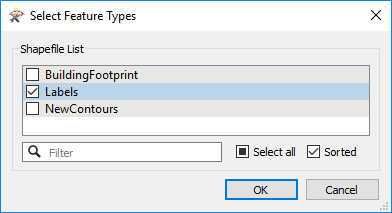

Click OK and now you should get a new feature type. Because we're reading from a zip file we don't even need to change the dataset parameter; FME will pick up the data anyway.

 **7) Add NeighborFinder**
 A NeighborFinder transformer will transfer the label values onto the nearest contour. So, add a NeighborFinder transformer and connect it in. The ChangeDetector:Added features are the Base and the labels are the Candidate:

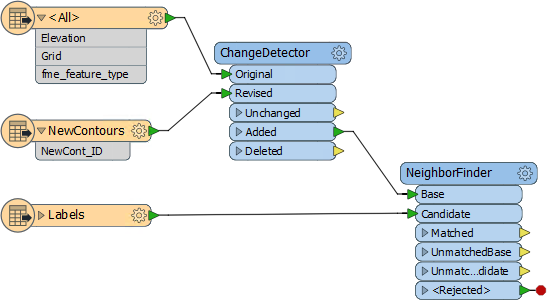

Check the parameters and set the Maximum Distance. This defines the maximum distance from the contour to the label. Because the labels appear to be almost on top of the contour you can set this to a low number, for example 5.

Now add some more Inspectors and rerun the workspace to ensure all seven contour features have an elevation value now.

 **8) Add 3DForcer**
 Having an elevation attribute is fine, but to actually create a 3D model we must convert this into a true Z value. This is done with a 3DForcer transformer, so place one of these. The ChangeDetector:Unchanged and NeighborFinder:Matched are the features we need to process.

Now check the parameters. For Elevation, click the drop-down arrow and choose Attribute Value > Elevation.

Run the workspace again and you will see the contours now have a Z value and the
Data Inspector reports they are true 3D features:

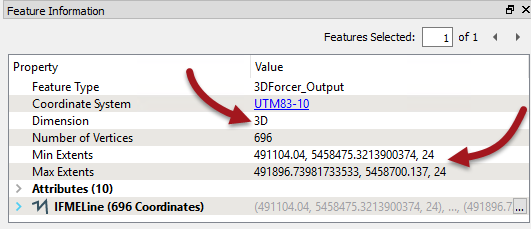

 **9) Add SurfaceModeller**
 Now we have 3D contours we can create a surface model. Add a SurfaceModeller transformer connected to the 3DForcer output. The input port to connect is Points/Lines.

Check the parameters. Set a Surface Tolerance of 1, and turn off the checkbox for Output Contours (it will run faster without). If you now connect an Inspector to the SurfaceModeller:TINSurface output port and run the workspace, you will be able to inspect the data in 3D.

---

<!--Tip Section--> 

<table style="border-spacing: 0px">
<tr>
<td style="vertical-align:middle;background-color:darkorange;border: 2px solid darkorange">
<i class="fa fa-info-circle fa-lg fa-pull-left fa-fw" style="color:white;padding-right: 12px;vertical-align:text-top"></i>
TIP
</td>
</tr>

<tr>
<td style="border: 1px solid darkorange">

To rotate the data in 3D in the FME Data Inspector, click the orbit icon on the toolbar, or press down on the centre mouse button if you have one.

</td>
</tr>
</table>

---

 **10) Exaggerate Scale (Optional)**
 If Vancouver seems a little flat, then why not exaggerate the Z scale a little to compensate!

Add an ExpressionEvaluator before the 3DForcer and use it to multiply the value of Elevation by a factor of 4. You'll want to use to option to apply the result to an existing attribute:

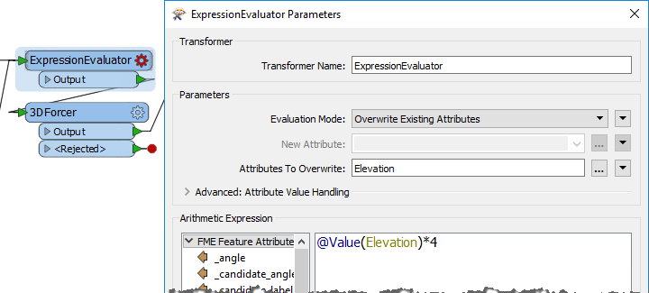

Now Vancouver will have a more interesting profile:

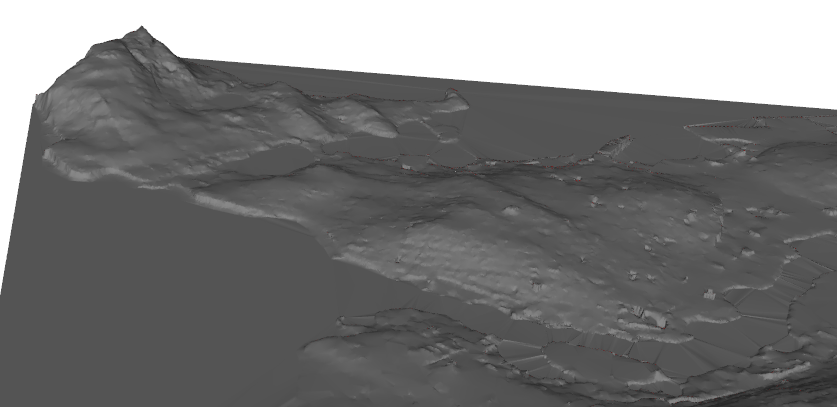

 **11) Add Writer**
 Now let's write this data. Select Writers &gt; Add Writer and add a Writer with the following specifications:

<table style="border: 0px">

<tr>
<td style="font-weight: bold">Writer Format</td>
<td style="">Adobe 3D PDF</td>
</tr>

<tr>
<td style="font-weight: bold">Writer Dataset</td>
<td style="">C:\FMEData2017\Output\Training\SurfaceModel.pdf</td>
</tr>

</table>

Make sure you choose the 3D (not 2D) version of the PDF Writer. You can choose to add a new feature type for the output in whatever way you want. The best method will be to select either Manual or Automatic from the Add Writer dialog. Give the feature type a name such as Surface and connect it up to the SurfaceModeller:TINSurface port.

In the writer parameters (Navigator window) locate the background color parameter and change it to black (0,0,0). Locate the Page Size parameter and change it to 600 400:

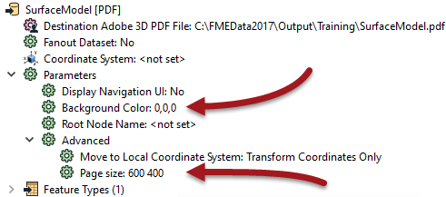

Now run the translation. Locate the output data - it will take a minute or so to write - and open it in Adobe Reader.

---

<!--Advanced Exercise Section-->

<table style="border-spacing: 0px">
<tr>
<td style="vertical-align:middle;background-color:darkorange;border: 2px solid darkorange">
<i class="fa fa-cogs fa-lg fa-pull-left fa-fw" style="color:white;padding-right: 12px;vertical-align:text-top"></i>
Advanced Exercise
</td>
</tr>

<tr>
<td style="border: 1px solid darkorange">

You've now used Readers and Writers (and transformers) to update an elevation model and create a 3D rendering of it. But there is so much more we can do with this.
  As an advanced task let's drape a raster image onto the surface model to make it look prettier.

</td>
</tr>
</table>

 **12) Add Reader**
 Add a Reader to read the raster data. The details are:

<table style="border: 0px">

<tr>
<td style="font-weight: bold">Reader Format</td>
<td style="">JPEG (Joint Photographic Experts Group)</td>
</tr>

<tr>
<td style="font-weight: bold">Reader Dataset</td>
<td style="">C:\FMEData2017\Resources\DesktopBasic\OverlayImage.jpg</td>
</tr>

</table>

 **13) Add AppearanceSetter**
 Now add an AppearanceSetter transformer. This is used to apply the raster as an "appearance" or texture onto the DEM surface. The Raster data is the Appearance and the TINSurface port is the Geometry:

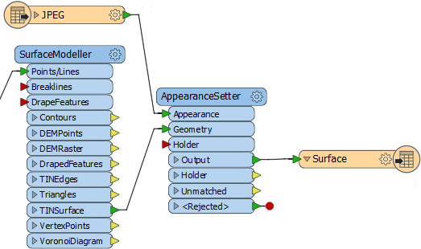

Check the parameters. Change "Set Appearance On" to be Front Side.

Expand the section Texture Coordinate Generation Parameters and set "Texture Mapping Type" to be From Top View:

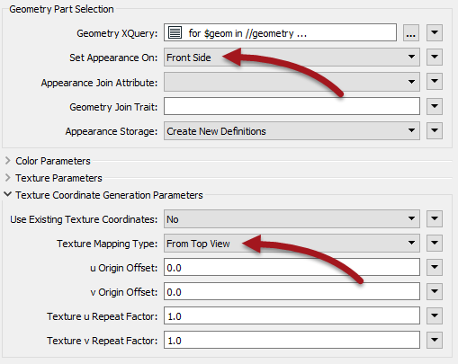

Run the workspace (be sure to close the PDF first if it is open in Adobe Reader). This time the PDF output should have a raster image draped on it.

---

<!--Warning Section--> 

<table style="border-spacing: 0px">
<tr>
<td style="vertical-align:middle;background-color:darkorange;border: 2px solid darkorange">
<i class="fa fa-exclamation-triangle fa-lg fa-pull-left fa-fw" style="color:white;padding-right: 12px;vertical-align:text-top"></i>
WARNING
</td>
</tr>

<tr>
<td style="border: 1px solid darkorange">

By default the PDF output will now be close to 100mb in size. If this is too large for your computer to handle, add a RasterResampler transformer before the JPEG feature type and set the parameters to resample to 25% of the original.
  The PDF will now only be 8mb in size, but the quality will, of course, be much less.

</td>
</tr>
</table>

---

 **14) Overlay Building Footprint**
 In the previous output, did you spot the lump in the surface where the new property is going to be developed? The one last thing we could do is add the building outline so that we can see where it will go.

Because we don't have the building data in the workspace the first task is to use Import Feature Types to add that back to the NewDevelopment Shapefile Reader.

Connect that up to the SurfaceModeller:DrapeFeatures input port (i.e. we want to drape the building onto the 3D surface that is being generated).

Add an Extruder transformer, connected to the SurfaceModeller:DrapedFeatures output port.

Set the Extruder parameters to extrude the data by a height of 25. This will create a 25m high building.

Now add a new Writer feature type to create a new output layer for the buildings. Connect it to the Extruder transformer and you will have a workspace that looks like this:

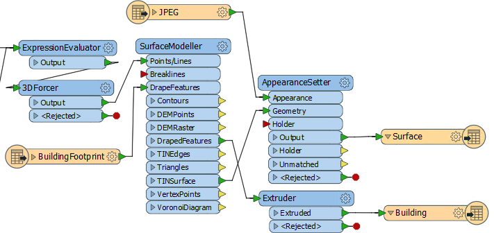

Run the workspace and the output will now look like this:

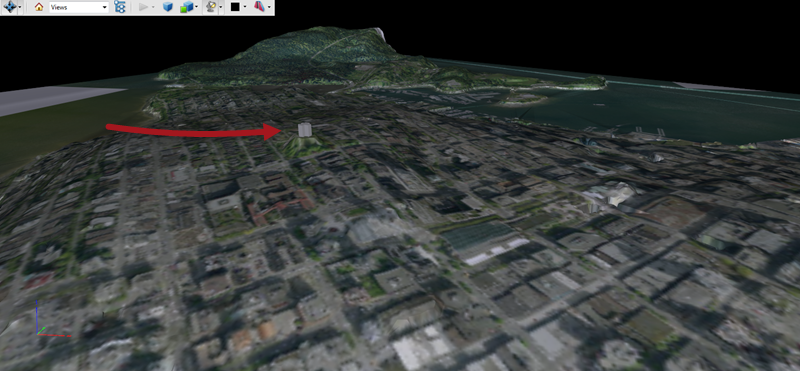

Wow! Even allowing for the 4x scale increase on the DEM, this building is very prominent on the Vancouver skyline!

---

<!--Exercise Congratulations Section--> 

<table style="border-spacing: 0px">
<tr>
<td style="vertical-align:middle;background-color:darkorange;border: 2px solid darkorange">
<i class="fa fa-thumbs-o-up fa-lg fa-pull-left fa-fw" style="color:white;padding-right: 12px;vertical-align:text-top"></i>
CONGRATULATIONS
</td>
</tr>

<tr>
<td style="border: 1px solid darkorange">

By completing this exercise you proved you know how to: 
<ul><li>Add Readers and Writers to a workspace</li>
<li>Set Reader and Writer parameters</li>
<li>Import Reader feature types</li>
<li>Read data from a zip file</li></ul>
And have learned how to: 
<ul><li>Use the Merge Feature Type option when adding a Reader</li>
<li>Convert contours to a 3D surface model</li>
<li>Drape a raster image onto a 3D surface model</li></ul>

</td>
</tr>
</table>
