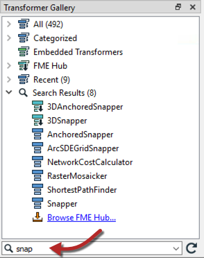
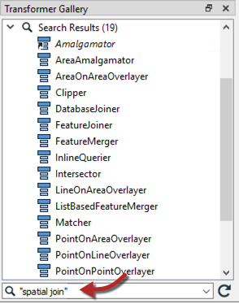
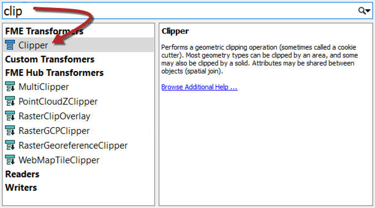
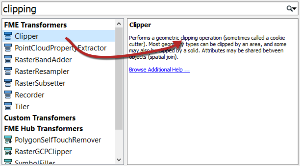
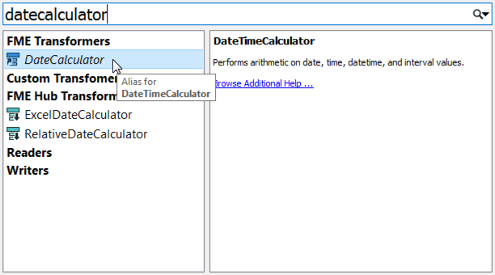
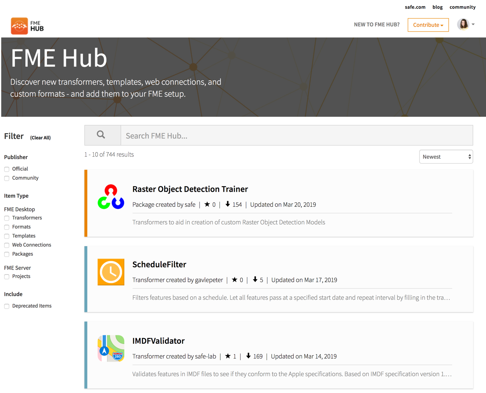
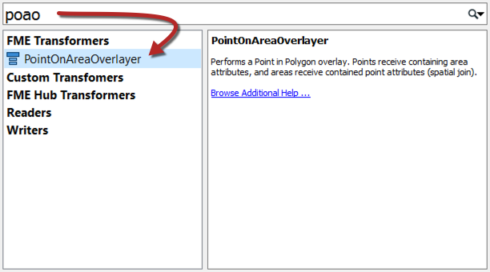

## Transformer Searching ##
There are search functions in both the transformer gallery and Quick Add dialog.

### Transformer Gallery Search

To perform a search in the transformer gallery, simply enter the search terms and either press the <enter> key or click the search icon (the binoculars icon).

The transformer gallery search searches in both name and description. Therefore a search term may be the exact name of a transformer, or it may be a general keyword referring to functionality in general:

Search terms can either be full or partial words, and may consist of a number of keywords, including quote marks to enclose a single search reference:

---

### Quick Add Search ###

Quick Add search terms can also be full or partial words:

By default, Quick Add does not look in transformer descriptions, so the search term must be the actual name of a transformer:

However, Quick Add will search in the transformer descriptions if you press the &lt;TAB&gt; key:

Quick Add results include aliases - for example transformers that have an alternative name or which have been renamed - and also include transformers found in the FME Hub:

---

<!--Person X Says Section-->

<table style="border-spacing: 0px">
<tr>
<td style="vertical-align:middle;background-color:darkorange;border: 2px solid darkorange">
<i class="fa fa-quote-left fa-lg fa-pull-left fa-fw" style="color:white;padding-right: 12px;vertical-align:text-top"></i>
Firefighter Mapp says...
</td>
</tr>

<tr>
<td style="border: 1px solid darkorange">

In case you weren't aware, the FME Hub (hub.safe.com) is a facility for sharing FME functionality such as custom transformers, web connections, and formats:
  
  Transformers from the hub are shown in Quick Add with a small, downwards-pointing arrow, to denote that they will be downloaded if selected.

</td>
</tr>
</table>

---

#### CamelCase ####
Quick Add also allows the use of CamelCase initials as a shortcut. CamelCase is where a single keyword is made up of several conjoined words, each of which retains an upper case initial; for example AttributeFileWriter (AFW) or ShortestPathFinder (SPF).

---

<!--Person X Says Section-->

<table style="border-spacing: 0px">
<tr>
<td td colspan="2" style="vertical-align:middle;background-color:darkorange;border: 2px solid darkorange">
<i class="fa fa-quote-left fa-lg fa-pull-left fa-fw" style="color:white;padding-right: 12px;vertical-align:text-top"></i>
Miss Vector says...
</td>
</tr>

<tr>
<td td colspan="2" style="border: 1px solid darkorange">

Try these questions to see if you can search for transformers. 
 Which of the following is NOT a category of transformers?
  <a href="http://52.73.3.37/fmedatastreaming/Manual/QAResponse2017.fmw?chapter=5&question=1&answer=1&DestDataset_TEXTLINE=C%3A%5CFMEOutput%5CQAResponse.html">1. Attributes</a>
 <a href="http://52.73.3.37/fmedatastreaming/Manual/QAResponse2017.fmw?chapter=5&question=1&answer=2&DestDataset_TEXTLINE=C%3A%5CFMEOutput%5CQAResponse.html">2. Calculations</a>
 <a href="http://52.73.3.37/fmedatastreaming/Manual/QAResponse2017.fmw?chapter=5&question=1&answer=3&DestDataset_TEXTLINE=C%3A%5CFMEOutput%5CQAResponse.html">3. Data Quality</a>
 <a href="http://52.73.3.37/fmedatastreaming/Manual/QAResponse2017.fmw?chapter=5&question=1&answer=4&DestDataset_TEXTLINE=C%3A%5CFMEOutput%5CQAResponse.html">4. Workflows</a>
  Here are four transformers and four categories. Match the transformer to the correct category.

</td>
</tr>
<tr><td width="50%" style="font-weight: bold; border: 1px solid darkorange">Scenario</td><td style="font-weight: bold; border: 1px solid darkorange">Tool</td></tr>
<tr><td style="border: 1px solid darkorange"><a href="http://52.73.3.37/fmedatastreaming/Manual/QAResponse2017.fmw?chapter=5&question=2&answer=1&DestDataset_TEXTLINE=C%3A%5CFMEOutput%5CQAResponse.html">Chopper</a></td><td style="border: 1px solid darkorange">Workflows</td></tr>
<tr><td style="border: 1px solid darkorange"><a href="http://52.73.3.37/fmedatastreaming/Manual/QAResponse2017.fmw?chapter=5&question=2&answer=2&DestDataset_TEXTLINE=C%3A%5CFMEOutput%5CQAResponse.html">Terminator</a></td><td style="border: 1px solid darkorange">Strings</td></tr>
<tr><td style="border: 1px solid darkorange"><a href="http://52.73.3.37/fmedatastreaming/Manual/QAResponse2017.fmw?chapter=5&question=2&answer=3&DestDataset_TEXTLINE=C%3A%5CFMEOutput%5CQAResponse.html">Matcher</a></td><td style="border: 1px solid darkorange">Geometries</td></tr>
<tr><td style="border: 1px solid darkorange"><a href="http://52.73.3.37/fmedatastreaming/Manual/QAResponse2017.fmw?chapter=5&question=2&answer=4&DestDataset_TEXTLINE=C%3A%5CFMEOutput%5CQAResponse.html">DateTimeConverter</a></td><td style="border: 1px solid darkorange">Data Quality</td></tr>

</td>
</tr>
</table>
