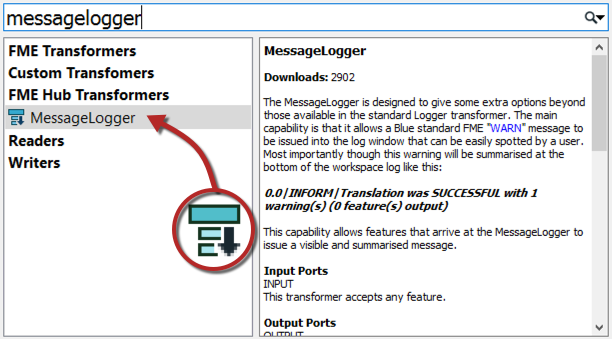

## Transformer Searching ##
There are search functions in both the transformer gallery and Quick Add dialog.

### Transformer Gallery Search

To perform a search in the transformer gallery, enter the search terms and either press the <kbd>enter</kbd> key or click the search icon (the binoculars icon).

The transformer gallery search searches in both name and description. Therefore a search term may be the exact name of a transformer, or it may be a general keyword referring to functionality in general:

Search terms can either be full or partial words and may consist of a number of keywords, including quote marks to enclose a single search reference:

---

### Quick Add Search ###

Quick Add search terms can also be full or partial words:

By default, Quick Add does not look in transformer descriptions, so the search term must be the actual name of a transformer:

However, Quick Add will search in the transformer descriptions if you press the <kbd>tab</kbd> key:

Quick Add results include aliases - for example, transformers that have an alternative name or which have been renamed - and also include transformers found in the FME Hub:

#### CamelCase ####
Quick Add also allows the use of CamelCase initials as a shortcut. CamelCase is where a single keyword is made up of several conjoined words, each of which retains an upper case initial; for example AttributeFileWriter (AFW) or ShortestPathFinder (SPF).

---

### FME Hub ###

FME Hub is an online facility for sharing FME functionality such as custom transformers, web connections, templates, formats and packages:

Transformers from FME Hub are shown in Quick Add with a small, downwards-pointing arrow to denote that they will be downloaded if selected:

---

<!--New Section-->

<table style="border-spacing: 0px">
<tr>
<td style="vertical-align:middle;background-color:darkorange;border: 2px solid darkorange">
<i class="fa fa-bolt fa-lg fa-pull-left fa-fw" style="color:white;padding-right: 12px;vertical-align:text-top"></i>
NEW
</td>
</tr>

<tr>
<td style="border: 1px solid darkorange">

Packages from FME Hub are new for 2019.0. They are a way to ship fully functional components outside of the main FME releases. Packages are fully portable, containing all required dependencies that they need in order to run. Python backed transformers, as well as Workbench created items, are supported.
 Packages can be searched and downloaded the same way as custom transformers. They are denoted in Quick Add by a little box icon:
  

</td>
</tr>
</table>
