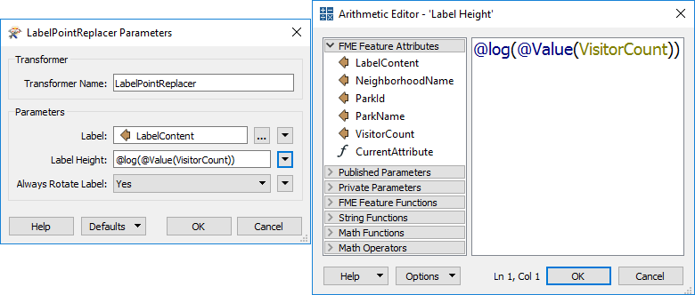

# Constructing Parameters #
Let's just put attributes to one side for a moment and look at transformer parameters.

Transformer parameters are often set in a fixed way (hard-coded) or set to take on the value of a particular attribute. However, in the same way that attributes can be constructed, text or arithmetic editors can be used to build values for transformer parameters. 

## Using Attributes for Parameters ##
As noted, most transformer parameters allow the user to select an attribute value instead of manually entering a fixed value. For example, the LabelPointReplacer can create a label whose contents and height are specified by attribute values:

This is very useful because it allows the parameters (for example label size) to get a different value for each feature. An attribute could be read from a source dataset, or calculated using an ExpressionEvaluator, so that one feature creates a label 10 units in height, another creates a label 15 units high, and so on. It is no longer a fixed value.

## Constructing Parameter Values ##

If a parameter value needs to be calculated or constructed, instead of using a separate transformer, FME has integrated string and numeric editors built into parameter dialogs.

For example, here the user is choosing to calculate label height using an arithmetic calculator:

The calculator allows the selection and use of FME attributes, other parameters, plus a number of mathematical and string-based functions. For example, here the user has chosen to calculate the height of their labels using the logarithm of the visitor count for a park:

---

<!--Person X Says Section-->

<table style="border-spacing: 0px">
<tr>
<td style="vertical-align:middle;background-color:darkorange;border: 2px solid darkorange">
<i class="fa fa-quote-left fa-lg fa-pull-left fa-fw" style="color:white;padding-right: 12px;vertical-align:text-top"></i>
Mr. E. Dict (attorney of FME law) says...
</td>
</tr>

<tr>
<td style="border: 1px solid darkorange">

It's a fixed rule that the editor dialogs available depend upon the type of parameter being set. For instance, the Label parameter in a LabelPointReplacer opens a text editor because the parameter requires a text value. The Label Height parameter opens an arithmetic editor because that parameter requires a numeric value.

</td>
</tr>
</table>

---

### Reducing Workspace Congestion ###
Like when attribute values are constructed, workspaces are more compact when as many peripheral operations as possible are directly integrated into a single transformer or parameter. However, as with attributes, it's important to add proper annotation, else it's difficult for a casual observer to understand what the workspace is meant to do.

Another drawback, specific to parameters, is that you don't also get the information as an attribute to use elsewhere. For example, if you construct a label string in the LabelPointReplacer, that string isn't available as an attribute elsewhere in the workspace. 
