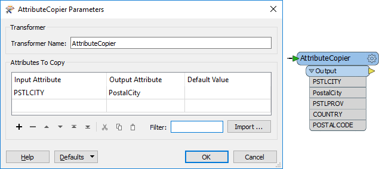

## Renaming and Copying Attributes ##

Renaming and - to a lesser extent - copying attributes are also key attribute functions within FME. When an attribute is renamed it ceases to exist under its prior name; when it is copied it exists both in its new and old names. 

The transformers capable of renaming an attribute are:

<table style="border-spacing: 0px">
<tr>
<th style="vertical-align:middle;background-color:darkorange;border: 2px solid darkorange">
Transformer</th>
<th style="vertical-align:middle;background-color:darkorange;border: 2px solid darkorange">
Capability</th>
</tr>
<tr><td style="text-align:center;font-weight: bold">AttributeCopier</td><td>Copy</td></tr>
<tr><td style="text-align:center;font-weight: bold">AttributeCreator</td><td>Copy</td></tr>
<tr><td style="text-align:center;font-weight: bold">AttributeManager</td><td>Copy and Rename</td></tr>
<tr><td style="text-align:center;font-weight: bold">AttributeRenamer</td><td>Rename</td></tr>
</table>

---

### Renaming ###

The fundamental purpose of renaming is to manually enter a new name for a selected attribute. The old attribute is removed and replaced with the newly named one:

Here an AttributeManager is used to rename a number of fields by entering a different name for the Output Attribute. The Action is automatically set to Rename. Notice that the user is also entering a new constant value for the PSTLCITY/PostalCity attribute.

This type of behaviour is obviously of use when the reader schema ('what we have') needs to be renamed to match the writer schema ('what we want').

---

<!--Tip Section--> 

<table style="border-spacing: 0px">
<tr>
<td style="vertical-align:middle;background-color:darkorange;border: 2px solid darkorange">
<i class="fa fa-info-circle fa-lg fa-pull-left fa-fw" style="color:white;padding-right: 12px;vertical-align:text-top"></i>
TIP
</td>
</tr>

<tr>
<td style="border: 1px solid darkorange">

Although you can manually type a new attribute name into the Output Attribute field, if the transformer is connected to a writer feature type with the correct attributes, its attribute names will be automatically available to select from:
  

</td>
</tr>
</table>

---

### Copying ###

Depending on the transformer, copying an attribute can be one of two styles.

Here the AttributeCopier consists of selecting the existing attribute and entering a new name for it. Again, when connected to a writer feature type, its schema is available to select from. 

Note how both PSTLCITY and PostalCity exist on the output of the transformer, proving that it is copying the attribute rather than renaming it.

<!--Tip Section--> 

<table style="border-spacing: 0px">
<tr>
<td style="vertical-align:middle;background-color:darkorange;border: 2px solid darkorange">
<i class="fa fa-info-circle fa-lg fa-pull-left fa-fw" style="color:white;padding-right: 12px;vertical-align:text-top"></i>
TIP
</td>
</tr>

<tr>
<td style="border: 1px solid darkorange">

You can (as above) enter a constant attribute value in the AttributeCopier, but in reality it's hardly a copy operation in that case; it's more an attribute creation task.

</td>
</tr>
</table>

---

For other transformers, the setup style is reversed: a new attribute is created and given the value of an existing attribute:

In this AttributeManager transformer the user creates a new attribute (PostalCity) and assigns it the value from another (PSTLCITY). In effect they have made a copy of the original attribute.