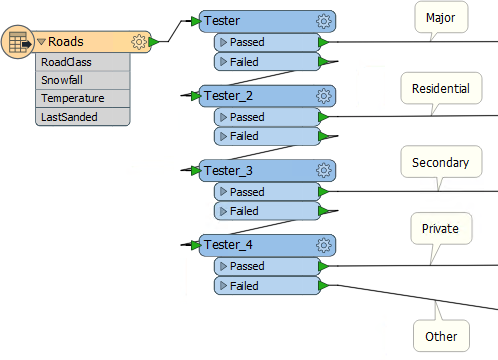
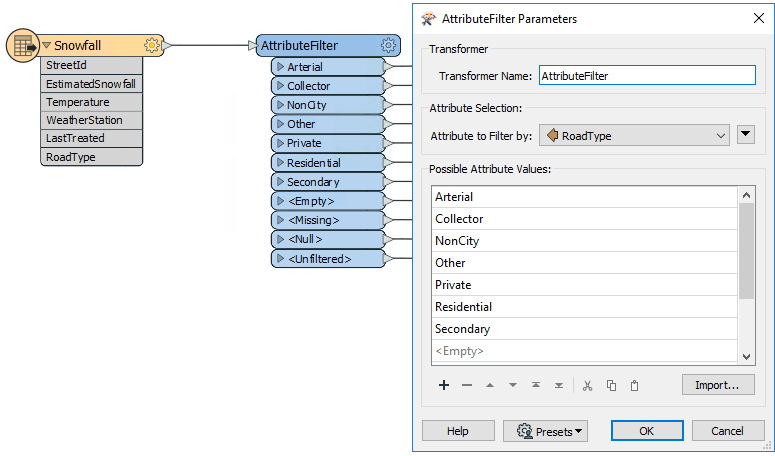

## Other Key Filter Transformers ##
The Tester and TestFilter are not the only useful filter transformers.

### AttributeFilter ###
The AttributeFilter transformer (#13 in the top 30) directs features on the basis of values in a chosen attribute. It is best for testing many values for a single attribute, for example:

- Is that road a Primary, Secondary, Residential, Private, or Other type of road?
- Is the forecast for sun, rain, snow, or fog?

In this example Testers divide features into different streams depending on the value of a RoadClass attribute:

The repetition of Tester transformers indicates an AttributeFilter transformer might be a better option:

The AttributeFilter's only "operator" is to find equivalency, so you would rarely use it for arithmetical tests.

### AttributeRangeFilter ###
The AttributeRangeFilter carries out the same operation as the AttributeFilter, except that it can handle a range of numeric values instead of just a simple one-to-one match.

The AttributeRangeFilter parameters dialog has the option to generate ranges automatically from a set of user-defined extents.

---

### GeometryFilter ###
The GeometryFilter (#22 in the top 30) directs features on the basis of geometry type; for example, point, line, area, ellipse:

The GeometryFilter is useful for:

- Filtering out unwanted geometry types; for example, removing non-linear features before using an AreaBuilder transformer
- Validating geometry against a list of permitted types; for example, where the dataset is constrained to either point or area features (above) 
- Dividing up geometry types to write to separate destination Feature Types; for example, when writing to a geometry-restricted format such as Esri Shapefile

---

<!--Person X Says Section-->

<table style="border-spacing: 0px">
<tr>
<td style="vertical-align:middle;background-color:darkorange;border: 2px solid darkorange">
<i class="fa fa-quote-left fa-lg fa-pull-left fa-fw" style="color:white;padding-right: 12px;vertical-align:text-top"></i>
Confused from Interopolis says...
</td>
</tr>

<tr>
<td style="border: 1px solid darkorange">

Dear Aunt Interop,
 If the Tester, TestFilter, and AttributeFilter all filter features on the basis of an attribute condition, then what’s the difference? When would I use each?

</td>
</tr>
</table>

<!--Person X Says Section-->

<table style="border-spacing: 0px">
<tr>
<td style="vertical-align:middle;background-color:darkorange;border: 2px solid darkorange">
<i class="fa fa-quote-left fa-lg fa-pull-left fa-fw" style="color:white;padding-right: 12px;vertical-align:text-top"></i>
Aunt Interop says...
</td>
</tr>

<tr>
<td style="border: 1px solid darkorange">

Dear Confused
 The best solution is to check out these two articles on the Safe Software blog:
 - <a href="https://blog.safe.com/2013/03/fmeevangelist113/">Conditional Processing in FME</a>
 - <a href="https://blog.safe.com/2015/05/fmeevangelist133/">A Simple Guide to FME Filter Transformers</a>
 There's also a useful table I put together:

</td>
</tr>
</table>

<table border="1">
<tbody>
<tr style="height: 15.0pt;" valign="bottom">
<td style="height: 15.0pt; width: 103pt;" width="137" height="20"></td>
<td style="width: 130pt;" colspan="2" width="173" align="center">Single Test</td>
<td style="width: 130pt;" colspan="2" width="173" align="center">Multiple Tests</td>
<td style="width: 77pt;" colspan="2" width="103" align="center">Test Type</td>
<td style="width: 63pt;" width="84" align="center">Operators</td>
<td style="width: 63pt;" width="84" align="center">Attributes</td>
</tr>
<tr style="height: 15.0pt;" valign="bottom">
<td></td>
<td align="center">Single Clause</td>
<td align="center">Multi Clause</td>
<td align="center">Single Clause</td>
<td align="center">Multi Clause</td>
<td align="center">String</td>
<td align="center">Numeric</td>
<td align="center">(Number of)</td>
<td style="text-align: center;">(Number of)</td>
</tr>
<tr style="height: 15.0pt;" valign="bottom">
<td>Tester</td>
<td align="center">Y</td>
<td align="center">Y</td>
<td align="center">–</td>
<td align="center">–</td>
<td align="center">Y</td>
<td align="center">Y</td>
<td align="center">16</td>
<td align="center">Multiple</td>
</tr>
<tr style="height: 15.0pt;" valign="bottom">
<td>TestFilter</td>
<td align="center">Y</td>
<td align="center">Y</td>
<td align="center">Y</td>
<td align="center">Y</td>
<td align="center">Y</td>
<td align="center">Y</td>
<td align="center">16</td>
<td align="center">Multiple</td>
</tr>
<tr style="height: 15.0pt;" valign="bottom">
<td>AttributeFilter</td>
<td align="center">Y</td>
<td align="center">Y</td>
<td align="center">–</td>
<td align="center">–</td>
<td align="center">Y</td>
<td align="center">–</td>
<td align="center">1</td>
<td align="center">1</td>
</tr>
<tr style="height: 15.0pt;" valign="bottom">
<td>AttributeRangeFilter</td>
<td align="center">Y</td>
<td align="center">Y</td>
<td align="center">–</td>
<td align="center">–</td>
<td align="center">–</td>
<td align="center">Y</td>
<td align="center">6</td>
<td align="center">1</td>
</tr>
</tbody>
</table>
