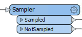

# Conditional Filtering #
Transformers that filter, don’t transform data content, yet surveys show that they’re the most commonly used type of transformer there is!

## What is Filtering? ##
Filtering is the technique of subdividing data as it flows through a workspace. It’s the case where there are multiple output connections from a transformer, each of which carries data to be processed differently. Here (for example) incoming stream A is filtered into two new streams, B and C:

A filtering transformer may be any transformer with multiple output ports, such as the GeometryFilter or Sampler transformers, the latter of which creates a sample selection of data and separates it out through Sampled and NotSampled output ports:

However, these are mostly in-built, fixed tests. Conditional filtering is where the decision about which features are output to which connection is decided by some form of *user-defined* test or condition. The Tester transformer is the most obvious example of this. It carries out a test and has different output ports for features that pass and fail the test.

## Transformers that Filter ##
Many transformers in the Filters and Joins category carry out these tests and redirect data according to the results:

Although the Tester transformer is the most used of this category, there are many other transformers such as the TestFilter, GeometryFilter, AttributeFilter, SpatialFilter, and Sampler.
