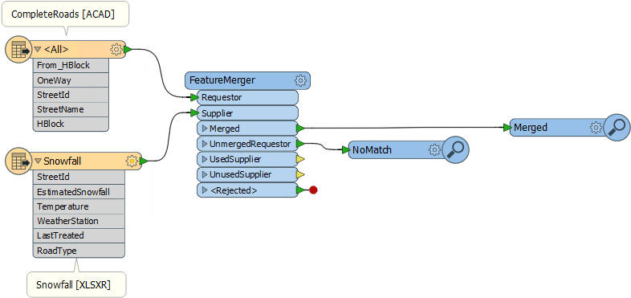
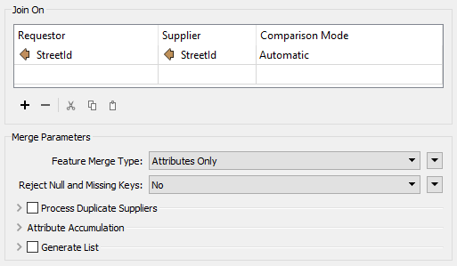
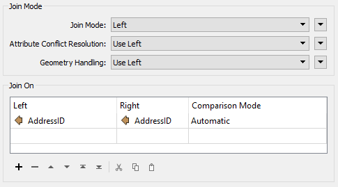
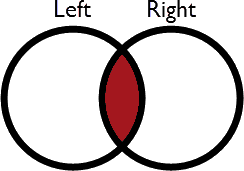
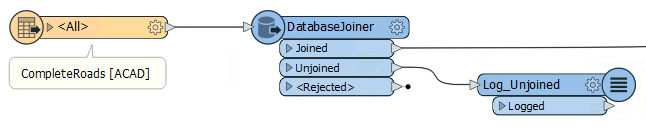
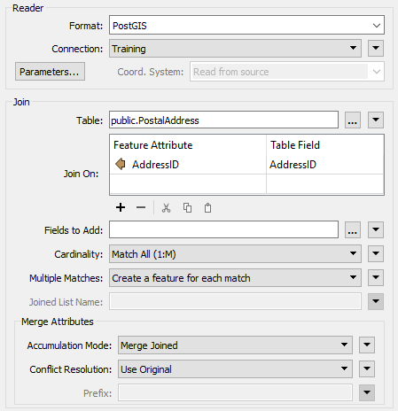
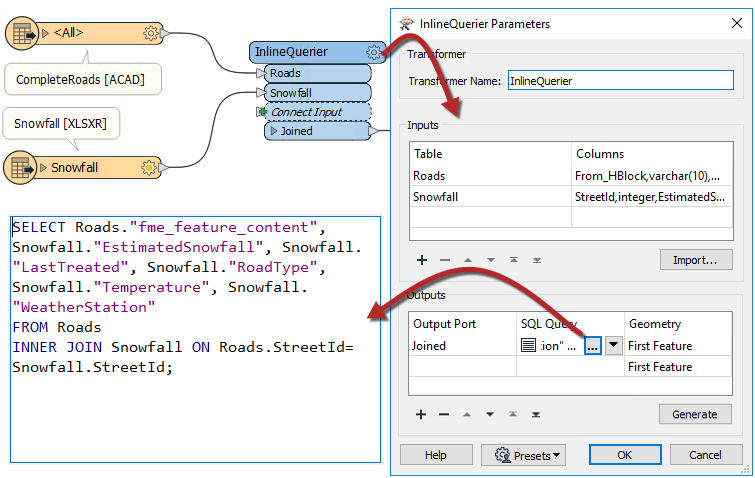

## Key-Based Join Transformers ##
There are several transformers that can join data on the basis of a matching attribute value (key). Some of these are more oriented towards geometry, others have a more SQL-like style. Some join streams of data within one workspace, others join one stream of data to an external database. 

Which you use depends on your join requirements and performance needs.

### FeatureMerger ###
The FeatureMerger is a transformer for joining two (or more) streams of data within a workspace based on a key field match.

Here, for example, a dataset of roads has a StreetId number. The FeatureMerger is being used to combine information from a spreadsheet of snowfall information onto the roads data:

The parameters dialog for the FeatureMerger looks like this:

This shows the join is made using StreetId as a key. All Requestor (Road) features that have a matching snowfall record are output through the Merged output port. All Road features without a match are output through the UnmergedRequestor port for inspection to determine why a match did not occur.

There are additional parameters to handle conflicts of information, duplicate keys, and whether to merge attributes only or geometry as well.

### FeatureJoiner ###
The FeatureJoiner is another transformer for joining two streams of data within a workspace based on a key field match.

---

<!--New Section--> 

<table style="border-spacing: 0px">
<tr>
<td style="vertical-align:middle;background-color:darkorange;border: 2px solid darkorange">
<i class="fa fa-bolt fa-lg fa-pull-left fa-fw" style="color:white;padding-right: 12px;vertical-align:text-top"></i>
NEW
</td>
</tr>

<tr>
<td style="border: 1px solid darkorange">

Remember that the FeatureJoiner is a new transformer for FME2018, designed to eventually replace the FeatureMerger.

</td>
</tr>
</table>

---

Here, for example, is the same Roads/Snowfall match in the FeatureJoiner. The parameters for the transformer looks like this:

As you can see, this transformer is based more on traditional SQL queries. The Join Mode parameter can take one of three values:

<table>
<tr><th>Mode</th><th>Description</th><th>Depiction</th><th>Joined Output</th><th>Unjoined Left</th><th>Unjoined Right</th></tr>
<tr>
<td style="font-weight:bold">Left</td><td>Left features look for a match and are output whether they find a match or not</td><td></td><td>All matches plus unmatched Left features</td><td>None</td><td>Unused Right features</td>
</tr>
<tr>
<td style="font-weight:bold">Inner</td><td>Left features look for a match and are output if they find one</td><td></td><td>All matches only</td><td>Unmatched Left features</td><td>Unused Right features</td>
</tr>
<tr>
<td style="font-weight:bold">Full</td><td>Both Left and Right features output through the Joined output port, whether they find a join or not</td><td></td><td>All matches plus unmatched Left and Right features</td><td>None</td><td>None</td>
</tr>
</table>

Other terms you might be familiar with are *Outer Join* and *Right Join*. An Outer join is simply a different name for what the Full Join does here. To do a Right join, you would simply switch which features are being sent to which input port and use the Left Join option.

---

<!--Warning Section--> 

<table style="border-spacing: 0px">
<tr>
<td style="vertical-align:middle;background-color:darkorange;border: 2px solid darkorange">
<i class="fa fa-exclamation-triangle fa-lg fa-pull-left fa-fw" style="color:white;padding-right: 12px;vertical-align:text-top"></i>
WARNING
</td>
</tr>

<tr>
<td style="border: 1px solid darkorange">

The key thing to be aware of here is that a feature is output for every match that occurs.
 For example, if 1 Road feature matches 5 Snowfall records, there will be 5 features output as Joined.
  Joined features are always output as a Join. Left, Inner, and Full really only control which unmatched records are included in the Joined output.

</td>
</tr>
</table>

---

With a Left join the user either believes that all roads will have a matching snowfall record, or it does not matter if there is not a match. In fact no features will ever appear from the Unjoined Left output port. 

If it was important to ensure a match, then the chosen mode should be Inner. Then records that exited the Unjoined Left output port could be treated as an error and investigated as to why there is no match.

Like the FeatureMerger, there are parameters to handle conflicts of information and whether to merge attributes only or geometry as well.

---

<!--Tip Section--> 

<table style="border-spacing: 0px">
<tr>
<td style="vertical-align:middle;background-color:darkorange;border: 2px solid darkorange">
<i class="fa fa-info-circle fa-lg fa-pull-left fa-fw" style="color:white;padding-right: 12px;vertical-align:text-top"></i>
TIP
</td>
</tr>

<tr>
<td style="border: 1px solid darkorange">

So the key difference between the FeatureMerger and the FeatureJoiner is what happens to multiple matches. 
  If the FeatureJoiner has multiple matches, it will output multiple features.
  If the FeatureMerger has multiple matches, it will output one feature only. That feature will either have only one matched record, or a list of matched records, depending on the Process Duplicate Suppliers parameter.

</td>
</tr>
</table>

---

### DatabaseJoiner ###
The DatabaseJoiner transformer is different to the FeatureMerger and FeatureJoiner because, instead of merging two streams of features, it merges one (or more) stream(s) of data with records from an external database.

Here is the same example as for the FeatureMerger above. In this case the roads features are obtaining snowfall data directly from a table in an Excel spreadsheet:

The parameters dialog for the DatabaseJoiner looks like this:

Again, AddressID is being used from both feature and database table to facilitate a merge between the two.

As with the other transformers, there are parameters to control the attributes that are accumulated and how conflicts are resolved.

---

<!--Person X Says Section-->

<table style="border-spacing: 0px">
<tr>
<td style="vertical-align:middle;background-color:darkorange;border: 2px solid darkorange">
<i class="fa fa-quote-left fa-lg fa-pull-left fa-fw" style="color:white;padding-right: 12px;vertical-align:text-top"></i>
First-Officer Transformer says...
</td>
</tr>

<tr>
<td style="border: 1px solid darkorange">

The DatabaseJoiner has a number of advantages over the FeatureMerger. Firstly it has parameters to control how multiple matches are handled, as well as parameters for optimizing the database query.
  Secondly, it allows features to be joined without having to read the entire dataset into a workspace. FME can just query the database and select the individual records it needs. This can improve performance greatly.
  It does, of course, require the supplier records to be stored in an appropriate database format!

</td>
</tr>
</table>

---

### InlineQuerier ###

The InlineQuerier transformer accepts features from the workspace and generates a temporary database. With that database it's possible to apply any SQL commands required - including Joins - across a number of tables:

The InlineQuerier has the distinct advantage of allowing its input to be reused multiple times in a single transformer; whereas multiple joins would otherwise require multiple FeatureJoiner transformer. However, there is a performance overhead involved in generating that initial database.