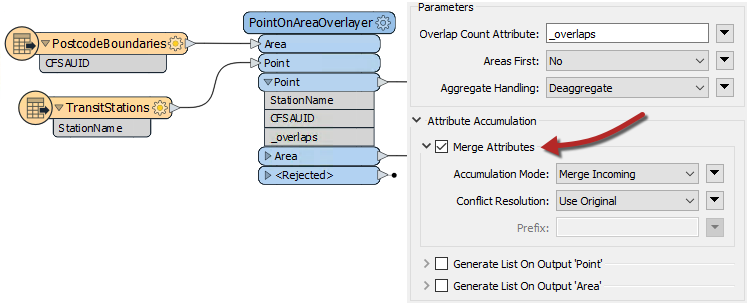
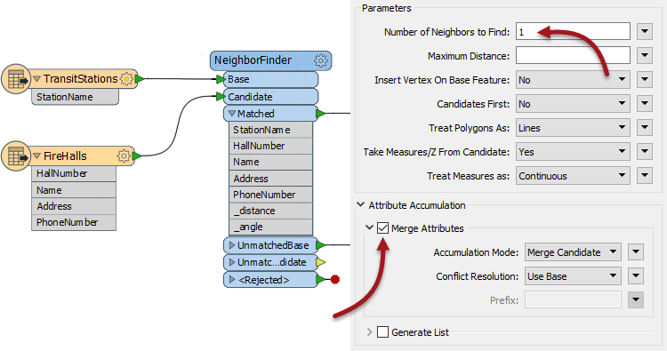
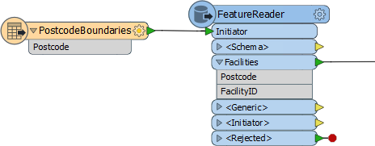
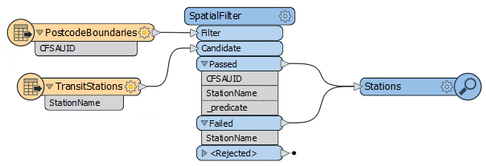

## Spatially Based Join Transformers ##

There are multiple transformers that can join data on the basis of a spatial relationship. Which you use depends on the spatial relationship to be tested and your exact join requirements. The following are some of the key transformers.

### Overlayers ###
There are a number of different "overlayer" transformers, each handling a different form of overlay. 

For example the PointOnAreaOverlayer carries out a spatial join on points that fall inside area (polygon) features. This is sometimes called a "Point in Polygon" operation.

As the help explains, "each point receives the attributes of the area(s) it is contained in, and each containing area receives the attributes of each point it contains"

Here the TransitStation features are being provided with a postal code (CFSAUID) depending on which PostcodeBoundary polygon they fall inside.

The "_overlaps" attribute is another useful outcome of this transformer. It tells us how many polygons each station fell inside; in this case overlapping postal codes might be spotted by a station having more than one overlap.

Conversely, the Area output would have an "_overlaps" attribute that would tell us how many stations fell inside each postal code.

---

### NeighborFinder ###
The NeighborFinder transformer carries out a spatial join based on a proximity relationship. Here the NeighborFinder is being used to identify the closest fire hall to each transit station:

The fire hall number, name, address, and phone number attributes are merged onto each Facility feature along with a number of useful attributes (not all shown) recording the X/Y coordinate, direction, and distance of the closest fire hall.

The parameters of the NeighborFinder includes the ability to specify a maximum distance for the relationship, or the maximum number of neighbors to find.

---

### FeatureReader ###
The FeatureReader is the spatial equivalent of the DatabaseJoiner transformer. It reads from an external dataset and forms a match based on a spatial relationship between the initiating feature and features in that dataset.

One difference is that the output is not the original feature, but the queried feature; hence the name FeatureReader:

For example, here the FeatureReader is being used to carry out the same overlay of transit station and postal code. The PostcodeBoundaries features are read into the workspace and used as a means to spatially query TransitStations (a table in a Geodatabase). The stations are retrieved with the attributes of the postcode feature they fall inside. 

This also acts as a form of filter, as stations are not output unless they fall inside the postcode boundary. 

---

### SpatialFilter ###
The SpatialFilter - as its name suggests - filters data according to a spatial relationship. However, it does also merge attributes from one feature to another, therefore can be said to be a type of Spatial Join.

The important part is to connect both Passed and Failed output ports, unless you do want to also filter the data.

---

<!--Person X Says Section-->

<table style="border-spacing: 0px">
<tr>
<td style="vertical-align:middle;background-color:darkorange;border: 2px solid darkorange">
<i class="fa fa-quote-left fa-lg fa-pull-left fa-fw" style="color:white;padding-right: 12px;vertical-align:text-top"></i>
Miss Vector says...
</td>
</tr>

<tr>
<td style="border: 1px solid darkorange">

Here is a question on data joins. Look at the following screenshot, then answer how many features will appear in the output connection...
  
  <a href="http://52.73.3.37/fmedatastreaming/Manual/QAResponse2017.fmw?chapter=5&question=6&answer=1&DestDataset_TEXTLINE=C%3A%5CFMEOutput%5CQAResponse.html">1. Eight (8)</a>
 <a href="http://52.73.3.37/fmedatastreaming/Manual/QAResponse2017.fmw?chapter=5&question=6&answer=2&DestDataset_TEXTLINE=C%3A%5CFMEOutput%5CQAResponse.html">2. Eighteen (18)</a>
 <a href="http://52.73.3.37/fmedatastreaming/Manual/QAResponse2017.fmw?chapter=5&question=6&answer=3&DestDataset_TEXTLINE=C%3A%5CFMEOutput%5CQAResponse.html">3. Twenty-six (26)</a>
 <a href="http://52.73.3.37/fmedatastreaming/Manual/QAResponse2017.fmw?chapter=5&question=6&answer=4&DestDataset_TEXTLINE=C%3A%5CFMEOutput%5CQAResponse.html">4. Can't tell</a>

</td>
</tr>
</table>
