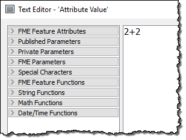
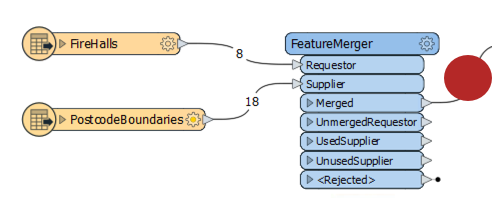

# Questions #

Here are the answers to the questions in this chapter.

---

<!--Person X Says Section-->

<table style="border-spacing: 0px">
<tr>
<td style="vertical-align:middle;background-color:darkorange;border: 2px solid darkorange">
<i class="fa fa-quote-left fa-lg fa-pull-left fa-fw" style="color:white;padding-right: 12px;vertical-align:text-top"></i>
Miss Vector says...
</td>
</tr>

<tr>
<td style="border: 1px solid darkorange">

Which of the following is NOT a category of transformers?
  1. Attributes
 2. Calculations
 3. Data Quality
 4. Workflows

</td>
</tr>
</table>

---

<!--Person X Says Section-->

<table style="border-spacing: 0px">
<tr>
<td colspan="2" style="vertical-align:middle;background-color:darkorange;border: 2px solid darkorange">
<i class="fa fa-quote-left fa-lg fa-pull-left fa-fw" style="color:white;padding-right: 12px;vertical-align:text-top"></i>
Miss Vector says...
</td>
</tr>

<tr>
<td colspan="2" style="border: 1px solid darkorange">

Here are four transformers and four categories. Match the transformer to the correct category.

</td>
</tr>
<tr><td width="50%" style="font-weight: bold; border: 1px solid darkorange">Scenario</td><td style="font-weight: bold; border: 1px solid darkorange">Tool</td></tr>
<tr><td style="border: 1px solid darkorange">Chopper</td><td style="border: 1px solid darkorange;font-weight:bold">Geometries</td></tr>
<tr><td style="border: 1px solid darkorange">Terminator</td><td style="border: 1px solid darkorange;font-weight:bold">Workflows</td></tr>
<tr><td style="border: 1px solid darkorange">Matcher</td><td style="border: 1px solid darkorange;font-weight:bold">Data Quality</td></tr>
<tr><td style="border: 1px solid darkorange">DateTimeConverter</td><td style="border: 1px solid darkorange;font-weight:bold">Strings</td></tr>
<tr>
<td colspan="2" style="border: 1px solid darkorange">

Did you look through the transformer gallery to find these? The quicker way is to look at the help page for the transformer. While we are on the subject, transformers can belong to more than one category. The DateTimeConverter (for example) belongs to both Strings and Calculated Values.

</td>
</tr>
</table>

---

<!--Person X Says Section-->

<table style="border-spacing: 0px">
<tr>
<td style="vertical-align:middle;background-color:darkorange;border: 2px solid darkorange">
<i class="fa fa-quote-left fa-lg fa-pull-left fa-fw" style="color:white;padding-right: 12px;vertical-align:text-top"></i>
Miss Vector says...
</td>
</tr>

<tr>
<td style="border: 1px solid darkorange">

Look at this screenshot of an editing dialog and tell me what the value returned to the attribute will be:
  
  1. 2+2
 2. 4
 3. 4.0
 4. Error!
  The key is to notice that the header of this dialog says "String Editor". Therefore the value returned to this attribute will be the literal string "2+2". If the user wishes to add 2+2 to get 4, they should have used the arithmetic editor!

</td>
</tr>
</table>

---

<!--Person X Says Section-->

<table style="border-spacing: 0px">
<tr>
<td style="vertical-align:middle;background-color:darkorange;border: 2px solid darkorange">
<i class="fa fa-quote-left fa-lg fa-pull-left fa-fw" style="color:white;padding-right: 12px;vertical-align:text-top"></i>
Miss Vector says...
</td>
</tr>

<tr>
<td style="border: 1px solid darkorange">

How many of the transformers in the Filters and Joins category appear in the top-30 Most-Valuable Transformers list?
  1. One (1)
 2. Four (4)
 3. Seven (7)
 4. Ten (10)
  As of January 2018 (and FME 2018.0) there are ten. They are the Tester (1st), FeatureMerger (4th), TestFilter (8th), Aggregator (12th), AttributeFilter (13th), FeatureReader (14th), SpatialFilter (21st), GeometryFilter (22nd), DuplicateFilter (27th), and Sampler (28th). So one-third of the top transformers come from the Filters and Joins category!

</td>
</tr>
</table>

---

<!--Person X Says Section-->

<table style="border-spacing: 0px">
<tr>
<td style="vertical-align:middle;background-color:darkorange;border: 2px solid darkorange">
<i class="fa fa-quote-left fa-lg fa-pull-left fa-fw" style="color:white;padding-right: 12px;vertical-align:text-top"></i>
Miss Vector says...
</td>
</tr>

<tr>
<td style="border: 1px solid darkorange">

So... why the Tester? Why not use the AttributeFilter? 
  Because we only need to test for one value in a simple Yes/No format. The AttributeFilter is better for testing multiple values. Also the AttributeFilter doesn't let us do "Begins With" tests.

</td>
</tr>
</table>

---

<!--Person X Says Section-->

<table style="border-spacing: 0px">
<tr>
<td style="vertical-align:middle;background-color:darkorange;border: 2px solid darkorange">
<i class="fa fa-quote-left fa-lg fa-pull-left fa-fw" style="color:white;padding-right: 12px;vertical-align:text-top"></i>
Miss Vector says...
</td>
</tr>

<tr>
<td style="border: 1px solid darkorange">

Look at the following screenshot, then answer how many features will appear in the output connection...
  
  1. Eight (8)
 2. Eighteen (18)
 3. Twenty-six (26)
 4. Can't tell
  It's impossible to tell from the screenshot, because you don't know how many attribute values will be a match. Because there are eight fire halls it will be anywhere from zero to eight, but that's all we can tell. In fact if it was a FeatureJoiner transformer there could be as many as 144 matches, if every fire hall somehow matched to every postcode boundary!

</td>
</tr>
</table>

---

<!--Person X Says Section-->

<table style="border-spacing: 0px">
<tr>
<td style="vertical-align:middle;background-color:darkorange;border: 2px solid darkorange">
<i class="fa fa-quote-left fa-lg fa-pull-left fa-fw" style="color:white;padding-right: 12px;vertical-align:text-top"></i>
Miss Vector says...
</td>
</tr>

<tr>
<td style="border: 1px solid darkorange">

Why do we use the StringCaseChanger on the roads data (to change it to UPPERCASE) rather than on the crime data (to change it to TitleCase)?
  Because uppercase is easier to match and has no risk of bad data. If a block was wrongly labelled W Georgia ST in the original data, a title case match would fail. An uppercase conversion would not.
  Also, be sure not to confuse the StringCaseChanger (changes attribute values) with the BulkAttributeRenamer (changes attribute names)!

</td>
</tr>
</table>

---
