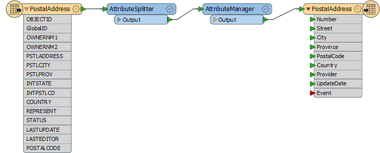
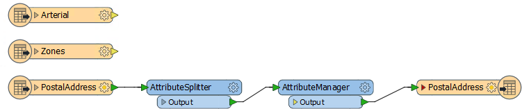
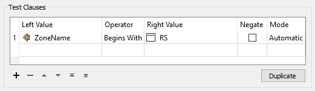
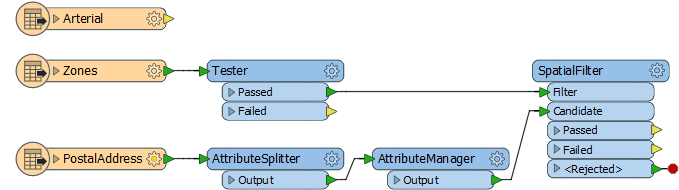
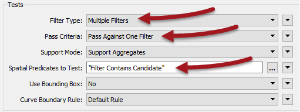
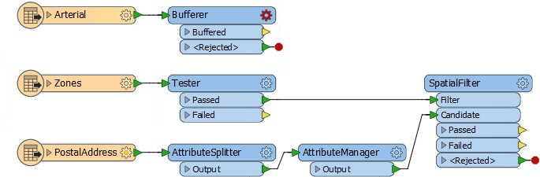
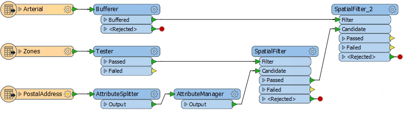
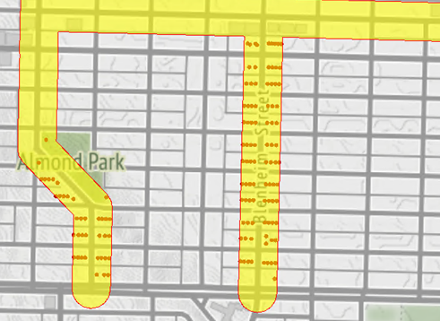
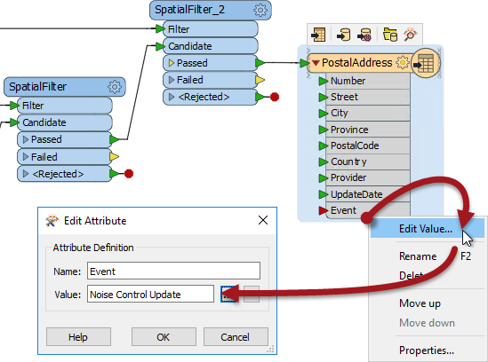

<!--Exercise Section-->

<table style="border-spacing: 0px;border-collapse: collapse;font-family:serif">
<tr>
<td width=25% style="vertical-align:middle;background-color:darkorange;border: 2px solid darkorange">
<i class="fa fa-cogs fa-lg fa-pull-left fa-fw" style="color:white;padding-right: 12px;vertical-align:text-top"></i>
Exercise 2
</td>
<td style="border: 2px solid darkorange;background-color:darkorange;color:white">
Noise Control Laws Project (Spatial Filtering)
</td>
</tr>

<tr>
<td style="border: 1px solid darkorange; font-weight: bold">Data</td>
<td style="border: 1px solid darkorange">Addresses (File Geodatabase) Zoning (MapInfo TAB) Roads (AutoCAD DWG)</td>
</tr>

<tr>
<td style="border: 1px solid darkorange; font-weight: bold">Overall Goal</td>
<td style="border: 1px solid darkorange">To find all residential addresses within 50 meters of an arterial highway</td>
</tr>

<tr>
<td style="border: 1px solid darkorange; font-weight: bold">Demonstrates</td>
<td style="border: 1px solid darkorange">Methods of conditional filtering</td>
</tr>

<tr>
<td style="border: 1px solid darkorange; font-weight: bold">Start Workspace</td>
<td style="border: 1px solid darkorange">C:\FMEData2018\Workspaces\DesktopBasic\Transformers-Ex2-Begin.fmw</td>
</tr>

<tr>
<td style="border: 1px solid darkorange; font-weight: bold">End Workspace</td>
<td style="border: 1px solid darkorange">C:\FMEData2018\Workspaces\DesktopBasic\Transformers-Ex2-Complete.fmw</td>
</tr>

</table>

As you know, city councillors have voted to amend noise control laws and local residents living in affected areas must be informed of these changes.

You have been recommended by your manager to take on the task, and there's a tight deadline.

In the first part of the project you created a workspace to convert addresses from Geodatabase to Excel, mapping the schema at the same time. 

This exercise is the second part of the project: locating all affected residents. You must locate all single-family residences within 50 metres of a major highway and filter out all others from the stream of address data.

 **1) Start Workbench**
 Start Workbench (if necessary) and open the workspace from Exercise 1. Alternatively you can open C:\FMEData2018\Workspaces\DesktopBasic\Transformers-Ex2-Begin.fmw

The workspace already has a reader to read addresses, transformers to edit the address schema, and a writer to write data to an Excel spreadsheet.

 **2) Add Reader (Roads data)**
 Use Readers > Add Reader to add a reader for the roads data. The roads data will be used to determine distance from an arterial route.

<table style="border: 0px">

<tr>
<td style="font-weight: bold">Reader Format</td>
<td style="">Autodesk AutoCAD DWG/DXF</td>
</tr>

<tr>
<td style="font-weight: bold">Reader Dataset</td>
<td style="">C:\FMEData2018\Data\Transportation\CompleteRoads.dwg</td>
</tr>

</table>

When prompted, select only the feature type (layer) called Arterial. 

 **3) Add Reader (Zoning data)**
 Use Readers > Add Reader to add a reader for zoning data. The zoning data will be used to determine whether an address is single-family residential or not.

<table style="border: 0px">

<tr>
<td style="font-weight: bold">Reader Format</td>
<td style="">MapInfo TAB (MITAB)</td>
</tr>

<tr>
<td style="font-weight: bold">Reader Dataset</td>
<td style="">C:\FMEData2018\Data\Zoning\Zones.tab</td>
</tr>

</table>

Ensure the feature types on the canvas are laid out in the order Arterial - Zones - PostalAddress; with attribute lists hidden the workspace will now look like this:

Feel free to inspect all of the source data to familiarize yourself with the contents.

 **4) Add Tester Transformer**
 Add a Tester transformer to the Zoning feature type.

This Tester will be used to filter residential zones from the other zoning areas.
All single-family residential zones will start with RS, so the Tester should be set up like this:

The important thing is to set up the tests using the “Begins With” predicate.

---

<!--Person X Says Section-->

<table style="border-spacing: 0px">
<tr>
<td style="vertical-align:middle;background-color:darkorange;border: 2px solid darkorange">
<i class="fa fa-quote-left fa-lg fa-pull-left fa-fw" style="color:white;padding-right: 12px;vertical-align:text-top"></i>
Miss Vector says...
</td>
</tr>

<tr>
<td style="border: 1px solid darkorange">

So... why the Tester? Why not use the AttributeFilter? <a href="http://52.73.3.37/fmedatastreaming/Manual/QAResponse2017.fmw?chapter=5&question=5&answer=1&DestDataset_TEXTLINE=C%3A%5CFMEOutput%5CQAResponse.html">Do you know?</a>

</td>
</tr>
</table>

---

 **5) Add SpatialFilter**
 Add a SpatialFilter transformer to the workspace. This will be used to test each address to show whether that address falls inside one of the filtered residential zones.

- Connect the Tester:Passed output to the SpatialFilter:Filter port
- Connect the AttributeManager:Output port to the SpatialFilter:Candidate port

 **6) Set up SpatialFilter**
 Set up the SpatialFilter parameters as follows:

<table>
<tr><td style="font-weight: bold">Filter Type</td><td>Multiple Filters</td><td>There are multiple zoning areas</td></tr>
<tr><td style="font-weight: bold">Pass Criteria</td><td>Pass Against One Filter</td><td>A single address cannot be in <strong>all</strong> zones</td></tr>
<tr><td style="font-weight: bold">Spatial Predicates to Test</td><td>Filter Contains Candidate</td><td>Find addresses that the zones contain</td></tr>
</table>

 **7) Add Inspectors**
 Now let's test what we have so far. Add Inspectors to the SpatialFilter Passed and Failed output ports, and the Tester:Passed port.

Save and run the workspace. Inspect the output to prove that it has worked as expected. The only area features will be the residential zones, and SpatialFilter:Passed (address) features will fall inside these areas.

 **8) Add Bufferer**
 Now we can determine which of the filtered addresses fall within 50 metres of an arterial route.

The SpatialFilter does not have a test for "within X distance" therefore we'll have to set that up a little differently. Add a Bufferer transformer to the workspace. Connect it to the Arterial roadsdata:

Set the Bufferer Buffer Amount parameter to be 50.

---

<!--Tip Section--> 

<table style="border-spacing: 0px">
<tr>
<td style="vertical-align:middle;background-color:darkorange;border: 2px solid darkorange">
<i class="fa fa-info-circle fa-lg fa-pull-left fa-fw" style="color:white;padding-right: 12px;vertical-align:text-top"></i>
TIP
</td>
</tr>

<tr>
<td style="border: 1px solid darkorange">

Optionally you can add a Dissolver transformer after the Bufferer, to merge all the buffer features together.
  The results of the translation will be the same (in terms of addresses selected) but the data will look better in the FME Data Inspector.

</td>
</tr>
</table>

---

 **9) Add SpatialFilter**
 Add a second SpatialFilter transformer. The buffered arterial routes are the Filter. The prefiltered addresses are the Candidates:

As before, set the parameters to test for candidates contained by a filter, using multiple filters but only a single pass is required.

**10) Run Workspace**
 Attach some Inspector transformers to show you the output from various transformers. Save and run the workspace. The output (zoomed in) should look like this:

 Map tiles by <a href="http://stamen.com">Stamen Design</a>, under <a href="http://creativecommons.org/licenses/by/3.0">CC-BY-3.0</a>. Data by <a href="http://openstreetmap.org">OpenStreetMap</a>, under <a href="http://creativecommons.org/licenses/by-sa/3.0">CC-BY-SA</a>.

**11) Connect Output**
 As a final step, reconnect the Excel spreadsheet output, and set a fixed value for the Event field:

Re-run the workspace and check the output to confirm the dataset has been written correctly. There should be 148 records in the spreadsheet, ready to send to the administration department for a bulk mailing.

---

<!--Exercise Congratulations Section--> 

<table style="border-spacing: 0px">
<tr>
<td style="vertical-align:middle;background-color:darkorange;border: 2px solid darkorange">
<i class="fa fa-thumbs-o-up fa-lg fa-pull-left fa-fw" style="color:white;padding-right: 12px;vertical-align:text-top"></i>
CONGRATULATIONS
</td>
</tr>

<tr>
<td style="border: 1px solid darkorange">

By completing this exercise you have learned how to:
 
<ul><li>Use the Tester transformer to filter by an attribute value</li>
<li>Use the SpatialFilter transformer to filter by geometry</li>
<li>Use the Bufferer transformer to set up a "within x distance of" test</li></ul>

</td>
</tr>
</table>
