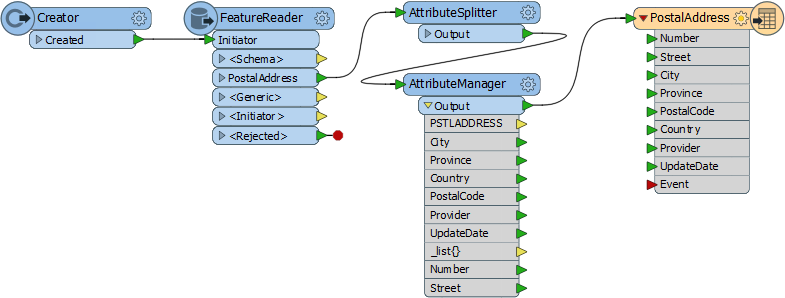
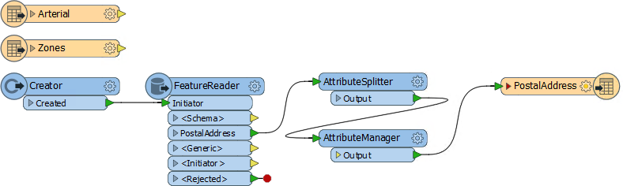
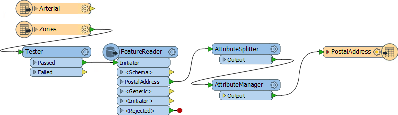
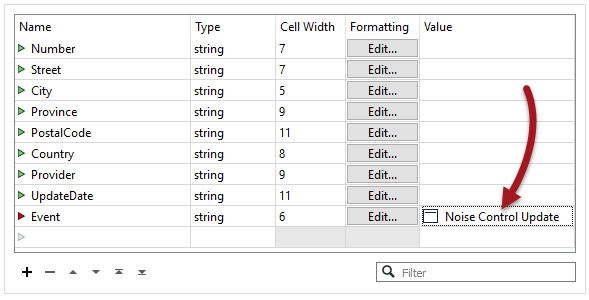

<!--Exercise Section-->

<table style="border-spacing: 0px;border-collapse: collapse;font-family:serif">
<tr>
<td width=25% style="vertical-align:middle;background-color:darkorange;border: 2px solid darkorange">
<i class="fa fa-cogs fa-lg fa-pull-left fa-fw" style="color:white;padding-right: 12px;vertical-align:text-top"></i>
Exercise 3
</td>
<td style="border: 2px solid darkorange;background-color:darkorange;color:white">
Noise Control Laws Project (Spatial Filtering)
</td>
</tr>

<tr>
<td style="border: 1px solid darkorange; font-weight: bold">Data</td>
<td style="border: 1px solid darkorange">Addresses (File Geodatabase) Zoning (MapInfo TAB) Roads (AutoCAD DWG)</td>
</tr>

<tr>
<td style="border: 1px solid darkorange; font-weight: bold">Overall Goal</td>
<td style="border: 1px solid darkorange">To find all residential addresses within 50 meters of an arterial highway</td>
</tr>

<tr>
<td style="border: 1px solid darkorange; font-weight: bold">Demonstrates</td>
<td style="border: 1px solid darkorange">Methods of conditional filtering</td>
</tr>

<tr>
<td style="border: 1px solid darkorange; font-weight: bold">Start Workspace</td>
<td style="border: 1px solid darkorange">C:\FMEData2018\Workspaces\DesktopBasic\Transformers-Ex3-Begin.fmw</td>
</tr>

<tr>
<td style="border: 1px solid darkorange; font-weight: bold">End Workspace</td>
<td style="border: 1px solid darkorange">C:\FMEData2018\Workspaces\DesktopBasic\Transformers-Ex3-Complete.fmw</td>
</tr>

</table>

As you know, city councillors have voted to amend noise control laws and local residents living in affected areas must be informed of these changes.

You have been recommended by your manager to take on the task, and there's a tight deadline.

In the first part of the project you created a workspace to convert addresses from Geodatabase to Excel, mapping the schema at the same time. 

This exercise is the second part of the project: locating all affected residents. You must locate all single-family residences within 50 metres of a major highway and filter out all others from the stream of address data.

 **1) Start Workbench**
 Start Workbench (if necessary) and open the workspace from Exercise 2. Alternatively you can open C:\FMEData2018\Workspaces\DesktopBasic\Transformers-Ex3-Begin.fmw

The workspace already has a FeatureReader to read addresses, transformers to edit the address schema, and a writer to write data to an Excel spreadsheet.

 **2) Add Reader (Roads data)**
 Use Readers > Add Reader to add a reader for the roads data. The roads data will be used to determine distance from an arterial route.

<table style="border: 0px">

<tr>
<td style="font-weight: bold">Reader Format</td>
<td style="">Autodesk AutoCAD DWG/DXF</td>
</tr>

<tr>
<td style="font-weight: bold">Reader Dataset</td>
<td style="">C:\FMEData2018\Data\Transportation\CompleteRoads.dwg</td>
</tr>

</table>

When prompted, select only the feature type (layer) called Arterial. 

 **3) Add Reader (Zoning data)**
 Use Readers > Add Reader to add a reader for zoning data. The zoning data will be used to determine whether an address is single-family residential or not.

<table style="border: 0px">

<tr>
<td style="font-weight: bold">Reader Format</td>
<td style="">MapInfo TAB (MITAB)</td>
</tr>

<tr>
<td style="font-weight: bold">Reader Dataset</td>
<td style="">C:\FMEData2018\Data\Zoning\Zones.tab</td>
</tr>

</table>

With attribute lists collapsed, the workspace will now look like this:

Feel free to inspect all of the source data to familiarize yourself with the contents. You can even run the workspace to make sure all caches are up to date.

 **4) Add Tester Transformer**
 Add a Tester transformer to the Zoning feature type.

This Tester will be used to filter residential zones from the other zoning areas.
All single-family residential zones will start with RS, so the Tester should be set up like this:

The important thing is to set up the test with the “Begins With” operator.

---

<!--Person X Says Section-->

<table style="border-spacing: 0px">
<tr>
<td style="vertical-align:middle;background-color:darkorange;border: 2px solid darkorange">
<i class="fa fa-quote-left fa-lg fa-pull-left fa-fw" style="color:white;padding-right: 12px;vertical-align:text-top"></i>
Miss Vector says...
</td>
</tr>

<tr>
<td style="border: 1px solid darkorange">

So... why the Tester? Why not use the AttributeFilter? <a href="http://52.73.3.37/fmedatastreaming/Manual/QAResponse2017.fmw?chapter=5&question=5&answer=1&DestDataset_TEXTLINE=C%3A%5CFMEOutput%5CQAResponse.html">Do you know?</a>

</td>
</tr>
</table>

---

 **5) Connect to FeatureReader**
 One way to filter data is to use a SpatialFilter transformer, and we will do this with the road features. But another method is to use filtering inside the FeatureReader transformer.

So, delete the Creator transformer and connect the Tester:Passed port to the FeatureReader:Initiator port:

 **6) Set up FeatureReader**
 Now inspect the FeatureReader's parameters. Set the Spatial Filter parameter to *Initiator Contains Result:*

This ensures that only addresses that fall inside a Single Family Residence zone will be read from the database. Make sure feature caching is turned on and run the workspace. Inspect the Tester:Passed and FeatureReader:PostalAddress caches to confirm that the results are correct.

 **7) Add Bufferer**
 Now we can determine which of the filtered addresses fall within 50 metres of an arterial route. This time we'll use a SpatialFilter transformer. 

The SpatialFilter does not have a test for "within X distance" therefore we'll have to set that up a little differently. Add a Bufferer transformer to the workspace. Connect it to the Arterial roads data:

Set the Bufferer Buffer Amount parameter to be 50.

---

<!--Tip Section--> 

<table style="border-spacing: 0px">
<tr>
<td style="vertical-align:middle;background-color:darkorange;border: 2px solid darkorange">
<i class="fa fa-info-circle fa-lg fa-pull-left fa-fw" style="color:white;padding-right: 12px;vertical-align:text-top"></i>
TIP
</td>
</tr>

<tr>
<td style="border: 1px solid darkorange">

Optionally you can add a Dissolver transformer after the Bufferer, to merge all the buffer features together.
  The results of the translation will be the same (in terms of addresses selected) but the data will look better in the FME Data Inspector.

</td>
</tr>
</table>

---

 **8) Add SpatialFilter**
 Add a SpatialFilter transformer. The buffered arterial routes are the Filter. The Candidate port can be connected between the FeatureReader and the AttributeSplitter:

This way the AttributeSplitter and AttributeManager are operating only on filtered features. If the SpatialFilter was connected after the AttributeManager, then data would be getting processed and then discarded.

 **9) Set SpatialFilter Parameters**
 Set up the SpatialFilter parameters as follows:

<table>
<tr><td style="font-weight: bold">Filter Type</td><td>Multiple Filters</td><td>There are multiple buffer polygons</td></tr>
<tr><td style="font-weight: bold">Pass Criteria</td><td>Pass Against One Filter</td><td>A single address cannot be in <strong>all</strong> buffers</td></tr>
<tr><td style="font-weight: bold">Spatial Predicates to Test</td><td>Filter Contains Candidate</td><td>Find addresses contained in the arterial buffers</td></tr>
</table>

ie there are multiple road buffers, but an address only has to be inside one buffer to pass (not all of them).

**10) Run Workspace**
 Run the workspace using Run From This on the SpatialFilter. Inspect the cached output to prove that only addresses inside both a single-family zone and a arterial road buffer have passed the filtering process.

**11) Set Event Field**
 As a final step, open the Feature Type dialog for the Excel writer, click on the User Attributes tab, and set a fixed value for the Event field:

Turn off caching, re-run the workspace, and check the output to confirm the dataset has been written correctly. There should be 148 records in the spreadsheet, ready to send to the administration department for a bulk mailing.

---

<!--Exercise Congratulations Section--> 

<table style="border-spacing: 0px">
<tr>
<td style="vertical-align:middle;background-color:darkorange;border: 2px solid darkorange">
<i class="fa fa-thumbs-o-up fa-lg fa-pull-left fa-fw" style="color:white;padding-right: 12px;vertical-align:text-top"></i>
CONGRATULATIONS
</td>
</tr>

<tr>
<td style="border: 1px solid darkorange">

By completing this exercise you have learned how to:
 
<ul><li>Use the Tester transformer to filter by an attribute value</li>
<li>Use the Spatial Filter option in the FeatureReader transformer</li>
<li>Use the Bufferer transformer to set up a "within x distance of" test</li>
<li>Use the SpatialFilter transformer to filter by geometry</li></ul>

</td>
</tr>
</table>