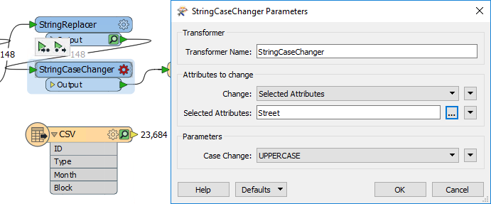
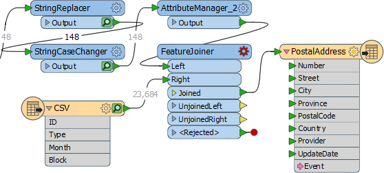
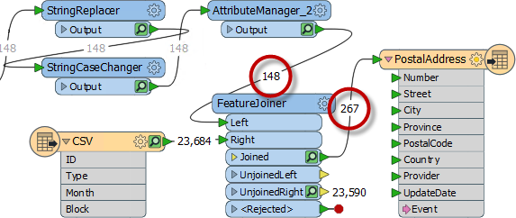
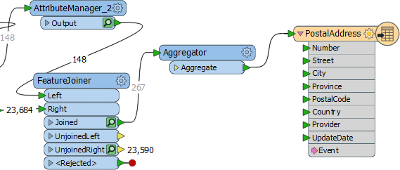
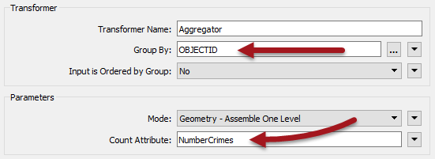
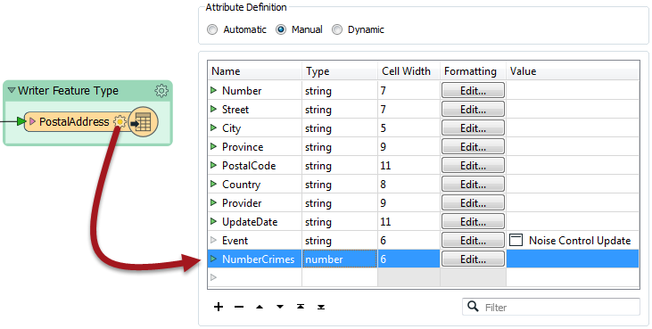

<!--Exercise Section-->

<table style="border-spacing: 0px;border-collapse: collapse;font-family:serif">
<tr>
<td width=25% style="vertical-align:middle;background-color:darkorange;border: 2px solid darkorange">
<i class="fa fa-cogs fa-lg fa-pull-left fa-fw" style="color:white;padding-right: 12px;vertical-align:text-top"></i>
Exercise 4
</td>
<td style="border: 2px solid darkorange;background-color:darkorange;color:white">
Noise Control Laws Project (Crime Data Joins)
</td>
</tr>

<tr>
<td style="border: 1px solid darkorange; font-weight: bold">Data</td>
<td style="border: 1px solid darkorange">Crime Statistics (CSV)</td>
</tr>

<tr>
<td style="border: 1px solid darkorange; font-weight: bold">Overall Goal</td>
<td style="border: 1px solid darkorange">Carry out a join between crime statistics and address features</td>
</tr>

<tr>
<td style="border: 1px solid darkorange; font-weight: bold">Demonstrates</td>
<td style="border: 1px solid darkorange">Attribute-Based Joins</td>
</tr>

<tr>
<td style="border: 1px solid darkorange; font-weight: bold">Start Workspace</td>
<td style="border: 1px solid darkorange">C:\FMEData2018\Workspaces\DesktopBasic\Transformers-Ex4-Begin.fmw</td>
</tr>

<tr>
<td style="border: 1px solid darkorange; font-weight: bold">End Workspace</td>
<td style="border: 1px solid darkorange">C:\FMEData2018\Workspaces\DesktopBasic\Transformers-Ex4-Complete.fmw</td>
</tr>

</table>

As you know, city councillors have voted to amend noise control laws and local residents living in affected areas were informed of these changes.

In the first part of the project, you created a workspace to convert addresses from Geodatabase to Excel, mapping the schema at the same time. In the second part of the project, you continued the workspace to locate all single-family residences within 50 metres of a major highway and filter out all others from the stream of address data.

Now a data journalist with a national newspaper is concerned that the relaxation of noise control laws may lead to more crime in the city. They have therefore made a request for recent crime figures for each of the affected addresses. They intend to compare this against future data to see if their theory is correct.

This is a major test of the city's open data policy and there's no question of not complying. However, a crisis arises as the current datasets for crime (CSV, non-spatial) is not joined to the address database in any way. 

So, for the final part of this project you must take the existing noise control workspace and amend it to incorporate crime statistics. 

Pull this off and you will be a spatial superhero!

 **1) Start Workbench**
 Start Workbench (if necessary) and open the workspace from Exercise 3. Alternatively you can open C:\FMEData2018\Workspaces\DesktopBasic\Transformers-Ex4-Begin.fmw

The workspace is already set up to read addresses, filter them spatially, and write them to an Excel spreadsheet.

 **2) Add Reader**
 Now let's start working with crime data. There is no benefit from using a FeatureReader, so add a reader to the workspace using Readers &gt; Add Reader from the menubar. Use the following parameters:

<table style="border: 0px">

<tr>
<td style="font-weight: bold">Reader Format</td>
<td style="">Comma Separated Value (CSV)</td>
</tr>

<tr>
<td style="font-weight: bold">Reader Dataset</td>
<td style="">C:\FMEData2018\Data\Emergency\Crime.csv</td>
</tr>

<tr>
<td style="font-weight: bold">Reader Parameters</td>
<td style="">Fields:Delimiter Character: , (Comma) Fields:Field Names Line: 1</td>
</tr>

</table>

 **3) Inspect Data**
 The next task is to familiarize yourself with the source data. Turn on feature caching and run the CSV reader using Run Just This:

Inspect the cached data. It will look like this in the Data Inspector Table View window:

Notice how there is no spatial data as such, but there is a block number. 

---

<!--Person X Says Section-->

<table style="border-spacing: 0px">
<tr>
<td style="vertical-align:middle;background-color:darkorange;border: 2px solid darkorange">
<i class="fa fa-quote-left fa-lg fa-pull-left fa-fw" style="color:white;padding-right: 12px;vertical-align:text-top"></i>
Police-Chief Webb-Mapp says...
</td>
</tr>

<tr>
<td style="border: 1px solid darkorange">

Crime?! In my city? I think not. But if there was... be aware that 7XX W Georgia Street means the seventh block on Georgia Street west of Ontario Street and covers building numbers 700-800. 7XX E Georgia Street would be 14 blocks away, the seventh block east of Ontario. Got it? 

</td>
</tr>
</table>

---

You might have spotted that each address feature has a number (not a block ID like "7XX"), and that the road data is stored in Title case ("W Georgia St") in the roads dataset, whereas the crime dataset is upper case ("W GEORGIA ST").

Both of these will make it harder, but not impossible, to join the two sets of data together.

 **4) Add StringReplacer**
 To merge the data we need to reduce the address number to a block number that matches the crime data in structure; for example we need 74XX instead of 7445.

So, add a StringReplacer transformer and connect it between the AttributeManager and the PostalAddress feature type. 

Set the following parameters:

<table>
<tr><td>Attributes</td><td>Number</td></tr>
<tr><td>Mode</td><td>Replace Regular Expression</td></tr>
<tr><td>Text to Replace</td><td>..$</td></tr>
<tr><td>Replacement Text</td><td>XX</td></tr>
</table>

The text to replace (..$) means replace the last two characters of the string, and they are replaced with XX to match the crime data. 

Run the workspace (using *Run to This* on the StringReplacer) and inspect the caches to ensure the transformer is working as expected.

 **5) Add StringCaseChanger**
 The other difference in crime/road data was in UPPER/Title case street names. This disparity can be fixed with a StringCaseChanger transformer.

Add a StringCaseChanger transformer after the StringReplacer and set the parameters to change the value of Street to upper case:

---

<!--Person X Says Section-->

<table style="border-spacing: 0px">
<tr>
<td style="vertical-align:middle;background-color:darkorange;border: 2px solid darkorange">
<i class="fa fa-quote-left fa-lg fa-pull-left fa-fw" style="color:white;padding-right: 12px;vertical-align:text-top"></i>
Miss Vector says...
</td>
</tr>

<tr>
<td style="border: 1px solid darkorange">

So, answer me this. Why do we use the StringCaseChanger on the address data (to UPPERCASE) rather than changing the crime data (to TitleCase)? <a href="http://52.73.3.37/fmedatastreaming/Manual/QAResponse2017.fmw?chapter=5&question=7&answer=1&DestDataset_TEXTLINE=C%3A%5CFMEOutput%5CQAResponse.html">Do you know?</a>

</td>
</tr>
</table>

---

 **6) Build Join Key**
 Having updated the attributes to match the crime data, we now have to construct a key out of them. 

Add an AttributeManager to the canvas after the StringCaseChanger. Create a new attribute called JoinKey. Open the Text Editor for the attribute and enter (select):

<pre>
@Trim(@Value(Number) @Value(Street))
</pre>

This will match the structure of the crime data (be sure to include a space character between the two attributes). The Trim function is there to ensure there are no excess spaces on those attributes. 

 **7) Add FeatureJoiner**
 Now we've sorted out the structure of our join keys we can merge the data together with a FeatureJoiner.

Add a FeatureJoiner to the canvas. 

Connect the address data (the AttributeManager output) to the Left input port. Connect the crime data (the CSV reader feature type) to the Right input port. 

Connect the FeatureJoiner:Joined output port to the PostalAddress writer feature type:

Inspect the parameters for the FeatureJoiner.

For the Join Mode select *Left*. This means that we want all of the addresses to be output, whether they match to a crime record or not.

In the Join On parameters select the JoinKey attribute for the Left value, and the Block attribute for the Right value.

Run that part of the workspace to see what the results of this translation are.

 **8) Add Aggregator**
 Interestingly, although 148 addresses enter the FeatureJoiner, 267 emerge from it:

That's because there are multiple crimes per block and there were 267 matches with the data.

We can aggregate that data together using an Aggregator transformer. So place an Aggregator transformer after the FeatureJoiner:Joined port:

Inspect the parameters. We need to set the group-by parameter by selecting attributes that will group matches back into the original addresses. There is no ID for each address because we removed them in a previous step, so either:

- Return to the AttributeManager, undo the Remove option for OBJECTID, and use OBJECTID as the Aggregator group-by
- Use UpdateDate as the Aggregator group-by (because each address will have received a unique timestamp)

Then set the Count Attribute to a value of NumberCrimes:

If you expand your attributes for the PostalAddress writer, you will notice that NumberCrimes doesn't appear. When we edited the User Attributes for this writer in an earlier exercise, we changed its Attribute Definition from Automatic to Manual. This means it will not automatically update to add new attributes created during translation. Therefore we have to either switch back to Automatic (which would bring along many other unwanted attributes), or simply add a new attribute called NumberCrimes here. Give it type "number" and cell width 6. The data from the Aggregator will now have its attribute on the writer.

 **9) Write Data**
 Now we know the workspace is performing correctly, turn off feature caching. It's not necessary to cache everything for a workspace that's in production.

Now edit the PostalAddress attribute schema by adding a NumberCrimes attribute:

Finally re-run the workspace and check the results in the Data Inspector. The data will include the number of crimes, and the reworking of the attributes means that individual addresses have been anonymized as well. This is important because this data is being made public.

---

<!--Exercise Congratulations Section--> 

<table style="border-spacing: 0px">
<tr>
<td style="vertical-align:middle;background-color:darkorange;border: 2px solid darkorange">
<i class="fa fa-thumbs-o-up fa-lg fa-pull-left fa-fw" style="color:white;padding-right: 12px;vertical-align:text-top"></i>
CONGRATULATIONS
</td>
</tr>

<tr>
<td style="border: 1px solid darkorange">

By completing this exercise you have learned how to:
 
<ul><li>Pre-process data to get join keys with a matching structure</li>
<li>Build a join key for use in a FeatureJoiner</li>
<li>Join non-spatial data with a join key in the FeatureJoiner</li>
<li>Use an Aggregator transformer to merge joins and count the number of joins</li></ul>

</td>
</tr>
</table>
