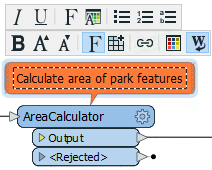

## Annotating Workspaces ##
Annotation is a key method for a clear and comprehensible design.

Annotation helps other users understand what is supposed to be happening in the translation and also helps the creator when returning to a workspace after a long interval (take it from me that this is especially important!)

There are two different types of annotation that can be applied to a workspace.

---

### User Annotation ###
User annotation is a comment created by the user. It can be connected to a workspace object (transformer or feature type), can be connected to a workspace connection, or can float freely within the workspace.

To create floating user annotation, right-click the canvas and select Insert Annotation.

To create attached user annotation, right-click a workspace object and select Add Annotation, or use the shortcut Ctrl+K.

When you place an annotation you have the opportunity to change the font style, font size, and background color; plus you can also add hyperlinks, bullet points, and tables.

---

### Summary Annotation ###
Summary annotation is an FME-generated comment that provides information about any object within the workspace. This item can be a source or destination feature type, or a transformer.

Summary annotation is always colored blue to distinguish it from other annotation. It's always connected to the item to which it relates and cannot be detached.

The nice thing about Summary Annotation is that it automatically updates in response to changes. That makes it very useful for checking transformer parameters (or reader/writer schemas) at a quick glance. It's particularly useful in situations where the parameters are set through a wizard and are more awkward to check (for example, the SchemaMapper or FMEServerJobSubmitter transformers).

---

<!--Tip Section--> 

<table style="border-spacing: 0px">
<tr>
<td style="vertical-align:middle;background-color:darkorange;border: 2px solid darkorange">
<i class="fa fa-info-circle fa-lg fa-pull-left fa-fw" style="color:white;padding-right: 12px;vertical-align:text-top"></i>
TIP
</td>
</tr>

<tr>
<td style="border: 1px solid darkorange">

A good idea is to use summary annotation to show <strong>what</strong> actions are taking place; but use user annotation to clarify <strong>why</strong> an action is being carried out.
  You can convert a summary annotation to a user (attached) annotation by using this context menu option: 
  
  This allows you to extract the information from a summary annotation, but edit it as you would a user annotation. Note that a converted summary annotation no longer updates automatically!

</td>
</tr>
</table>