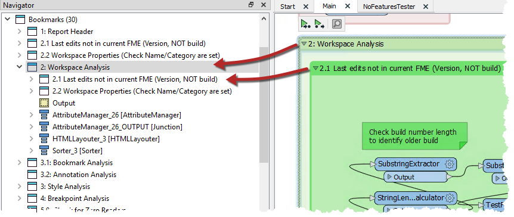
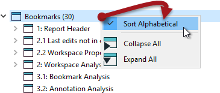

### Bookmarks for Quick Access ###
Bookmarks are listed in the Workbench Navigator window. Each bookmark is depicted as a folder and can be expanded to show its contents. This may include feature types, transformers, or other - nested - bookmarks:

Clicking or double-clicking a bookmark in the Navigator selects that bookmark and brings it into view. So when bookmarks have been used to divide a workspace into sections, they can also be used to navigate between different parts of that workspace.

In this way bookmarks are like the chapter headings in a book!

### Workspace Presentation ###
Bookmarks can also be made to appear on the FME Workbench toolbar:

Besides being a way to quickly access bookmarks, this tool can be used as what is known as "Presentation Mode" in FME Workbench. By clicking the arrow button (or pressing the keyboard spacebar) you flip from bookmark to bookmark, using animation, in a way that would be very useful when showing the workspace as part of a presentation.

---

<!--Tip Section--> 

<table style="border-spacing: 0px">
<tr>
<td style="vertical-align:middle;background-color:darkorange;border: 2px solid darkorange">
<i class="fa fa-info-circle fa-lg fa-pull-left fa-fw" style="color:white;padding-right: 12px;vertical-align:text-top"></i>
TIP
</td>
</tr>

<tr>
<td style="border: 1px solid darkorange">

To access the functionality you need to make sure it is added to the toolbar. You can do this by right-clicking on the toolbar and using the customize option. 

</td>
</tr>
</table>

---

<!--Person X Says Section-->

<table style="border-spacing: 0px">
<tr>
<td style="vertical-align:middle;background-color:darkorange;border: 2px solid darkorange">
<i class="fa fa-quote-left fa-lg fa-pull-left fa-fw" style="color:white;padding-right: 12px;vertical-align:text-top"></i>
Dr. Workbench says...
</td>
</tr>

<tr>
<td style="border: 1px solid darkorange">

The order of bookmarks in that window is alphabetical and that might not always be the same order that you wish to present a workspace.
  In that case, right-click on Bookmarks in the Navigator window and turn off the default option to "Sort Alphabetically". 
  
  Bookmarks can then be dragged up and down in the Navigator window to give the correct order. Additionally, a new option on the bookmark Properties dialog allows you to exclude specific bookmarks from the Bookmark Navigator. Nested bookmarks are excluded by default, so must be turned on to be included in the navigator.
  For more information see this <strong><a href="http://blog.safe.com/2016/03/fmeevangelist146/">article on bookmarks</a></strong> on the Safe Software blog.

</td>
</tr>
</table>