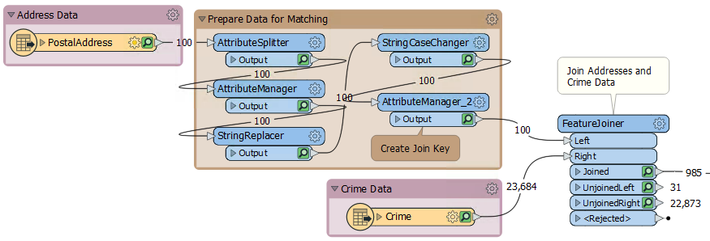
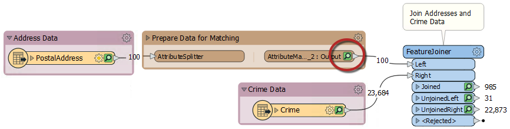
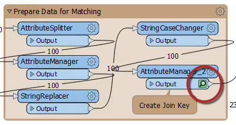

### Bookmarks for Performance ###
When a workspace is run with Data Caching turned on, then features are cached at every transformer. As you can imagine, in larger workspaces this leads to a lot of data being cached, sometimes unnecessarily:

 
Notice in the above screenshot that every transformer in the Prepare Data for Matching bookmark is being cached.

However, when a bookmark is collapsed, then caching only occurs on the bookmark output objects:

This means that data is cached only for the final transformer in the bookmark, saving considerable time and resources:

---

<!--Person X Says Section-->

<table style="border-spacing: 0px">
<tr>
<td style="vertical-align:middle;background-color:darkorange;border: 2px solid darkorange">
<i class="fa fa-quote-left fa-lg fa-pull-left fa-fw" style="color:white;padding-right: 12px;vertical-align:text-top"></i>
Dr. Workbench says...
</td>
</tr>

<tr>
<td style="border: 1px solid darkorange">

Obviously you don't want to put a workspace into production when caching is turned on, regardless of whether your bookmarks are collapsed. This technique is only recommended for use in the design, authoring, and testing phases of workspace creation.

</td>
</tr>
</table>