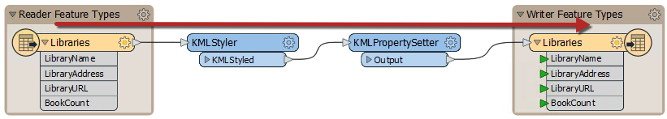
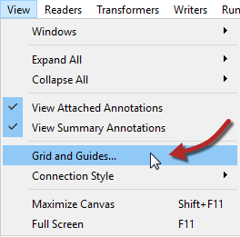
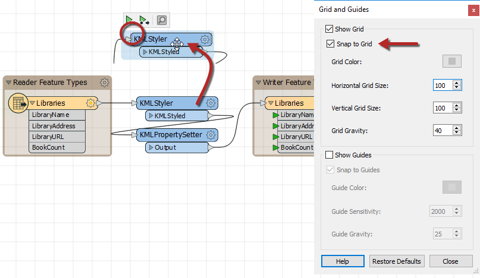
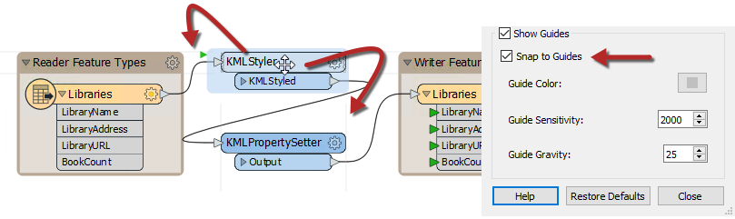
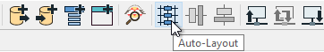
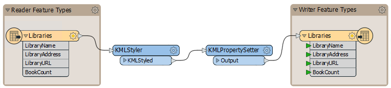

## Object Layout ##

The positioning of workspace objects and the care taken in connecting them can really make the difference between a poorly-designed workspace and one that is visually attractive and efficient.  

### Object Layout ###

Layout methods vary from user to user. Some users like to line up objects so that all *connections* are horizontal:

Others prefer the tops of *objects* to be aligned horizontally, with angled connections:

Some prefer to align object edges vertically:

The style used is more a personal preference than a definite rule, but what is important is consistency. A workspace that has no obvious layout style, or an inconsistent one, does not inspire confidence in the author's abilities!

---

### Grid and Guides ###
Grids and Guides are a tool to help align workspace objects in a neat and tidy way. This functionality is accessed through View > Grid and Guides on the Workbench menubar.

**Show Grid** causes a grid of lines to be displayed on the Workbench canvas. Snap to Grid causes all objects - such as the summary annotation highlighted - to snap onto the intersection of grid lines when moved. In this way objects can be more easily lined up.

**Show Guides** causes guidelines to be displayed on the Workbench canvas whenever an object is moved, and lines up approximately to another canvas object. Snap to Guides allows an object to be snapped onto a highlighted guideline.

These two tools make it very simple for workspace objects to be aligned in a pleasing style.

---

### Autolayout ###

The Autolayout tool appears on the toolbar of FME Workbench:

Clicking the toolbar button will layout either all of the workspace, or just objects that are currently selected:

As you can see, the autolayout tends to use a horizontal pattern, with the tops of objects aligned. Therefore it's better to select groups of transformers at a time, when using this tool, rather than trying to lay out the entire workspace in a single action.

---

<!--Person X Says Section-->

<table style="border-spacing: 0px">
<tr>
<td style="vertical-align:middle;background-color:darkorange;border: 2px solid darkorange">
<i class="fa fa-quote-left fa-lg fa-pull-left fa-fw" style="color:white;padding-right: 12px;vertical-align:text-top"></i>
Dr. Workbench says...
</td>
</tr>

<tr>
<td style="border: 1px solid darkorange">

In general, the autolayout algorithm is OK... but it still can't compare with taking the time and effort to manually organize your object layout.

</td>
</tr>
</table>