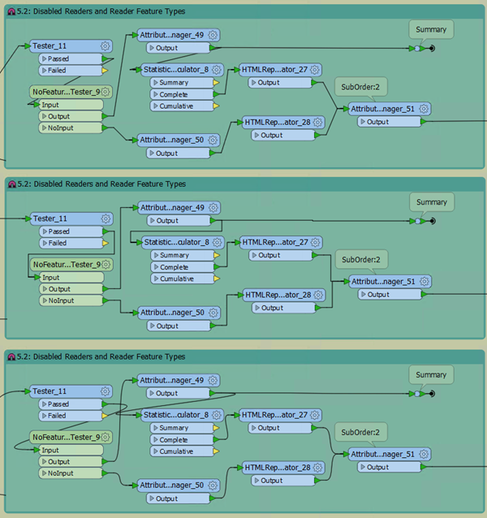
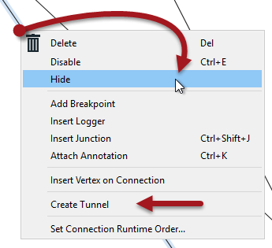
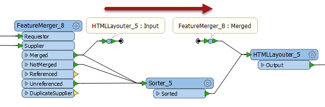

## Connection Style ##

It's also worth noting that object positioning is only part of a good layout. The other key part is the connection style. 

As with the positioning of workspace objects, the care taken in connecting them can really make the difference between a poorly-designed workspace and one that is visually attractive and efficient.  

### Connection Styles ###

Connections are the lines between objects on the workspace canvas. There are three different styles of connection that you can create in Workbench.

- Straight: The original connection style; a straight line between two objects
- Squared: A style that evokes a Manhattan skyline through squared connections 
- Curved: A style that changes straight lines to curved

This image shows a comparison of the three styles. You can switch between styles using either the View menu, the FME Options menu, or the shortcut Ctrl+Shift+C.

Once more, there is no right or wrong choice about which style to use; it is more a personal preference. However, the best overall look is usually defined by an object layout that will be subtly different for each style, as the following shows.

---

### Non-Overlapping Connections ###

One of the most obvious failings of a workspace design is to have connections that cross over each other, for example like this: 

So overlapping connections should always be avoided. However, sometimes the choice of connection style can be more likely to lead to this happening. For example curved connections tend to cross over more than straight ones: 

...and squared connections can sometimes cross in ways that are difficult to decipher: 

Because these issues can spring up when you switch connection style, and would need objects moving to clear them up, it's wise to choose a particular connection style and layout technique and stick with it.

---

### Junctions ###

There is one transformer in FME Workbench that is designed to be used to enhance the layout of objects and connections. That transformer is called the **Junction**.

This transformer is a small, node-like object, that carries out no function on the data, but is instead used to tidy connections within a workspace - as in the above screenshot. This makes it an excellent tool for best practice.

As with any other transformer, a junction can be connected to an Inspector or Logger, and it can have annotation objects attached to it. It also works with both Quick Add and Drag/Connect functionality.

---

### Hidden Connections and Tunnels ###

The ability to hide connections is especially useful for avoiding overlaps. To hide a connection, right-click on it and choose the option to Hide:

A hidden connection is represented by a 'transmitter' icon, or by a greyed-out dashed line when the object at one end of the connection is selected:

The other available option is "Create Tunnel". This creates a hidden connection with the addition of an annotated junction transformer at each end:

A tunnel makes a hidden connection slightly more obvious, plus allows for annotation at each end.

#### Revisualizing Hidden Connections ####

To view hidden connections, simply click on an object at either end. The connection is highlighted as a greyed-out dashed line.

To return a connection back to view, right-click an object to which it is connected and choose Show Connection(s). 

For more information on Tunnels and Junctions see <strong><a href="http://blog.safe.com/2016/05/fmeevangelist150/">this blog post</a></strong>.