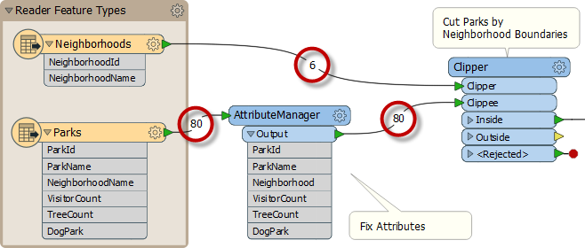
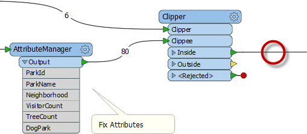
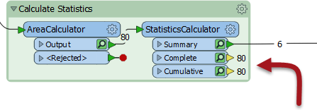
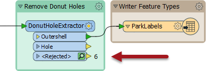
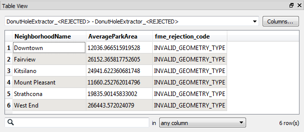

## Feature Counts ##
A workspace **Feature Count** refers to the numbers shown on each connection once a translation is complete:

Once an error or problem has been determined to exist, feature counts help us identify *where* that problem occurred. 

In the above screenshot, if you were expecting 74 output features, but only got 73, then you would inspect the feature counts to find where that missing feature went (it appears to unexpectedly fail the Tester tests).

---

### Incorrect Output ###

When the number of output features is incorrect, then there are several things to check.

If you get zero output, and the feature counts show that all features entered a transformer, but none emerged, then you can be fairly confident that the transformer is the cause of the problem:

Here, for example, 80 features enter the Clipper transformer (to be clipped against a single boundary) but none emerge. The Clipper transformer is almost certainly the cause of any incorrect output. 

The data is not rejected as invalid; it merely does not pass the test expected. It's possible that Clipper and Clippees don't occupy the same coordinate system, hence one does not fall inside the other. 

Alternatively - and this is a common cause of missing features - the author has connected the wrong output port! For example, this user has connected the StatisticsCalculator Summary output port, when they really wanted the Complete port connected:

The red attribute connectors on the writer feature type are a good indication that something is going wrong.

---

### Rejected Features ###

Sometimes when features go missing they are being rejected by a transformer. Many transformers include a &lt;Rejected&gt; port to output these invalid features:

Remember, features are automatically counted on a &lt;Rejected&gt; port, even if there is no other transformer attached. Additionally, the rejected features are also saved as a temporary dataset that can be viewed by clicking on the inspect icon.

As an additional benefit, the rejected features will often include a rejection code attribute:

