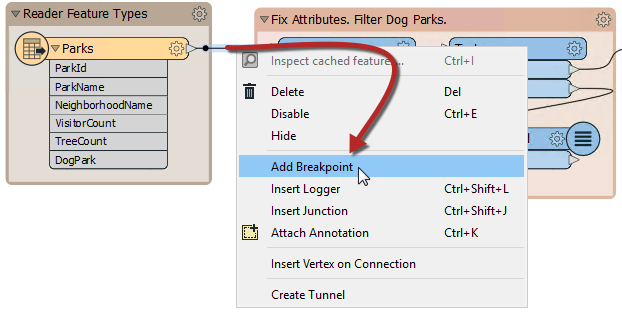
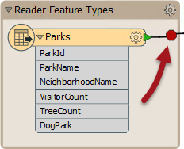
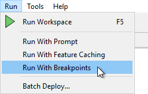

## Feature Debugging ##
Feature Debugging is a tool that allows individual features to be inspected during a translation. It differs from inspecting data at a particular location in that it inspects features one at a time, and allows the author to trace that feature's progress through a workspace.

This is most useful when a problem has been identified as being during transformation, but the point of failure is unknown.

Feature Debugging is triggered by "breakpoints"; workspace connections that are flagged by the user as a location where features should be inspected:

The connection is highlighted in a darker black color with a red "stop" sign, to denote its new status:

Now the workspace is run with the “Run with Breakpoints” option turned on:

When the first feature arrives at the breakpoint, the translation is temporarily paused and information about the feature displayed in a Feature Inspector window.

The upper part of the window shows a graphic representation of the feature; the lower part lists properties such as Feature Type and Coordinate System; plus attribute and geometry information.

There are four buttons at the foot of the Feature Inspector window:

<table>

<tr>
<th>Button</th>
<th>Operation</th>
<th>Description</th>
</tr>

<tr>
<td></td>
<td>Step to Next Connection</td>
<td>This tool steps through the workspace one transformer at a time, showing the status of a feature as it is processed.</td>
</tr>

<tr>
<td></td>
<td>Step to Next Breakpoint</td>
<td>This tool re-starts the translation, stopping the next time a feature reaches an inspection point.</td>
</tr>

<tr>
<td></td>
<td>Continue Translation</td>
<td>This tool re-starts the translation, ignoring all further breakpoints.</td>
</tr>

<tr>
<td></td>
<td>Stop Translation</td>
<td>This tool stops the translation.</td>
</tr>

</table>

The currently active connection is highlighted red to show it is the location where the translation is currently paused.