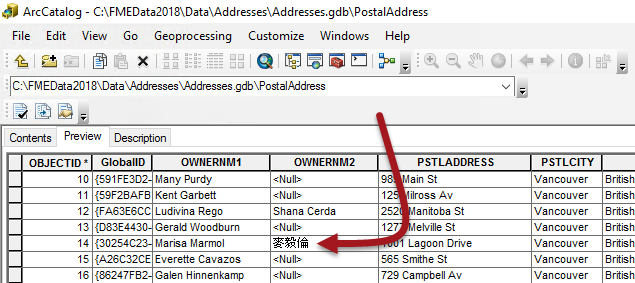
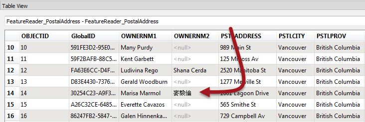
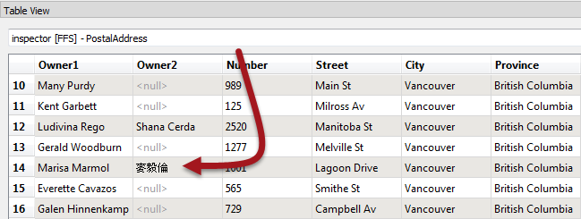
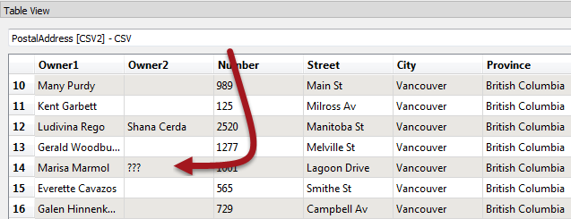
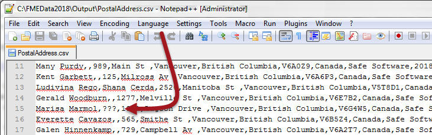
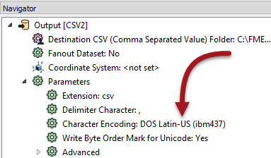

## Checking Key Stages ##

If the feature counts cannot help to pinpoint the location of a problem, then the next step is inspecting data at key stages of a translation.

Generally, issues in an output dataset occur due to one of these:

- The data was incorrectly read
- The data was incorrectly transformed 
- The data was incorrectly written
- The data is being incorrectly interpreted by another application

### Example ###

A translation from a File Geodatabase of addresses to CSV format renders attribute values incorrectly in the output. For example, the name "麥毅倫" is rendered as "???".

Obviously an encoding problem has occurred, but where? The fact that data appears incorrect in another application is no real indication of where that problem was introduced. 

In this scenario the author should check the data at key stages to determine when the data last looked correct.

---

### Inspect the Source Data Before Reading ###

It's easy to assume source data is correct without checking it. So, if possible, the source data should be inspected in its native application:

Obviously if the data is incorrect at source then there is little chance the translation output will be correct. However in our example it is correct in ArcGIS, so the translation should work.

---

### Inspect the Source Data After Reading ###

If the source data is correct in its native application, then inspect it using FME. Either open the data directly in the FME Data Inspector, or - if the workspace was run with caching turned on - open it from within FME Workbench:

If the data is incorrect at this point then the process of reading the data with FME is at fault. Again, in our example the data is correct, so we must continue on to diagnose the problem.

---

### Inspect the Data Before Writing ###

Now we should inspect the data between transformation and writing.

If the workspace was run with caching turned on (Run &gt; Run with Feature Caching) then the data is available for inspection already. Otherwise turn on this option (or Writers &gt; Redirect to FME Data Inspector) and re-run the workspace. 

Inspect the data to see if it was correct at the point just before it is written to the output: 

If the Data Inspector shows � characters at this point then we can assume that the problem occurs in data transformation, before it is written. You can, using Feature Caching, inspect each step of the process to locate at which transformer the problem appears.

In our example the data is still correct, so we should test the output dataset next.

---

### Inspect the Output Dataset ###

If the data is correct before writing, then it might be that it is being written incorrectly.

Open the output dataset in the FME Data Inspector. This will show the data as FME wrote it (and, of course, read it back). If the data is incorrect here, then the problem will have likely occurred during writing of the data:

In the above example, if the Data Inspector shows � characters at this point, then the data has been mangled when it was being written. That appears to be the case here. 

Another check to make is to open the data in a text editor. For obvious reasons it will not be possible to do this for every dataset (binary files or databases for example) but for text-based files it can provide definitive proof of whether the data is correct at this point: 

For our example this confirms that the problem occurs when writing the data. However, this might not always be the case...

---

### Inspect the Output Dataset in Another Application ###

If FME (and a text editor) can display the output data, then it might be that the intended application is not interpreting the data correctly.

So, open the output dataset in the application in which it is intended to be used. If FME can read the data correctly, and it looks correct in a text editor, then the problem is more likely to be with how the end application interprets the data:

That would be particularly true if the format was non-native to that application; for example, reading a Geodatabase outside of an Esri product.

---

All of these techniques narrow down where an error might have occurred, but don't always specify the cause. For example, incorrect output could mean that FME has a limitation in that writer or that the workspace author has set an incorrect parameter. Or maybe one application uses a different default encoding to another.

In this case knowing the writer is at fault, we can check the Writer parameters and find one that appears to be setting an incorrect encoding:

In short, these techniques identify where to investigate first, but won't provide an absolute answer by themselves.

---

<!--Tip Section--> 

<table style="border-spacing: 0px">
<tr>
<td style="vertical-align:middle;background-color:darkorange;border: 2px solid darkorange">
<i class="fa fa-info-circle fa-lg fa-pull-left fa-fw" style="color:white;padding-right: 12px;vertical-align:text-top"></i>
TIP
</td>
</tr>

<tr>
<td style="border: 1px solid darkorange">

Encoding is a good example for us here, but it's also an example of where you should check that your computer is capable of viewing such data at all! If your computer is set up in the wrong locale then it might not even be possible for you.

</td>
</tr>
</table>