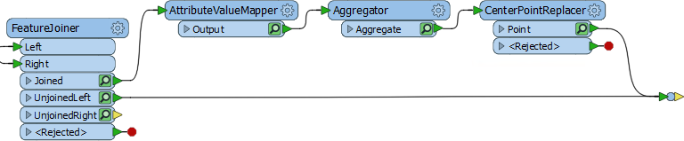
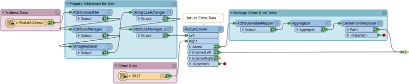
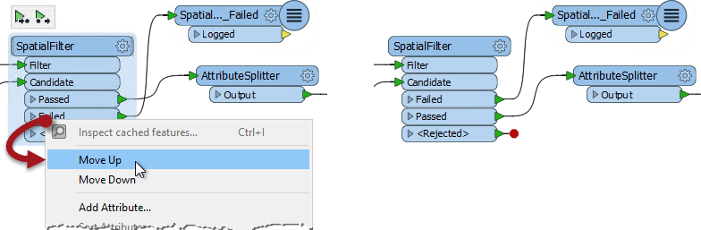

<!--Exercise Section-->

<table style="border-spacing: 0px;border-collapse: collapse;font-family:serif">
<tr>
<td width=25% style="vertical-align:middle;background-color:darkorange;border: 2px solid darkorange">
<i class="fa fa-cogs fa-lg fa-pull-left fa-fw" style="color:white;padding-right: 12px;vertical-align:text-top"></i>
Exercise 1
</td>
<td style="border: 2px solid darkorange;background-color:darkorange;color:white">
Applying the Style Guide
</td>
</tr>

<tr>
<td style="border: 1px solid darkorange; font-weight: bold">Data</td>
<td style="border: 1px solid darkorange">Addresses (Esri Geodatabase) Crime Data (CSV - Comma Separated Value) Parks (MapInfo TAB)</td>
</tr>

<tr>
<td style="border: 1px solid darkorange; font-weight: bold">Overall Goal</td>
<td style="border: 1px solid darkorange">Work on Vancouver Walkability Project</td>
</tr>

<tr>
<td style="border: 1px solid darkorange; font-weight: bold">Demonstrates</td>
<td style="border: 1px solid darkorange">Style Best Practice</td>
</tr>

<tr>
<td style="border: 1px solid darkorange; font-weight: bold">Start Workspace</td>
<td style="border: 1px solid darkorange">C:\FMEData2018\Workspaces\DesktopBasic\BestPractice-Ex1-Begin.fmwt</td>
</tr>

<tr>
<td style="border: 1px solid darkorange; font-weight: bold">End Workspace</td>
<td style="border: 1px solid darkorange">C:\FMEData2018\Workspaces\DesktopBasic\BestPractice-Ex1-Complete.fmwt</td>
</tr>

</table>

You have just been assigned to a project to calculate the "walkability" of each address in the city of Vancouver. Walkability is a measure of how easy it is to access local facilities on foot. It will include a measure of the distance to the nearest park, the amount of crime in an area, and other similar measures. 

The workspace for this project has already been started, with crime information being connected to each address, but the author was obviously unaware of the FME style guide, so as well as continuing the project, a certain amount of styling must be added to the existing content.

 **1) Start Workbench**
 Start FME Workbench. 

Notice that the workspace file is actually a template (it has the file extension .fmwt). This is good because it means that there might be existing caches for the project. Ensure that Run with Feature Caching is turned on. and open the workspace template from from C:\FMEData2018\Workspaces\DesktopBasic\BestPractice-Ex1-Begin.fmwt

This workspace obviously needs some style applied to it in the form of bookmarks and annotation.

 **2) Rearrange Transformers**
 Firstly the Inspector transformer is not required - we can inspect caches more easily - and can be deleted. However, because it has two connections into it, and we want to keep track of what they are, once deleted replace it with a Junction transformer.

Then clean up the transformers around it so that there are no overlapping connections:

Now rearrange the first part of the workspace, avoiding overlapping connections and looking out for transformers that might logically be grouped together in a bookmark:

 **3) Add Style**
 Having rearranged the transformers in a pleasing way, now add bookmarks and annotation where appropriate.  This will require some inspection of the transformers to see what each of them is doing. But you should be able to see at least two groups of transformers that can be placed into a bookmark:

Don't forget to phrase annotation and bookmark titles so that future users of the workspace will be able to tell at a glance what the workspace is supposed to do. 

---

<!--Tip Section--> 

<table style="border-spacing: 0px">
<tr>
<td style="vertical-align:middle;background-color:darkorange;border: 2px solid darkorange">
<i class="fa fa-info-circle fa-lg fa-pull-left fa-fw" style="color:white;padding-right: 12px;vertical-align:text-top"></i>
TIP
</td>
</tr>

<tr>
<td style="border: 1px solid darkorange">

Overlapping connections can also be cleaned up by rearranging the order of transformer output ports:
  

</td>
</tr>
</table>

---

![](./Images/
![](./Images/
![](./Images/
![](./Images/
![](./Images/
![](./Images/

 

---

<!--Exercise Congratulations Section--> 

<table style="border-spacing: 0px">
<tr>
<td style="vertical-align:middle;background-color:darkorange;border: 2px solid darkorange">
<i class="fa fa-thumbs-o-up fa-lg fa-pull-left fa-fw" style="color:white;padding-right: 12px;vertical-align:text-top"></i>
CONGRATULATIONS
</td>
</tr>

<tr>
<td style="border: 1px solid darkorange">

By completing this exercise you have learned how to:
 
<ul><li>Use annotations to clarify the processes taking place in a workspace</li>
<li>Use bookmarks to turn a single workspace into defined sections</li>
<li>Rename transformers to make their purpose more clear</li>
<li>Avoid poor design choices like overlapping connections</li></ul>

</td>
</tr>
</table>
