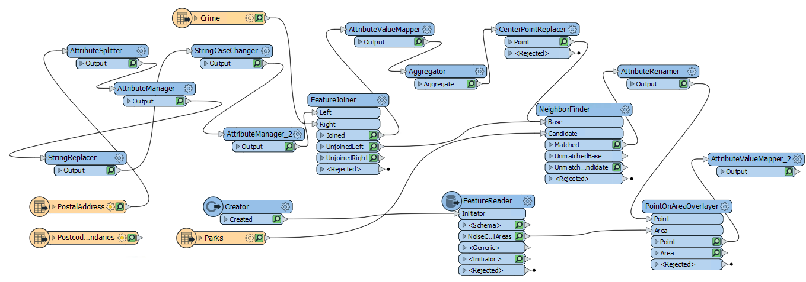
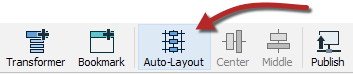
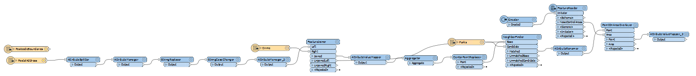
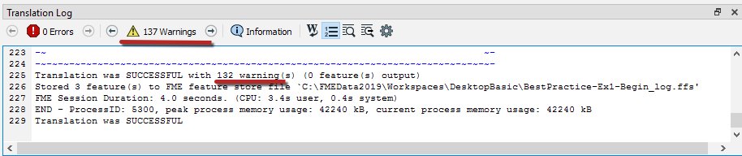
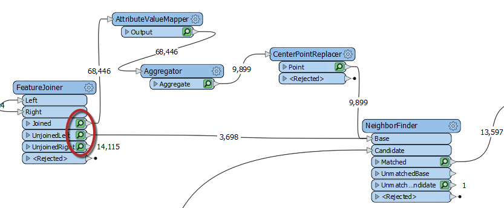
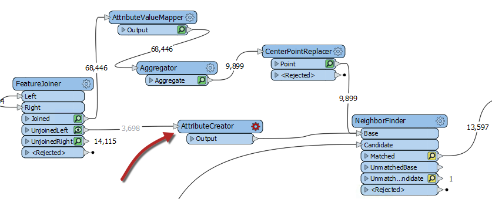
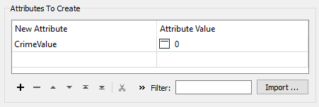
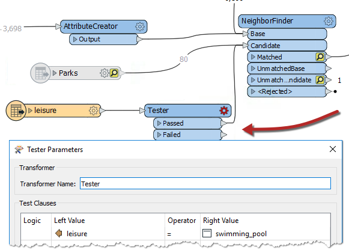
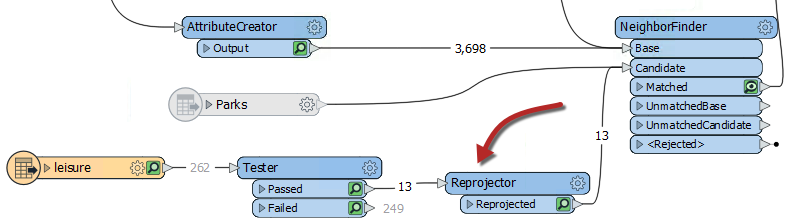

<!--Exercise Section-->

<table style="border-spacing: 0px;border-collapse: collapse;font-family:serif">
<tr>
<td width=25% style="vertical-align:middle;background-color:darkorange;border: 2px solid darkorange">
<i class="fa fa-cogs fa-lg fa-pull-left fa-fw" style="color:white;padding-right: 12px;vertical-align:text-top"></i>
Exercise 1
</td>
<td style="border: 2px solid darkorange;background-color:darkorange;color:white">
Debugging a Workspace
</td>
</tr>

<tr>
<td style="border: 1px solid darkorange; font-weight: bold">Data</td>
<td style="border: 1px solid darkorange">Addresses (Esri Geodatabase) Crime Data (CSV - Comma Separated Value) Parks (MapInfo TAB) Swimming Pools (OSM - OpenStreetMap)</td>
</tr>

<tr>
<td style="border: 1px solid darkorange; font-weight: bold">Overall Goal</td>
<td style="border: 1px solid darkorange">Work on Vancouver Walkability Project</td>
</tr>

<tr>
<td style="border: 1px solid darkorange; font-weight: bold">Demonstrates</td>
<td style="border: 1px solid darkorange">Debugging Best Practice</td>
</tr>

<tr>
<td style="border: 1px solid darkorange; font-weight: bold">Start Workspace</td>
<td style="border: 1px solid darkorange">C:\FMEData2019\Workspaces\DesktopBasic\BestPractice-Ex1-Begin.fmw</td>
</tr>

<tr>
<td style="border: 1px solid darkorange; font-weight: bold">End Workspace</td>
<td style="border: 1px solid darkorange">C:\FMEData2019\Workspaces\DesktopBasic\BestPractice-Ex1-Complete.fmw</td>
</tr>

</table>

You have just been assigned to take over a project from your colleague and they passed their workspace on to you. This project is to calculate the "walkability" of each address in the city of Vancouver. Walkability is a measure of how easy it is to access local facilities on foot. It will include a measure of the distance to the nearest park, the amount of crime in an area, and other similar metrics.

The workspace currently assesses crime, parks, and noise-control areas, but it doesn't give an overall measure of walkability.

So let's do that, and then see if there are any other aspects we can include.

---

 **1) Start FME Workbench**
 Start FME Workbench. Open the workspace template C:\FMEData2019\Workspaces\DesktopBasic\BestPractice-Ex1-Begin.fmw. Then run the workspace to cache the data.

This workspace is a bit messy, but we will fix that in a later exercise. First, let's figure out what this workspace does:

1. PostalAddress and PostcodeBoundaries are being read in from the Addresses.gdb
2. Attributes from the PostalAddress feature type are being cleaned up to create a separate Number and Street attribute. Then the last two digits of the Number are being replaced by XX to create an attribute that will be the Join Key for joining the crime data.
3. Crime.csv read in, the street number for each crime incident is protected by XX as the last two digits.
4. PostalAddress and the Crime data is joined in the FeatureJoiner based on the Join Key attribute that was created in 2. and the Block attribute from Crime.
5. The [crime] Type attribute is given a number based on severity, and then the total CrimeValue is calculated for each address block. Then with the CenterPointReplacer, only one point is extracted if there are multiple crime incidents in the same location.
6. Parks MapInfo TAB file read in. This will be used to determine if any of the crimes are in or close to a park.
7. Using the NeighborFinder the parks closest to each crime is determined
8. The &#95;distance attribute that was created with the NeighborFinder is renamed ParkDistance
9. A Planning Restrictions OGC Geopackage is read in using the Creator and the FeatureReader. Then from that dataset, the NoiseControlAreas are read in to obtain the noise restrictions areas. This data will be joined with the crime and address data.
10. Using the PointOnAreaOverlayer, the point data containing the crime, distance to park and addresses is joined with the NoiseControlAreas polygons. This assigns the noise restrictions to any overlapping points. The AttributeValueMapper is used to assign the zone with a score, creating the attribute NoiseZoneScore.

---

<!--Tip Section-->

<table style="border-spacing: 0px">
<tr>
<td style="vertical-align:middle;background-color:darkorange;border: 2px solid darkorange">
<i class="fa fa-info-circle fa-lg fa-pull-left fa-fw" style="color:white;padding-right: 12px;vertical-align:text-top"></i>
TIP
</td>
</tr>

<tr>
<td style="border: 1px solid darkorange">

This workspace is very messy as our colleague didn't follow any best practices. We will be cleaning it up in a later exercise, but if it is too hard for you to make sense of in its messy state, click on the Autolayout button to quickly tidy it up:
 

  
 <strong>Note that this will change how your workspace looks compared to the screenshots and the instructor, so pay attention to the transformer names and ports: </strong>
  

</td>
</tr>
</table>

---

 **2) Add an ExpressionEvaluator Transformer**
 We can create a measure of walkability that combines all of our current values using the ExpressionEvaluator transformer.

So add an ExpressionEvaluator transformer to the end of the workspace and connect it to the AttributeValueMapper&#95;2.

Inspect its parameters. Set it up to create a new attribute called Walkability that is:

<pre>
@Value(ParkDistance) + @Value(CrimeValue) - @Value(NoiseZoneScore)
</pre>

With this expression, the smaller the result, the better. Run the workspace. Because we ran the workspace in the beginning to cache all the data, only the ExpressionEvaluator will run.

 **3) Assess the Result**
 Let's assess whether the result of the translation is correct.

Firstly check the log window for errors and warnings. There are no errors, but there are several warnings, which is not a good sign:

***Note:*** *The number of warnings showed in the Translation Log may be different, this is based on the Logging Parameters set in FME Options.*

Click on the warnings button to filter out the warnings. The warnings say:

<pre>
ExpressionEvaluator: Failed to evaluate expression '@real64(560.3272250455418+&lt;null&gt;-0)'.
Result is set to null
</pre>

Inspect the output cache on the ExpressionEvaluator, and some addresses do indeed have a Walkability value of &lt;null&gt;.

So we know there is a problem, let's try and figure out where the problem is and why it occurs.

---

<!--Tip Section-->

<table style="border-spacing: 0px">
<tr>
<td style="vertical-align:middle;background-color:darkorange;border: 2px solid darkorange">
<i class="fa fa-info-circle fa-lg fa-pull-left fa-fw" style="color:white;padding-right: 12px;vertical-align:text-top"></i>
TIP
</td>
</tr>

<tr>
<td style="border: 1px solid darkorange">

A useful test would be to right-click on CrimeValue in the Table View window, and sort by ascending numeric order. That will put any null values to the top of the table.

</td>
</tr>
</table>

---

 **4) Locate the Problem**
 We can tell the warning comes from the ExpressionEvaluator, but that doesn't necessarily mean that is where the problem lies. The calculation fails because the middle value is &lt;null&gt;

If the expression is:

<pre>
ParkDistance + CrimeValue - NoiseZoneScore
</pre>

Then we know that it must be the CrimeValue that is an issue because it is the middle value.

Let's find out where it becomes an issue. First, organize the workspace a bit, and then inspect the caches on the FeatureJoiner transformer. We are inspecting the FeatureJoiner because that's where we first get our Crime data:

There are no &lt;null&gt; values coming from the FeatureJoiner, so let's move along the translation. Check the cache for the AttributeValueMapper. That's where values are set, so perhaps nulls are coming out of there?

On inspection, there are no &lt;null&gt; values for the CrimeValue or the crime Type attribute in there. There are also no nulls for the Aggregator and CenterPointReplacer caches.

Checking each feature cache is a bit time consuming, let's try a different method. Check the feature counts on each connection. There are 68,446 features tagged with a crime (FeatureJoiner:Joined), but then that is reduced to 9,899 after the Aggregator and then there are 3,698 features that are not tagged with a crime (FeatureJoiner:UnjoinedLeft). That gives a total of 13,597, coming out of the NeighborFinder, which is correct.

Oh. Do you see it yet? The 3,698 features that are not tagged with a crime: what CrimeValue do they get? Inspect the UnjoinedLeft output from the FeatureJoiner, and you will see that they do not have the CrimeValue attribute. That's why the ExpressionEvaluator says that there are nulls.

---

<!--Tip Section-->

<table style="border-spacing: 0px">
<tr>
<td style="vertical-align:middle;background-color:darkorange;border: 2px solid darkorange">
<i class="fa fa-info-circle fa-lg fa-pull-left fa-fw" style="color:white;padding-right: 12px;vertical-align:text-top"></i>
FME Lizard says...
</td>
</tr>

<tr>
<td style="border: 1px solid darkorange">

To confirm this I copied the log into a text editor and searched for the phrase "ExpressionEvaluator: Failed to evaluate expression".
 It appeared 3,698 times, the same as the number of features that exit the UnjoinedLeft port. Coincidence?

</td>
</tr>
</table>

---

 **5) Fix the Problem**
 If those features do not have a CrimeValue attribute, then we should give them one. To do so, add an AttributeCreator transformer to the workspace between the FeatureJoiner:UnjoinedLeft output port and the NeighborFinder:Base input port:

Open up its parameters and create an attribute called CrimeValue with a value of zero (0).

Run the workspace, which will run from the AttributeCreator to the ExpressionEvaluator. You should now find that there are fewer warnings and that the output contains no &lt;null&gt; values.

 **6) Add Swimming Pools**
 The city has decided that parks are not a great candidate for walkability scores because there is usually a park nearby. They decided to evaluate how easy it is to walk to a swimming pool, and this evaluation might be used to decide later where a new pool should be built.

We can reuse the same workflow for swimming pools that was built for parks, with just a few minor updates.

First let's add a new reader with the following parameters:

<table style="border: 0px">

<tr>
<td style="font-weight: bold">Reader Format</td>
<td style="">OpenStreetMap (OSM) XML</td>
</tr>

<tr>
<td style="font-weight: bold">Reader Dataset</td>
<td style="">C:\FMEData2019\Data\OpenStreetMap\leisure.osm</td>
</tr>

</table>

When prompted, select only the leisure feature type:

Then move the new leisure reader near the Parks reader and connect it to the NeighborFinder:Candidate input port. Then right-click on the Parks reader and select disable.

 **7) Filter Leisure Data**
 If you inspect the leisure data, you'll notice that there are various types of leisure facility, the type being recorded in the *leisure* attribute.

So, add a Tester transformer between the leisure reader and the NeighborFinder. Set up the parameters to test for leisure = swimming_pool

 **8) Update Transformer Parameters**
 Now update AttributeRenamer to be PoolDistance instead of ParkDistance. The renaming of this attribute will cause the ExpressionEvaluator to turn red.

To fix the ExpressionEvaluator, open the parameters and change @Value(ParkDistance) to @Value(PoolDistance) to take account of the new PoolDistance attribute:

<pre>
@Value(PoolDistance) + @Value(CrimeValue) - @Value(NoiseZoneScore)
</pre>

Re-run the workspace. Check the log for warnings and errors, and then inspect the ExpressionEvaluator cache.

Notice that the walkability scores are exceedingly large all of a sudden, due to the PoolDistance. Something is wrong, but what?

 **9) Locate Problem**
 The PoolDistance is the source of the problem. There is no related log message to give a clue, and the Feature Count numbers look correct.

Let's inspect the data. Click on the leisure reader and while holding the <kbd>shift</kbd> key, click on the NeighborFinder. Then right-click on either object and select Inspect Cached Features. This will open all the selected caches in Visual Preview.

Right-click in the Graphics view, go to Background Map and ensure Background map off is selected. Visual Preview shows two specks of data, a long distance apart. This result is typical of a mismatch of coordinate systems.

Click on some features and select the Feature Information button. In this window you will see that the main data has a coordinate system of UTM83-10, while the leisure data from OSM has a coordinate system of LL84.

This disparity is why the "nearest" pool to each address is such a high distance.

 **10) Fix Coordinate System Problem**
 The obvious solution is to reproject the pools to the correct coordinate system. So, add a Reprojector transformer to reproject the leisure data before it gets to the NeighborFinder:

Inspect its parameters and set it up to reproject from LL84 to UTM83-10.

Re-run the appropriate parts of the workspace. Check the log window and inspect the ExpressionEvaluator cache.

Each address now has a walkability score account for pools instead of parks, with a lower number being better and a higher number worse.

---

<!--Exercise Congratulations Section-->

<table style="border-spacing: 0px">
<tr>
<td style="vertical-align:middle;background-color:darkorange;border: 2px solid darkorange">
<i class="fa fa-thumbs-o-up fa-lg fa-pull-left fa-fw" style="color:white;padding-right: 12px;vertical-align:text-top"></i>
CONGRATULATIONS
</td>
</tr>

<tr>
<td style="border: 1px solid darkorange">

By completing this exercise you have learned how to:
 
<ul><li>use the ExpressionEvaluator transformer</li>
<li>Check the log window for errors and warnings</li>
<li>Locate problems through use of Feature Counts and Visual Preview</li>
<li>Identify and fix problems in a workspace</li></ul>

</td>
</tr>
</table>
