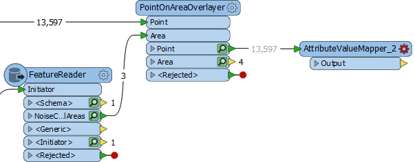
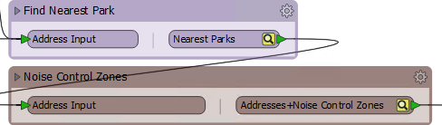

<!--Exercise Section-->

<table style="border-spacing: 0px;border-collapse: collapse;font-family:serif">
<tr>
<td width=25% style="vertical-align:middle;background-color:darkorange;border: 2px solid darkorange">
<i class="fa fa-cogs fa-lg fa-pull-left fa-fw" style="color:white;padding-right: 12px;vertical-align:text-top"></i>
Exercise 2
</td>
<td style="border: 2px solid darkorange;background-color:darkorange;color:white">
Methodology
</td>
</tr>

<tr>
<td style="border: 1px solid darkorange; font-weight: bold">Data</td>
<td style="border: 1px solid darkorange">Addresses (Esri Geodatabase) Crime Data (CSV - Comma Separated Value) Parks (MapInfo TAB)</td>
</tr>

<tr>
<td style="border: 1px solid darkorange; font-weight: bold">Overall Goal</td>
<td style="border: 1px solid darkorange">Work on Vancouver Walkability Project</td>
</tr>

<tr>
<td style="border: 1px solid darkorange; font-weight: bold">Demonstrates</td>
<td style="border: 1px solid darkorange">Methodology Best Practice</td>
</tr>

<tr>
<td style="border: 1px solid darkorange; font-weight: bold">Start Workspace</td>
<td style="border: 1px solid darkorange">C:\FMEData2018\Workspaces\DesktopBasic\BestPractice-Ex2-Begin.fmwt</td>
</tr>

<tr>
<td style="border: 1px solid darkorange; font-weight: bold">End Workspace</td>
<td style="border: 1px solid darkorange">C:\FMEData2018\Workspaces\DesktopBasic\BestPractice-Ex2-Complete.fmwt</td>
</tr>

</table>

Continuing on from the previous exercise, you have been assigned to a project to calculate the "walkability" of each address in the city of Vancouver. Walkability is a measure of how easy it is to access local facilities on foot. The initial workspace analyzed crime in the area, and you added a section to calculate the distance to the nearest park. 

Now we can extend the project to see if each address falls inside a noise-control area.

---

 **1) Add Reader**
 Our first task is to read noise-control area data. This can be found in the following dataset:

<table style="border: 0px">

<tr>
<td style="font-weight: bold">Reader Format</td>
<td style="">OGC GeoPackage</td>
</tr>

<tr>
<td style="font-weight: bold">Reader Dataset</td>
<td style="">C:\FMEData2018\Data\Planning\PlanningRestrictions.gpkg</td>
</tr>

</table>

We'll try to improve performance by using a FeatureReader transformer to read this data, using the Addresses as a trigger; so place a FeatureReader transformer and connect it up to the AttributeRenamer.

Inspect the transformer's parameters. Set the Reader parameters as above. Read only the NoiseControlArea feature type and set the Spatial Filter parameter to Initiator is Within Result:

Reading the data this way may benefit performance because we're only reading noise control areas that we know addresses fall inside. We'll see...

 **2) Overlay Addresses and Noise Control Zones**
 To do the overlay, add a PointOnAreaOverlayer transformer. Connect FeatureReader:&lt;Initiator&gt; to the Point input port, and FeatureReader:NoiseControlArea to the Area input port:

Inspect the parameters and turn on the Merge Attributes option. Run the workspace using Run to This... sadly the workspace is takes a long time to run, so press the Stop button to cancel the translation. 

 **3) Add Creator**
 It's clear that the current setup is not the best solution. A polygon feature is output from the FeatureReader for every address that overlaps it, causing the PointOnAreaOverlayer to slow down. Our gamble has failed.

So, add a Creator transformer to trigger the FeatureReader, and disconnect it from the AttributeRenamer, leaving other connections intact:

Check the FeatureReader parameters and reset the Spatial Filter parameter to &lt;No Spatial Filter&gt;.

Now re-run this part of the workspace and inspect the output to ensure some address features are receiving AreaID, AreaName, and AreaDescription attributes.

 **4) Set a Numeric Value**
 To help with assessing walkability, we'll give each different zone a numeric value, relative to the benefit they would provide residents walking through the city:

<table style="border: 0px">

<tr>
<td style="font-weight: bold">Schedule F</td>
<td style="">50</td>
</tr>

<tr>
<td style="font-weight: bold">Schedule C</td>
<td style="">200</td>
</tr>

<tr>
<td style="font-weight: bold">Intermediate</td>
<td style="">100</td>
</tr>

</table>

One technique would be to use Tester and AttributeCreator transformers, like so:

However, this is clearly a case of duplication. This is hard to maintain and if extra schedules were added would require an extra Tester/AttributeCreator combination for each.

So, instead of that place an AttributeValueMapper transformer connected to the PointOnAreaOverlayer:Point output port:

Inspect the AttributeValueMapper's parameters. Set it up to map from AreaName to NoiseZoneScore, with a default value of zero (0):

Now set up the mapping using the values in the table shown above:

You can either set this up manually (by typing in the values) or automatically (by using the Import button).

Put a bookmark around this section of the workspace and run it. Inspect the cached results to prove that addresses are being given the correct value.

 **5) Clean Output**
 Inspecting the output becomes hard at this point because there are so many excess attributes cluttering the display. These attributes can hardly be helping performance of the workspace either - even if that's mitigated by using caches during development.

Check the size of the template file BestPractice-Ex2-Begin.fmwt. You'll see that it is nearly 46mb in size, which is fairly large for a template. Save the workspace now and the file would likely be even larger. It's not a problem to have a large template file, but it does indicate a lot of data is being cached and that this could affect the workspace's performance.

One aspect of data is the number of attributes and lists. To remove some of these place an AttributeRemover transformer at the end of the workspace. 

Inspect its parameters and set them up to remove any attributes and lists that you suspect are not required in the output.

One item of interest is a list attribute called CrimeList{}, which doesn't appear necessary for any part of this translation. Track down its source by pressing Ctrl+F and searching for that phrase. You will find it is being created by the Aggregator transformer. 

Check the parameters for the Aggregator transformer and turn off the Generate List parameter, to prevent the list from being created. This will cause many caches to become stale, but we will re-run the workspace shortly to solve this.

 **5) Collapse Bookmarks**
 Another source of excess caching are transformers producing output that we don't need to inspect. These can be prevent by hiding these transformers within a collapsed bookmark.

So, pass through the workspace collapsing bookmarks where we know the transformers within it are producing the correct output:

You may wish to rename some of the ports on the bookmarks to clarify what they do:

 **6) Re-Run Workspace**
 Now re-run the workspace by clicking on the AttributeRemover and choosing *Run to This*.

The workspace will run and data will be cached, but only at the output point of bookmarks. Also attributes unnecessary to the output will be removed.

Save the workspace as a new template and check the option to include caches. This way the workspace will be ready to continue later.

Check the file size of the new template. It should be considerably smaller (around 14mb).

---

<!--Exercise Congratulations Section--> 

<table style="border-spacing: 0px">
<tr>
<td style="vertical-align:middle;background-color:darkorange;border: 2px solid darkorange">
<i class="fa fa-thumbs-o-up fa-lg fa-pull-left fa-fw" style="color:white;padding-right: 12px;vertical-align:text-top"></i>
CONGRATULATIONS
</td>
</tr>

<tr>
<td style="border: 1px solid darkorange">

By completing this exercise you have learned how to:
 
<ul><li>Assess reader performance and when the FeatureReader is not a good choice</li>
<li>Avoid duplicating transformers to improve maintenance and scalability</li>
<li>Remove unnecessary attributes to improve performance</li>
<li>Track down unnecessary lists and remove them</li>
<li>Improve performance by collapsing bookmarks to prevent excess caching</li></ul>

</td>
</tr>
</table>
