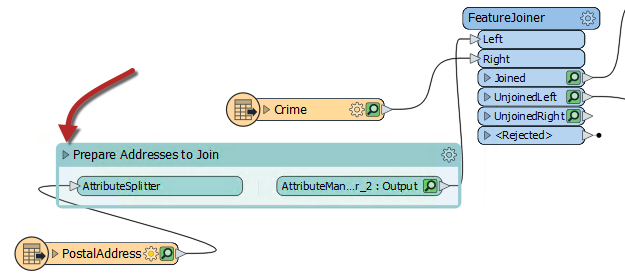

<!--Exercise Section-->

<table style="border-spacing: 0px;border-collapse: collapse;font-family:serif">
<tr>
<td width=25% style="vertical-align:middle;background-color:darkorange;border: 2px solid darkorange">
<i class="fa fa-cogs fa-lg fa-pull-left fa-fw" style="color:white;padding-right: 12px;vertical-align:text-top"></i>
Exercise 2
</td>
<td style="border: 2px solid darkorange;background-color:darkorange;color:white">
Methodology
</td>
</tr>

<tr>
<td style="border: 1px solid darkorange; font-weight: bold">Data</td>
<td style="border: 1px solid darkorange">Addresses (Esri Geodatabase) Crime Data (CSV - Comma Separated Value) Parks (MapInfo TAB)</td>
</tr>

<tr>
<td style="border: 1px solid darkorange; font-weight: bold">Overall Goal</td>
<td style="border: 1px solid darkorange">Work on Vancouver Walkability Project</td>
</tr>

<tr>
<td style="border: 1px solid darkorange; font-weight: bold">Demonstrates</td>
<td style="border: 1px solid darkorange">Methodology Best Practice</td>
</tr>

<tr>
<td style="border: 1px solid darkorange; font-weight: bold">Start Workspace</td>
<td style="border: 1px solid darkorange">C:\FMEData2019\Workspaces\DesktopBasic\BestPractice-Ex2-Begin.fmwt</td>
</tr>

<tr>
<td style="border: 1px solid darkorange; font-weight: bold">End Workspace</td>
<td style="border: 1px solid darkorange">C:\FMEData2019\Workspaces\DesktopBasic\BestPractice-Ex2-Complete.fmwt</td>
</tr>

</table>

Continuing from the previous exercise, you have been assigned to a project to calculate the "walkability" of each address in the city of Vancouver. Walkability is a measure of how easy it is to access local facilities on foot. The initial workspace analyzed crime in the area and distance to the nearest park. Then you were asked to calculate the distance to the nearest swimming pool instead of parks.

Now we can extend the project to see if each address falls inside a noise-control area.

---

 **1) Continue Workspace**
 Start FME Workbench and open the workspace from the previous exercise. Alternatively, you can open
C:\FMEData2019\Workspaces\DesktopBasic\BestPractice-Ex2-Begin.fmwt. Continuing in the workspace from Exercise 1, we will now try and make this workspace run faster as it is really slow.

 **2) Clean Output**
 While editing the ExpressionEvaluator in the previous exercise, you might have noticed there was a lot of additional attributes like CrimeList{}.City or CrimeList{}.Block. These excess attributes clutter the display and inspecting the output becomes hard. These attributes can hardly be helping the performance of the workspace either - even if that's mitigated by using caches during development.

Check the size of the template file BestPractice-Ex2-Begin.fmwt. You'll see that it is nearly 43mb in size, which is fairly large for a template. It's not a problem to have a large template file, but it does indicate a lot of data is being cached and that this could affect the workspace's performance.

One aspect of data is the number of attributes and lists. Since there are a lot of additional attributes to remove but only a few we need to keep, we will use the AttributeKeeper transformer. Place the AttributeKeeper between the AttributeValueMapper_2 and the ExpressionEvaluator transformers:

Inspect the AttributeKeeper parameters and set them up to keep only CrimeValue, NoiseZoneScore, and PoolDistance. Take note of the names of the attributes that we are not keeping. We might be able to remove them earlier in the workspace.

 **3) Remove Lists**
 One attribute of interest is a list attribute called CrimeList{}, which doesn't appear necessary for any part of this translation. Track down its source by pressing <kbd>Ctrl</kbd>+<kbd>F</kbd> and search for CrimeList. The search results show up in the Navigator window, and there you will find the Aggregator transformer is creating CrimeList.

Check the parameters for the Aggregator transformer and turn off the Generate List parameter, to prevent the list from being created. This step will cause many caches to become stale, but we will re-run the workspace shortly to solve this.

 **4) Remove Extra Feature Types**
 Another reason a workspace is running slowly is if you are reading in extra data that is not being used in the workspace. It looks like the original author read in the PostcodeBoundaries feature type from the Addresses.gdb. Additionally, we didn't remove the Parks feature type once we were done with it. Delete both of those now and click Yes on any warnings that pop up.

 **5) Collapse the Bookmark**
 Another source of excess caching are transformers producing output that we don't need to inspect. These can be prevented by hiding these transformers within a collapsed bookmark.

Add a bookmark around all of the transformers between the PostalAddress reader and the FeatureJoiner, name the bookmark Prepare Addresses to Join:

Now we can collapse the bookmark and then when we re-run the translation only the last transformer will have a cache. To collapse the bookmark click on the arrow beside the bookmark name:  

---

<!--Tip Section-->

<table style="border-spacing: 0px">
<tr>
<td style="vertical-align:middle;background-color:darkorange;border: 2px solid darkorange">
<i class="fa fa-info-circle fa-lg fa-pull-left fa-fw" style="color:white;padding-right: 12px;vertical-align:text-top"></i>
FME Lizard Says...
</td>
</tr>

<tr>
<td style="border: 1px solid darkorange">

If you want to work ahead, add a couple more bookmarks around other sections and then collapse them. We will be doing this in the next exercise so you can see if your bookmarks are the same.

</td>
</tr>
</table>

---

 **6) Run the Workspace**
 Now run the workspace by clicking on the ExpressionEvaluator and choosing *Run to This*.

The workspace will run and data will be cached, but only at the output point of the bookmark. Also attributes unnecessary to the output will be removed.

Save the workspace as a new template and check the option to include caches. This way the workspace will be ready to continue later.

Check the file size of the new template. It should be considerably smaller (around 14mb).

---

<!--Exercise Congratulations Section-->

<table style="border-spacing: 0px">
<tr>
<td style="vertical-align:middle;background-color:darkorange;border: 2px solid darkorange">
<i class="fa fa-thumbs-o-up fa-lg fa-pull-left fa-fw" style="color:white;padding-right: 12px;vertical-align:text-top"></i>
CONGRATULATIONS
</td>
</tr>

<tr>
<td style="border: 1px solid darkorange">

By completing this exercise you have learned how to:
 
<ul><li>Assess reader performance and when the FeatureReader is not a good choice</li>
<li>Avoid duplicating transformers to improve maintenance and scalability</li>
<li>Remove unnecessary attributes to improve performance</li>
<li>Track down unnecessary lists and remove them</li>
<li>Improve performance by collapsing bookmarks to prevent excess caching</li></ul>

</td>
</tr>
</table>
