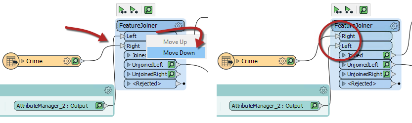
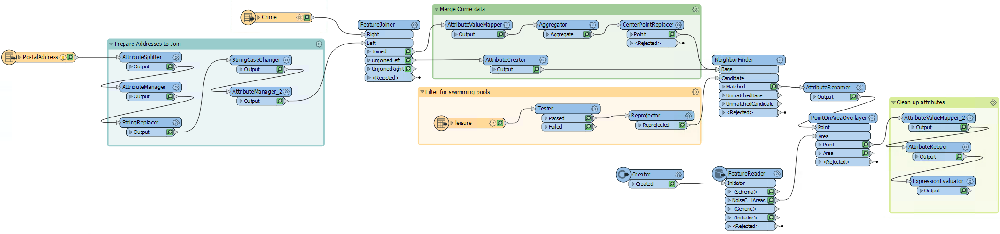
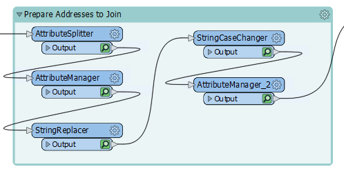
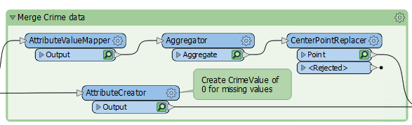
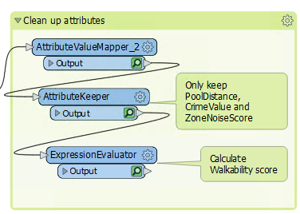
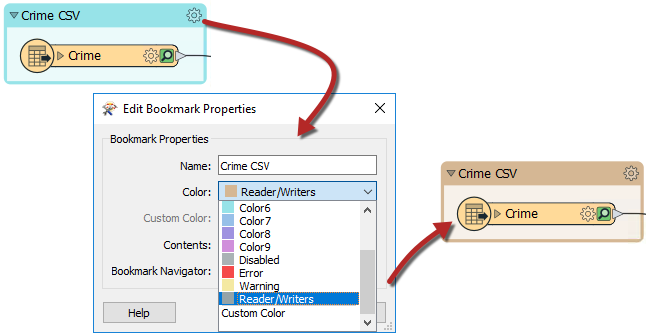
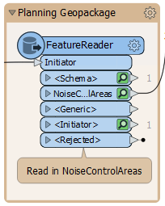

<!--Exercise Section-->

<table style="border-spacing: 0px;border-collapse: collapse;font-family:serif">
<tr>
<td width=25% style="vertical-align:middle;background-color:darkorange;border: 2px solid darkorange">
<i class="fa fa-cogs fa-lg fa-pull-left fa-fw" style="color:white;padding-right: 12px;vertical-align:text-top"></i>
Exercise 3
</td>
<td style="border: 2px solid darkorange;background-color:darkorange;color:white">
Applying the Style Guide
</td>
</tr>

<tr>
<td style="border: 1px solid darkorange; font-weight: bold">Data</td>
<td style="border: 1px solid darkorange">Addresses (Esri Geodatabase) Crime Data (CSV - Comma Separated Value) Parks (MapInfo TAB)</td>
</tr>

<tr>
<td style="border: 1px solid darkorange; font-weight: bold">Overall Goal</td>
<td style="border: 1px solid darkorange">Work on Vancouver Walkability Project</td>
</tr>

<tr>
<td style="border: 1px solid darkorange; font-weight: bold">Demonstrates</td>
<td style="border: 1px solid darkorange">Style Best Practice</td>
</tr>

<tr>
<td style="border: 1px solid darkorange; font-weight: bold">Start Workspace</td>
<td style="border: 1px solid darkorange">C:\FMEData2019\Workspaces\DesktopBasic\BestPractice-Ex3-Begin.fmw</td>
</tr>

<tr>
<td style="border: 1px solid darkorange; font-weight: bold">End Workspace</td>
<td style="border: 1px solid darkorange">C:\FMEData2019\Workspaces\DesktopBasic\BestPractice-Ex3-Complete.fmw</td>
</tr>

</table>

Continuing from the previous exercise, you have been assigned to a project to calculate the "walkability" of each address in the city of Vancouver. Walkability is a measure of how easy it is to access local facilities on foot. It will include a measure of the distance to the nearest park, the amount of crime in an area, and other similar metrics.

Your colleague wasn't aware of the FME style guide when they gave us the workspace, which made working with it a bit challenging. We need to present our workspace, so we want it to look neat, organized and well documented.

 **1) Start Workbench**
 Start FME Workbench and open the workspace from the previous exercise. Alternatively, you can open
C:\FMEData2019\Workspaces\DesktopBasic\BestPractice-Ex3-Begin.fmw.

 **2) Rearrange Transformers**
 Firstly, let's clean up the transformers. Move the transformers around so that there are no overlapping connections.

For the FeatureJoiner, you could move the Crimes reader below the Prepare Addresses to Join bookmark, or you can reorder the FeatureJoiner ports. Right click on the Left input port, and select Move Down. Now the two connection lines are not crossing:

Move the transformers into a logical order and add a bookmark around any logical groupings:

Don't forget to expand the Prepare Addresses to Join bookmark from the previous exercise and organize those transformers:

 **3) Add Style**
 Having rearranged the transformers and added bookmarks we can now add annotations and color to highlight what is going on. This step will require some inspection of the transformers to find out what they are doing as well as inspecting the readers to know which format they are in:

Adding good annotation where necessary will help determine what is going on in the workspace:

---

<!--Tip Section-->

<table style="border-spacing: 0px">
<tr>
<td style="vertical-align:middle;background-color:darkorange;border: 2px solid darkorange">
<i class="fa fa-info-circle fa-lg fa-pull-left fa-fw" style="color:white;padding-right: 12px;vertical-align:text-top"></i>
TIP
</td>
</tr>

<tr>
<td style="border: 1px solid darkorange">

By adding a bookmark around a reader or writer and then setting the color to the preset Readers/Writers color, it is quick to see at a glance where your readers or writers are:
 
 
 
 You can also do this with FeatureReaders and FeatureWriters:
  

</td>
</tr>
</table>

---

 **4) Run Workspace**
 Collapse all the bookmarks if you wish and run the workspace once more to ensure all the caches are fresh. It might be a good idea to re-run the entire workspace.

 **5) Save the Workspace**
 You can choose to save this workspace as a regular workspace or as a template workspace.  

---

<!--Exercise Congratulations Section-->

<table style="border-spacing: 0px">
<tr>
<td style="vertical-align:middle;background-color:darkorange;border: 2px solid darkorange">
<i class="fa fa-thumbs-o-up fa-lg fa-pull-left fa-fw" style="color:white;padding-right: 12px;vertical-align:text-top"></i>
CONGRATULATIONS
</td>
</tr>

<tr>
<td style="border: 1px solid darkorange">

By completing this exercise you have learned how to:
 
<ul><li>Rearrange transformers into a logical layout that groups those carrying out a single task</li>
<li>Use annotations to clarify the processes taking place in a workspace</li>
<li>Use bookmarks to turn a single workspace into defined sections</li>
<li>Avoid poor design choices like overlapping connections</li></ul>

</td>
</tr>
</table>
