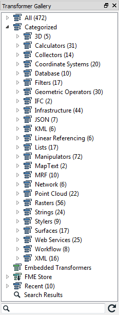
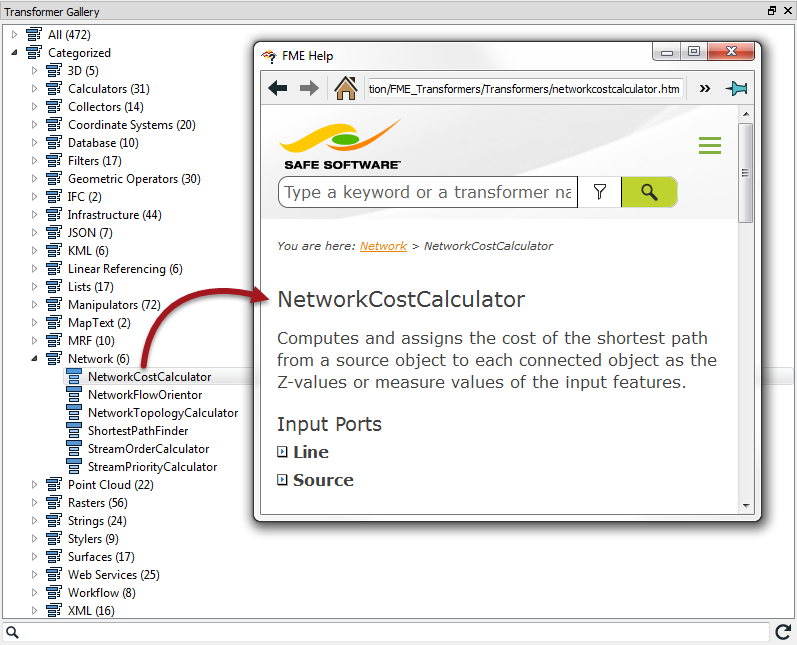

## Transformer Gallery ##
The transformer gallery is the obvious place to start looking for transformers. There are a number of ways in which transformers here can be located.

## Transformer Categories ##
Transformer categories are a good starting point from which to explore the transformer list. Transformers are grouped in categories to help find a transformer relevant to the problem at hand.

---

<!--Tip Section--> 

<table style="border-spacing: 0px">
<tr>
<td style="vertical-align:middle;background-color:darkorange;border: 2px solid darkorange">
<i class="fa fa-info-circle fa-lg fa-pull-left fa-fw" style="color:white;padding-right: 12px;vertical-align:text-top"></i>
TIP
</td>
</tr>

<tr>
<td style="border: 1px solid darkorange">

Notice that each category lists the number of transformers that it contains!

</td>
</tr>
</table>

---

Important categories include:

- **Calculators**: Calculate a value and supply it as a new attribute
- **Database**: Interact with external databases
- **Filters**: Split and re-route data
- **Geometric Operators**: Process feature geometry
- **Infrastructure**: Structural transformation and scripting with Tcl/Python
- **Strings**: Create, modify and delete string (character) attributes
- **Workflow**: Run workspaces either locally or on an FME Server

Simply click on the expand button to show all transformers within a particular category.

---

## Transformer Help ##
The FME Workbench Help tool displays information about transformers. Simply click on a transformer and press the F1 key to open the help dialog.

This tool is linked to FME Workbench so that a transformer selected (in the gallery or on the canvas) triggers content to display in the Help tool.

---

<!--Updated Section--> 

<table style="border-spacing: 0px">
<tr>
<td style="vertical-align:middle;background-color:darkorange;border: 2px solid darkorange">
<i class="fa fa-bolt fa-lg fa-pull-left fa-fw" style="color:white;padding-right: 12px;vertical-align:text-top"></i>
.1 UPDATE
</td>
</tr>

<tr>
<td style="border: 1px solid darkorange">

In FME2016.1 the help window was altered to not update automatically when a new object is clicked on.

</td>
</tr>
</table>

---

---

<!--Tip Section--> 

<table style="border-spacing: 0px">
<tr>
<td style="vertical-align:middle;background-color:darkorange;border: 2px solid darkorange">
<i class="fa fa-info-circle fa-lg fa-pull-left fa-fw" style="color:white;padding-right: 12px;vertical-align:text-top"></i>
TIP
</td>
</tr>

<tr>
<td style="border: 1px solid darkorange">

Another useful - and printable - piece of documentation is the <strong><a href="http://cdn.safe.com/resources/fme/FME-Transformer-Reference-Guide.pdf">FME Transformer Reference Guide</a></strong>.

</td>
</tr>
</table>

