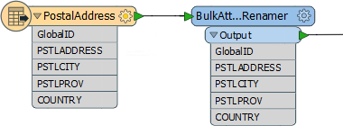
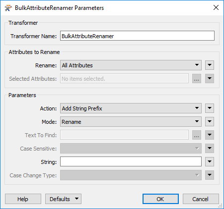

## Bulk Attribute Renaming ##

Usual attribute renaming involves selecting individual attributes to operate on. However, in some cases it's important to be able to carry out the same renaming operation on a large number of attributes.

This scenario is catered for by the BulkAttributeRenamer transformer.

### BulkAttributeRenamer ###

The BulkAttributeRenamer carries out the core function of renaming attributes. But instead of manually specifying each attribute, this transformer lets the user select multiple attributes - or all of them.

When multiple attributes are selected, the action must - of course - carry out the same renaming action on them all. These actions are:

- Add String Prefix
- Add String Suffix
- Remove Prefix String
- Remove Suffix String
- Regular Expression Replace
- String Replace
- Change Case

The power of the transformer is also in its ability to manipulate multiple attributes at once, without having to individually select them all. Here, for example, the incoming attributes are all being renamed to lower case names in order to match a Writer schema that does not support upper case:

Here, for example, the user has converted to lower case and then used a second transformer to add a prefix:

