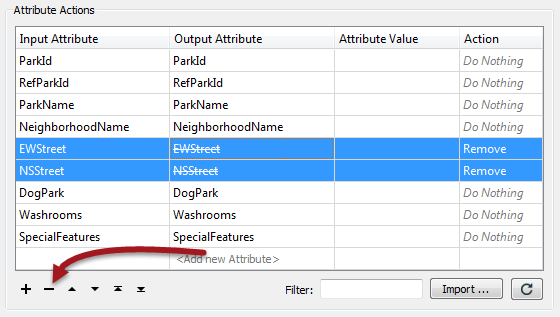
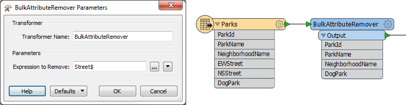

## Removing Attributes ##

Removing attributes is perhaps seen as a less-important task in FME. That's because - for a manual attribute schema - only attributes defined in the Writer are written to the output; extra attributes that are not required are just ignored.

However, removing attributes does carry useful benefits:

- Removing attributes that aren’t required tidies up a workspace and makes it easier to understand
- A workspace is a complex network of objects and schemas. Removing attributes simplifies the workspace and makes the Workbench interface more responsive
- All data processing incurs costs of time and memory. Removing attributes means less data is being processed and so the FME engine performs faster

---

<!--Tip Section--> 

<table style="border-spacing: 0px">
<tr>
<td style="vertical-align:middle;background-color:darkorange;border: 2px solid darkorange">
<i class="fa fa-info-circle fa-lg fa-pull-left fa-fw" style="color:white;padding-right: 12px;vertical-align:text-top"></i>
TIP
</td>
</tr>

<tr>
<td style="border: 1px solid darkorange">

Hiding attributes on a Reader schema, while it helps tidy a workspace, is not the same as removing them and does not help improve the translation performance.

</td>
</tr>
</table>

---

Transformers that can remove attributes are:

- AttributeKeeper
- AttributeManager
- AttributeRemover
- BulkAttributeRemover

---

### Removing Attributes ###

The AttributeManager and AttributeRemover have the same technique; select an attribute to be removed:

Attributes can be removed in the AttributeManager by selecting it and clicking the - button. Alternatively you can change the action field from *Do Nothing* to Remove. 

Notice in the above that two attributes have been removed. The output attribute (when selected) shows the name struck out to signify that it is no longer present.

---

### Keeping Attributes ###
The AttributeKeeper transformer carries out the same function, but approaches it from the opposite directions. It lets the user specify which attributes ones are **not** to be removed; in other words, this transformer lets the user specify which ones to keep.

So, the AttributeManager should be used where one or two attributes are to be removed, but the majority of them kept. The AttributeKeeper should be used when the majority of attributes are to be removed, and only one or two of them kept.

---

### Bulk Attribute Removal ###

The BulkAttributeRemover - like the BulkAttributeRenamer - lets the user carry out a process on multiple attributes. In this case, instead of being able to select all attributes, the user enters a string-matching expression in order to define which attributes to remove:

Here the user is removing all attribute whose name ends in the word "Street".
