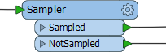
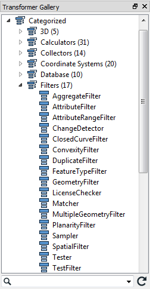

# Conditional Filtering #
Transformers that filter don’t transform data content, yet surveys show that they’re the most commonly used type of transformer there is!
 
## What is Filtering? ##
Filtering is the technique of subdividing data as it flows through a workspace. It’s the case where there are multiple output connections from a transformer, each of which carries data to be processed in a different way.

A filtering transformer may be any transformer with multiple output ports, such as the GeometryFilter or Sampler transformers, the latter of which create a sample selection of data and separates it out through Sampled and NotSampled output ports.

However, these are mostly in-built, fixed tests. Conditional filtering is where the decision about which features are output to which connection is decided by some form of *user-defined* test or condition. The Tester transformer is the most obvious example of this. It carries out a test and has different output ports for features that pass and fail the test.

## Transformers that Filter ##
The transformers in the Filter category are the main group that carry out these tests and redirect data according to the results.

Although the Tester transformer is the most used of this category, there are many other transformers such as the TestFilter,GeometryFilter, AttributeFilter, SpatialFilter, and Sampler.

---

<!--Person X Says Section-->

<table style="border-spacing: 0px">
<tr>
<td style="vertical-align:middle;background-color:darkorange;border: 2px solid darkorange">
<i class="fa fa-quote-left fa-lg fa-pull-left fa-fw" style="color:white;padding-right: 12px;vertical-align:text-top"></i>
Miss Vector says...
</td>
</tr>

<tr>
<td style="border: 1px solid darkorange">

Time for a quick question. How many of the transformers in the Filter category appear in the top-25 Most-Valuable Transformers list?
  1. Three (3)
 2. Four (4)
 3. Five (5)
 4. Six (6)

</td>
</tr>
</table>